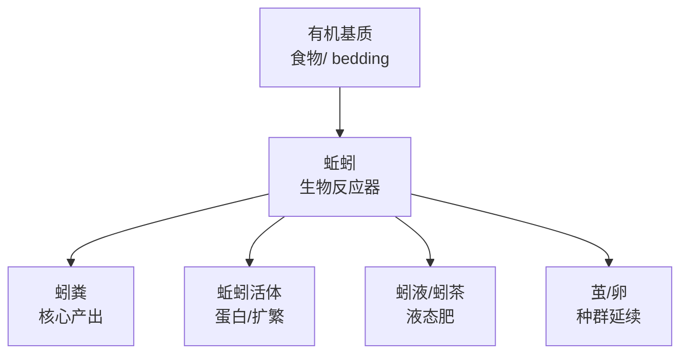
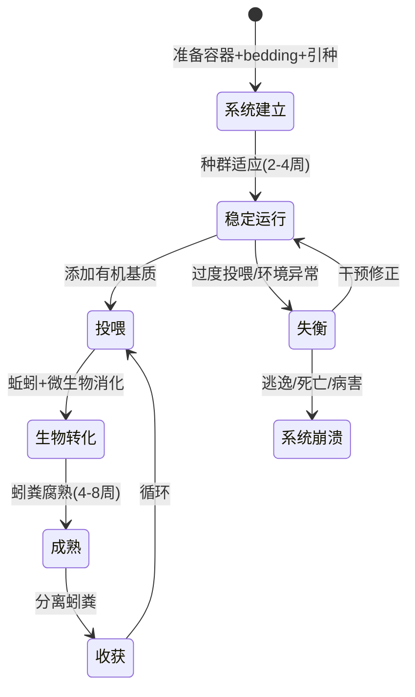
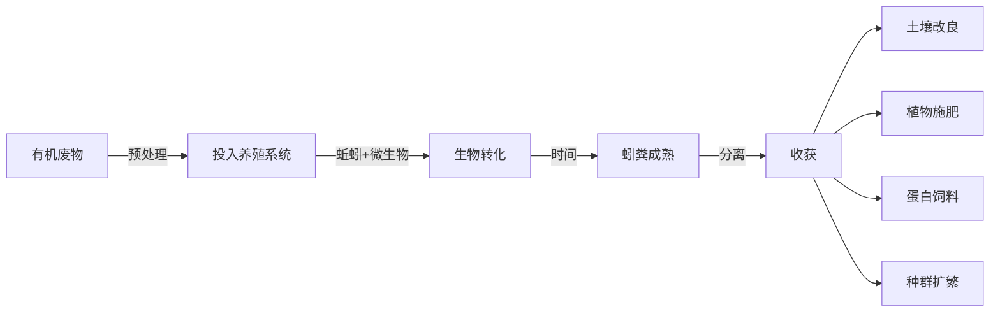
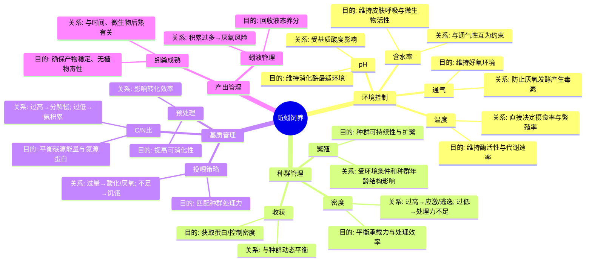
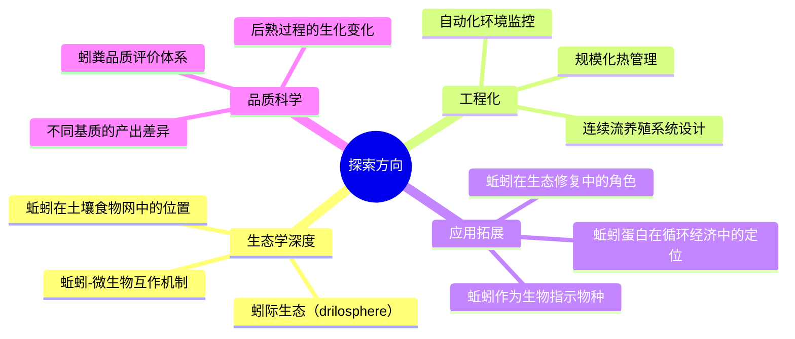
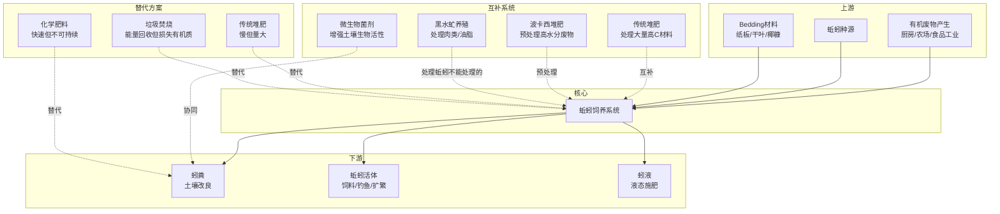
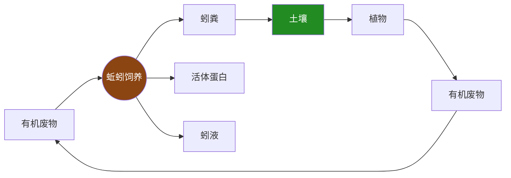

# 蚯蚓的饲养 — 心智模型与世界模型

---

## 1. 本质（Essence）

> **蚯蚓饲养，本质上是通过管理一个「活的生物反应器」，将有机废弃物转化为高价值生物产出的生态工程。**

### 为什么它存在？

自然界中，蚯蚓是土壤生态系统的「分解者」——它们消化腐烂的有机物，排出富含微生物、酶和植物可利用养分的蚓粪。蚯蚓饲养是人类对这一自然过程的**有意识放大与定向利用**。

它存在，是因为人类面临一个根本矛盾：

- **有机废弃物大量产生**（厨余、农业残余、畜禽粪便）
- **土壤有机质持续下降**（集约化农业、城市化）
- **化学肥料带来边际递减与生态代价**

蚯蚓饲养提供了一条**用生物过程连接「废物」与「资源」**的路径。

### 它解决什么根本问题？

| 根本问题 | 蚯蚓的回应方式 |
|---------|-------------|
| 有机物如何回归土壤？ | 通过生物消化而非化学分解 |
| 废物与资源之间的断裂如何弥合？ | 蚯蚓作为「活的转化节点」 |
| 如何在不依赖工业投入的情况下维持土壤肥力？ | 构建闭环的有机质循环 |

### 没有它时，人们通常怎么办？

- **堆肥**：依赖微生物自然分解，周期长（3-6个月），养分流失多，产物品质不稳定
- **直接还田**：未腐熟的有机物在土壤中分解时争夺氮素，可能产生 phytotoxic 物质
- **化学肥料**：跳过生物循环直接供给无机养分，但破坏土壤结构、微生物群落和长期生产力
- **丢弃/填埋**：有机废弃物进入厌氧环境，产生甲烷（强温室气体）

### 它带来了哪些新的可能？

- **分布式废物处理**：每个家庭/农场都可以成为微型有机废物处理站
- **活体蛋白生产**：蚯蚓本身是高蛋白饲料（水产、禽类），开辟「废物→蛋白」路径
- **土壤生态修复**：蚓粪不仅是肥料，更是土壤微生物接种剂
- **碳封存**：将有机碳稳定化为腐殖质，回归土壤碳库

---

## 2. 世界模型（World Model）

### 对象（Objects）



| 对象 | 本质 | 关键属性 |
|------|------|---------|
| **蚯蚓**（通常指赤子爱胜蚓 *Eisenia fetida*） | 活的生物加工单元 | 日食量≈体重50-100%；雌雄同体异体受精；皮肤呼吸 |
| **有机基质** | 输入原料 | C/N比、含水率、粒径、可降解性 |
| **蚓粪（Vermicompost）** | 核心产品 | 富含腐殖酸、有益微生物、植物可利用态养分 |
| **蚓液/蚓茶** | 液态副产物 | 速效养分、活性微生物群落 |
| **养殖系统** | 物理容器与环境 | 温度、湿度、通气、光照、pH |

### 角色（Actors）

| 角色 | 关注点 | 与蚯蚓的关系 |
|------|--------|------------|
| **饲养者**（你） | 环境调控、投入管理、产出收获 | 系统的「外部调节器」 |
| **蚯蚓** | 摄食、消化、繁殖、迁移 | 系统的「核心处理器」 |
| **微生物群落** | 分解、固氮、竞争病原菌 | 蚯蚓的「共生协作网络」 |
| **目标植物/动物** | 接收养分 | 产出链的「终端受益者」 |

### 状态变化（State）



### 核心工作流



### 与哪些系统交互？

| 外部系统 | 交互方式 |
|---------|---------|
| **厨房/农场** | 有机废物供给源 |
| **花园/农田** | 蚓粪的终端应用场所 |
| **气候/季节** | 温度决定系统活性（15-25°C最适） |
| **水系统** | 含水率管理、蚓液回收 |
| **碳循环** | 有机碳的稳定化与封存 |

### 创造的价值

```
有机废物（负价值/零价值）
        ↓ 蚯蚓饲养
蚓粪（土壤改良价值） + 蚯蚓活体（蛋白价值） + 蚓液（液态肥价值）
        ↓
土壤健康提升 → 植物生产力 → 生态系统服务
```

---

## 3. 概念地图（Concept Map）



### 概念间的核心关系

| 概念A | 关系 | 概念B | 解释 |
|-------|------|-------|------|
| 温度 | 决定 | 代谢速率 | 每降10°C，代谢率约降一半 |
| 含水率 | 约束 | 通气性 | 水 fills 孔隙 → 氧气减少 |
| C/N比 | 决定 | 分解速率与产物品质 | 微生物需要碳作能量、氮作蛋白 |
| 种群密度 | 反馈于 | 环境条件 | 高密度→代谢热↑→温度↑→应激 |
| 投喂量 | 匹配 | 种群处理力 | 输入>处理能力→系统失衡 |
| 蚓粪成熟度 | 决定 | 植物安全性 | 未成熟蚓粪含有机酸，抑制种子萌发 |

---

## 4. 决策地图（Decision Map）

### 场景 1：系统启动

```
Situation: 我想开始蚯蚓饲养
    ↓
Decision: 选择养殖容器规模、蚯蚓种类、初始种群量
    ↓
Reason: 系统规模必须匹配废物产生量和可用空间；
        赤子爱胜蚓（Eisenia fetida）适应力强、处理效率高，
        是室内/小规模的首选；初始种群决定系统达到稳定处理
        能力的时间
    ↓
Expected Outcome: 2-4周内系统稳定运行，4-8周后开始产出
```

### 场景 2：投喂决策

```
Situation: 积累了一批厨余/有机废物
    ↓
Decision: 是否投入？投入多少？需要预处理吗？
    ↓
Reason: 投喂量不应超过蚯蚓2天内的处理能力；
        高水分/高氮废物（水果皮、菜叶）需搭配高碳bedding
        （纸板、干叶）调节C/N比和结构；
        避免柑橘类过量（柠檬烯对蚯蚓有毒）、
        避免肉类/油脂（吸引害虫、厌氧）
    ↓
Expected Outcome: 基质在2-3天内被开始消化，无异味，无逃逸
```

### 场景 3：逃逸事件

```
Situation: 蚯蚓试图逃离养殖容器
    ↓
Decision: 诊断根本原因并修正环境
    ↓
Reason: 逃逸是蚯蚓对环境的「投票」——
        常见原因：过度投喂→酸化(pH↓)；
        含水率过高→缺氧；温度过高(>30°C)；
        新环境未适应。逃逸不是「蚯蚓的问题」，
        而是「系统状态偏离适生区」的信号
    ↓
Expected Outcome: 修正后24-48h内逃逸停止
```

### 场景 4：收获时机

```
Situation: 养殖系统运行数月，bedding已大部分转化为深色颗粒
    ↓
Decision: 是否收获？用什么方法分离？
    ↓
Reason: 收获过早→基质未充分转化；
        收获过晚→种群密度过高、食物不足、自溶风险；
        分离方法（光照驱赶、筛分、侧向迁移）
        影响蚯蚓损耗率和操作效率
    ↓
Expected Outcome: 获得成熟蚓粪，种群保持健康密度
```

### 场景 5：季节性管理

```
Situation: 夏季气温>35°C / 冬季气温<5°C
    ↓
Decision: 是否需要温控干预？如何调整投喂和管理策略？
    ↓
Reason: 蚯蚓在极端温度下代谢紊乱——
        高温：蛋白质变性、脱水死亡（>35°C致死）；
        低温：代谢停滞、不死亡但不处理废物；
        策略：移至阴凉处、加冰瓶降温 / 室内保温、
        减少投喂量（低温下处理力极低）
    ↓
Expected Outcome: 种群在极端季节存活，温度恢复后快速恢复活性
```

### 场景 6：产出应用

```
Situation: 获得了蚓粪和蚓液，准备使用
    ↓
Decision: 直接施用还是稀释？用在哪里？用量多少？
    ↓
Reason: 蚓粪是缓释型改良剂，不会烧根，但过量不经济；
        蚓液含高浓度可溶性养分和微生物，必须稀释
        （通常1:5-1:10），否则渗透压伤害植物；
        不同植物对养分需求不同
    ↓
Expected Outcome: 植物获得适宜养分，土壤微生物活性提升
```

---

## 5. 搜索空间扩展（Search Space Expansion）

### 初学者通常不会想到的问题

| 问题 | 为什么重要 |
|------|----------|
| **蚯蚓没有胃，它靠什么消化？** | 理解砂囊（gizzard）研磨+微生物协同消化的机制，才能理解为什么需要添加「研磨料」（蛋壳粉、细土） |
| **蚓粪和堆肥有什么本质区别？** | 蚓粪经过蚯蚓消化道，被包裹在黏液团粒中，结构更稳定、微生物群落更丰富——这不是简单的「蚯蚓做的堆肥」 |
| **蚯蚓为什么是雌雄同体却要异体受精？** | 这影响种群遗传多样性，也意味着单条蚯蚓无法建立可持续种群 |
| **养殖系统中的微生物到底在做什么？** | 微生物先「预消化」基质，蚯蚓再摄食——蚯蚓和微生物是共生关系，不是单向利用 |
| **蚓粪也有「未成熟」的问题？** | 刚产出的蚓粪含有机酸和乙烯前体，需要后熟（curing）2-4周才能安全使用 |
| **蚯蚓能处理所有有机废物吗？** | 不能。高木质素材料（木屑、树枝）蚯蚓几乎无法处理；高盐、高酸、含杀菌剂的材料有毒 |

### 专家真正关心的问题

| 问题 | 决定了什么 |
|------|----------|
| **蚓粪中微生物群落的组成与功能？** | 决定了蚓粪作为「生物肥料」的实际效果——不同基质产出的蚓粪微生物组成差异巨大 |
| **蚯蚓种群的年龄结构与繁殖动力学？** | 决定了系统的长期处理能力和稳定性 |
| **重金属与污染物的生物富集？** | 蚯蚓能富集重金属——如果基质来源不干净，蚓粪和蚯蚓活体都可能不安全 |
| **规模化养殖的工程化问题？** | 从家庭到农场到工业级，热管理、气体交换、连续收获的工程挑战完全不同 |
| **蚓粪的标准化与品质控制？** | 作为商品，蚓粪需要稳定的养分含量、无病原、无杂草种子——如何建立标准？ |

### 下一步值得探索的问题



### 决定领域上限的关键问题

1. **蚯蚓处理有机废物的理论上限是多少？**（受代谢速率、种群密度、环境条件约束）
2. **蚓粪能否替代所有化学肥料？**（不能——它是土壤改良剂+生物肥料，但养分浓度低，无法在大规模农业中替代化肥的精准供给）
3. **蚯蚓饲养能否实现碳负排放？**（理论上可以——将有机碳转化为稳定的土壤腐殖质，但规模有限）

---

## 6. 生态系统（Ecosystem）



### 关键关系说明

| 关系 | 说明 |
|------|------|
| **波卡西 → 蚯蚓** | 波卡西发酵（厌氧预处理）后的废物可以被蚯蚓更快处理 |
| **传统堆肥 ↔ 蚯蚓** | 大量高C材料（树枝、秸秆）先堆肥再喂蚯蚓；蚯蚓处理精细废物 |
| **黑水虻 ↔ 蚯蚓** | 黑水虻能处理肉类、油脂、高水分废物——这些蚯蚓不能处理；两者互补 |
| **蚓粪 + 微生物菌剂** | 蚓粪本身含微生物，但添加特定功能菌（如菌根真菌）可增强效果 |

---

## 7. 可迁移原则（Transferable Principles）

### 第一性原理

| 原理 | 解释 | 稳定性 |
|------|------|--------|
| **生物转化优于化学转化** | 通过生物过程（消化、分解）将废物转化为资源，过程温和、产物复杂且功能丰富 | ★★★★★ 长期稳定 |
| **闭环思维** | 废物是放错位置的资源——有机饲养的核心是将「线性消耗」变为「循环再生」 | ★★★★★ 长期稳定 |
| **环境决定行为** | 蚯蚓的行为（摄食、繁殖、逃逸）是环境状态的函数——改变行为必须改变环境 | ★★★★★ 长期稳定 |
| **承载力约束** | 任何生物系统都有承载力上限——种群密度、投喂量、空间都受此约束 | ★★★★★ 长期稳定 |

### 可迁移的方法论

| 方法论 | 蚯蚓饲养中的体现 | 可迁移到 |
|--------|----------------|---------|
| **输入-过程-输出模型** | 基质→生物转化→蚓粪 | 任何生产/加工系统 |
| **反馈调节** | 观察蚯蚓行为→推断环境状态→修正条件 | 任何需要间接观测的系统 |
| **C/N比平衡** | 碳氮比调控分解过程 | 堆肥、农业、发酵工程 |
| **渐进式启动** | 少量引种→逐步扩繁→稳定运行 | 任何生物系统的建立 |
| **多产物思维** | 一个系统产出蚓粪+活体+蚓液 | 系统设计中追求复合价值 |

### 当前实现细节（容易变化）

- 具体养殖容器的选择（塑料箱、木箱、堆叠式）
- 特定bedding材料（椰糠、纸板、泥炭藓）
- 具体的温湿度数值范围（不同品种有差异）
- 商业蚓粪产品的包装和标准

### 长期稳定的知识

- 蚯蚓的生物学特性（皮肤呼吸、雌雄同体、砂囊消化）
- 微生物在分解中的核心角色
- 有机质循环的基本原理
- 腐殖质形成的生化过程

---

## 8. 最小心智模型（Minimum Mental Model）

> 如果只能记住 **15 个概念**，按重要性排序：

| 排序 | 概念 | 为什么重要 |
|------|------|----------|
| 1 | **蚯蚓是活的生物反应器** | 不是机器，是生命——它的状态决定一切 |
| 2 | **环境决定行为** | 所有问题都是环境问题，不是蚯蚓的问题 |
| 3 | **承载力** | 投喂量、种群密度、空间——一切都有上限 |
| 4 | **C/N比** | 碳氮平衡是分解过程的核心约束 |
| 5 | **好氧环境** | 厌氧=毒素=死亡——通气是生命线 |
| 6 | **含水率** | 蚯蚓通过皮肤呼吸——太干窒息，太湿缺氧 |
| 7 | **温度窗口** | 15-25°C最适，>35°C致死——温度是硬约束 |
| 8 | **微生物共生** | 蚯蚓不单独工作——它和微生物是团队 |
| 9 | **后熟（Curing）** | 新鲜蚓粪≠可用——需要时间稳定化 |
| 10 | **种群动态** | 蚯蚓会繁殖、会老化——种群是活的系统 |
| 11 | **逃逸是信号** | 逃逸不是「蚯蚓不乖」，是环境在报警 |
| 12 | **输入品质决定输出品质** | 垃圾进→垃圾出；干净基质→高品质蚓粪 |
| 13 | **渐进式管理** | 不要一次投太多、不要期望立刻产出 |
| 14 | **多产物价值** | 不只是蚓粪——活体蛋白和蚓液同样有价值 |
| 15 | **闭环循环** | 蚯蚓饲养是循环经济的微观实践 |

---

## 9. 常见误区（Common Misconceptions）

### 误区 1：「蚯蚓饲养就是堆肥」

| | |
|---|---|
| **误解** | 蚯蚓只是加速了堆肥过程 |
| **为什么产生** | 两者都是有机废物→腐殖质的转化 |
| **更准确的模型** | 堆肥是微生物主导的热过程（50-60°C）；蚯蚓饲养是蚯蚓+微生物的中温过程（15-25°C）。蚓粪经过消化道，被黏液包裹成团粒结构，微生物群落更丰富、养分更易利用、结构更稳定 |

### 误区 2：「给蚯蚓吃的就行」

| | |
|---|---|
| **误解** | 只要不断投喂，蚯蚓就会一直工作 |
| **为什么产生** | 把蚯蚓当成机器 |
| **更准确的模型** | 蚯蚓是生命体——温度、湿度、pH、密度、通气都在影响它的状态。过度投喂比不投喂更危险（酸化、厌氧） |

### 误区 3：「蚓粪可以直接用」

| | |
|---|---|
| **误解** | 刚收获的蚓粪立刻施用到植物上 |
| **为什么产生** | 蚓粪看起来已经是「土」了 |
| **更准确的模型** | 新鲜蚓粪含有机酸和可能未稳定的中间产物，需要后熟（curing）2-4周。未成熟的蚓粪可能抑制种子萌发和根系生长 |

### 误区 4：「任何虫子都可以」

| | |
|---|---|
| **误解** | 挖一些花园里的蚯蚓就能养 |
| **为什么产生** | 不知道蚯蚓种类差异 |
| **更准确的模型** | 花园蚯蚓（如环毛蚓）是「深栖型」（anecic），需要深厚土层，不适合容器养殖。养殖用的是「表栖型」（epigeic）蚯蚓，如赤子爱胜蚓，它们适应高密度、浅层、高有机质环境 |

### 误区 5：「蚯蚓越多越好」

| | |
|---|---|
| **误解** | 投入大量蚯蚓可以更快处理废物 |
| **为什么产生** | 线性思维：更多工人=更快完成 |
| **更准确的模型** | 种群密度受空间和食物约束。过高密度→竞争→应激→逃逸→种群崩溃。存在最优密度区间 |

### 误区 6：「蚯蚓不需要水」

| | |
|---|---|
| **误解** | 基质看起来不干就不用加水 |
| **为什么产生** | 用人的触觉判断含水率 |
| **更准确的模型** | 蚯蚓通过湿润的皮肤进行气体交换。基质含水率应维持在60-80%（手感：握紧出水但不滴水）。干燥=窒息 |

---

## 10. 总结（Summary）

> **我真正获得的不是「一种养蚯蚓的技术」，**
> **而是一套理解「如何通过管理生命系统来实现资源循环」的心智模型。**

这套模型的核心是：

- **你不是在「操作机器」，你是在「调节生态」** —— 输入改变环境，环境改变行为，行为产出价值
- **废物是设计缺陷** —— 在自然界中没有废物，蚯蚓饲养让你在实践中理解这一点
- **生命系统的约束不同于机械系统** —— 承载力、适应性、反馈延迟、非线性响应——这些概念从蚯蚓养殖中可以迁移到理解任何复杂系统

---



*蚯蚓饲养的本质：在微观尺度上，重建被人类打断的有机质循环。*
