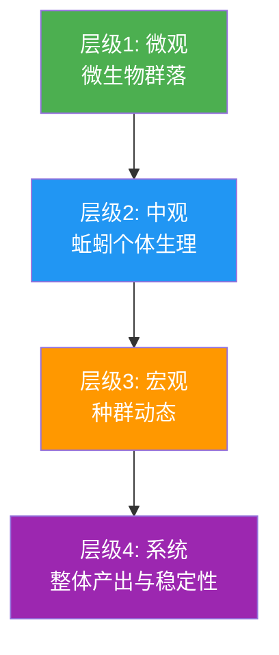
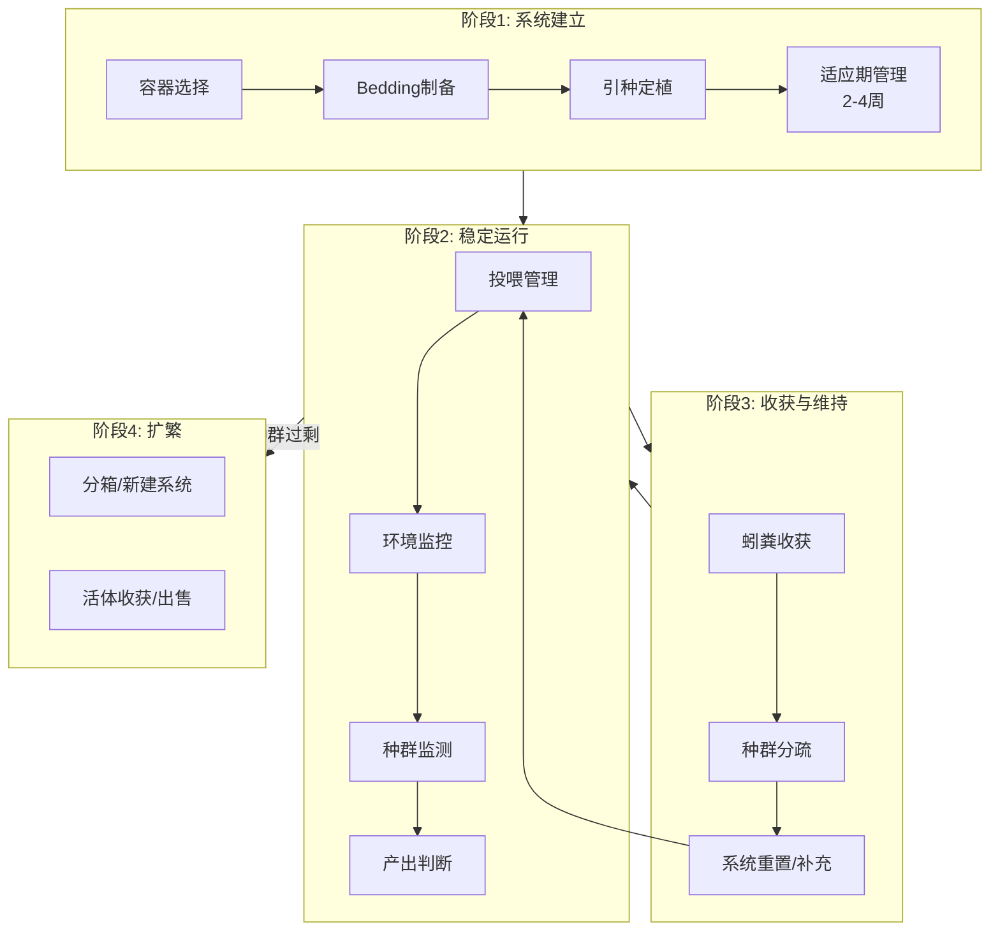
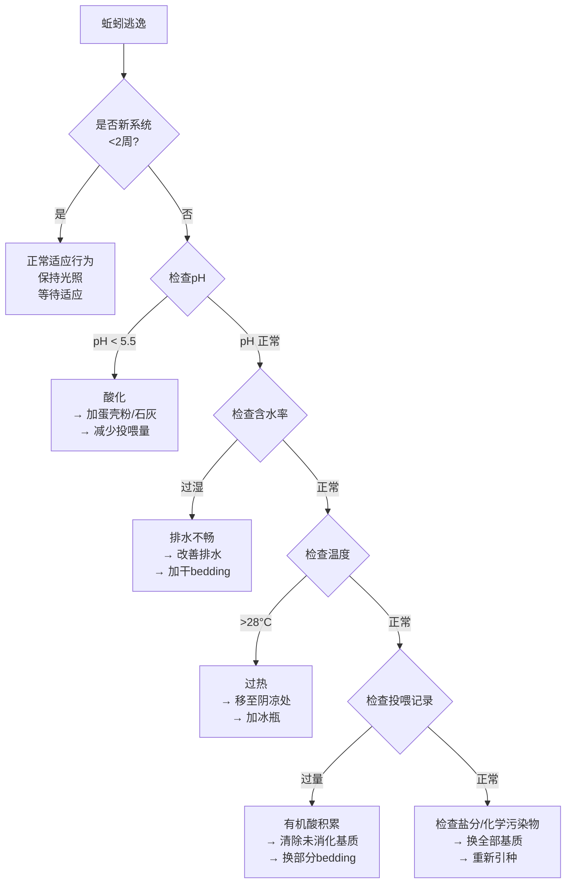
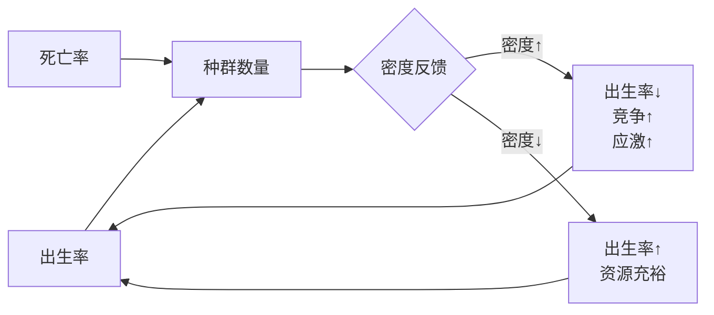
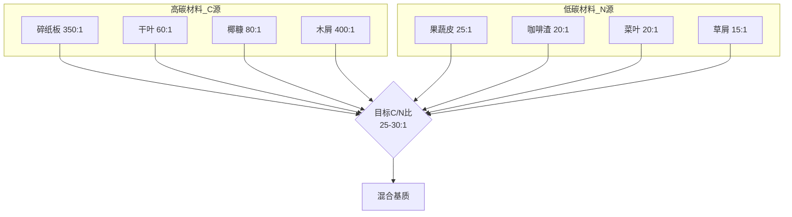
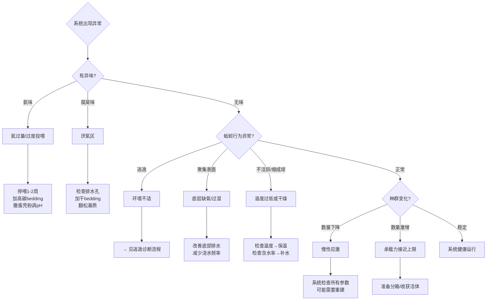
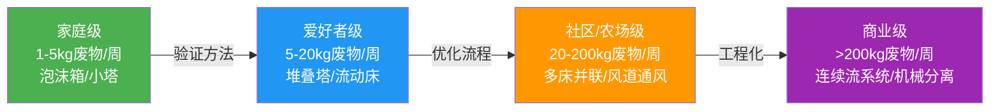
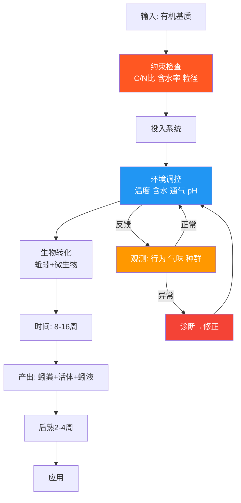

# 蚯蚓饲养繁殖 — 系统性框架

---

## 一、核心认知：你在管理什么？

蚯蚓饲养的本质不是「养虫子」，而是**管理一个多层级的生物系统**：



**所有管理行为的本质，都是在调控这四个层级的状态。**

---

## 二、关键约束条件（硬约束）

这些是**不可违反的物理/生物学边界**，违反即导致系统崩溃：

| 约束 | 安全区间 | 致死边界 | 机制 |
|------|---------|---------|------|
| **温度** | 15-25°C | <5°C 停滞；>35°C 致死 | 酶活性窗口；蛋白质热变性 |
| **含水率** | 60-80%（基质） | <30% 脱水；>90% 厌氧 | 皮肤呼吸依赖水膜；水填充孔隙→缺氧 |
| **pH** | 6.0-8.0 | <5.0 应激/逃逸；>9.0 氨中毒 | 消化酶最适pH；氨在碱性条件下毒性↑ |
| **溶解氧** | >5 mg/L（基质水相） | <2 mg/L 厌氧发酵 | 好氧微生物+蚯蚓均需氧 |
| **氨氮** | <0.5 g/kg | >1.5 g/kg 致死 | 蛋白质脱氨产物，穿透皮肤 |
| **盐分** | <0.5% | >1% 渗透压应激 | 蚯蚓无渗透压调节能力 |

> **决策原则：所有管理行为都是在这些硬约束的可行域内寻找最优解。**

---

## 三、系统性饲养框架

### 3.1 框架总览



---

### 3.2 阶段1：系统建立

#### 容器选择 — 决策矩阵

| 场景 | 推荐方案 | 理由 |
|------|---------|------|
| 室内/阳台（<10kg废物/周） | 堆叠式蚯蚓塔（tray system） | 利用蚯蚓避光性实现自动分离；占地小 |
| 庭院（10-50kg废物/周） | 流动式养殖床（flow-through bin） | 底部连续收获；容量大 |
| 临时/试验 | 泡沫箱+打孔 | 保温好、成本低、透气需手动管理 |

**关键参数**：
- 深度：25-35cm（表栖型蚯蚓的活动层）
- 表面积 > 深度（蚯蚓是水平分布，不是垂直分布）
- 排水：必须有——积水=厌氧=死亡

#### Bedding（垫料）制备

Bedding 不只是「住处」，它同时承担三重功能：

```
功能1: 物理结构 → 维持通气孔隙
功能2: 碳源供给 → 平衡投喂中的氮源
功能3: 水分缓冲 → 吸收多余水分，防止厌氧
```

| 材料 | C/N比 | 保水性 | 结构支撑 | 备注 |
|------|-------|--------|---------|------|
| 椰糠（coir） | ~80:1 | ★★★★★ | ★★ | 需预洗去盐；最常用 |
| 碎纸板/瓦楞纸 | ~350:1 | ★★★ | ★★★ | 免费；需撕碎浸泡 |
| 干落叶 | ~60:1 | ★★★ | ★★★★ | 需粉碎；种类注意（避免核桃叶含juglone） |
| 泥炭藓（peat moss） | ~100:1 | ★★★★★ | ★★ | 偏酸(pH 3-4)，需加石灰调 |
| 腐熟木屑 | ~400:1 | ★★ | ★★★★★ | 必须腐熟，新鲜木屑含萜烯类抑制物 |

**制备流程**：
1. 材料浸泡至饱和含水
2. 挤水至「握紧出水但不滴落」
3. 蓬松填入容器（不要压实——需要孔隙空间）
4. 深度 15-20cm

#### 引种定植

| 参数 | 推荐值 | 理由 |
|------|--------|------|
| 种类 | 赤子爱胜蚓（*Eisenia fetida/andrei*） | 表栖型；耐高密度；处理效率高；文献最充分 |
| 初始密度 | 0.5-1 lb/ft²（约2.5-5 kg/m²） | 平衡初始成本与稳定时间 |
| 适应期 | 2-4周不投喂或极少量投喂 | 让蚯蚓适应新环境，建立肠道微生物群落 |

> **注意**：不要用花园土蚯蚓（环毛蚓 *Pheretima* spp. 等深栖型）。它们在容器中无法建立稳定种群。

---

### 3.3 阶段2：稳定运行（核心循环）

这是持续时间最长的阶段，也是管理复杂度最高的阶段。

#### 投喂管理 — 核心决策

```mermaid
decision_tree
    root{投喂决策}
    root --> A{基质类型?}
    A -->|高氮/高水分<br/>果蔬皮| B[需搭配高碳bedding<br/>比例 1:1 体积比]
    A -->|高碳/干燥<br/>纸/叶| C[加水软化<br/>作为bedding补充]
    A -->|高蛋白<br/>咖啡渣| D[少量混入 ≤20%<br/>过量导致氨积累]

    root --> E{投喂量?}
    E -->|经验法则| F[蚯蚓体重50-100%/天<br/>但宁少勿多]
    E -->|实际操作| G[观察上次投喂剩余量<br/>有剩余→减量/延长间隔]

    root --> H{禁忌物?}
    H --> I[避免: 肉类/油脂/乳制品<br/>→ 厌氧+害虫]
    H --> J[限制: 柑橘类(pH低+柠檬烯)<br/>洋葱/大蒜(含硫化物)<br/>辛辣食物(辣椒素)]
    H --> K[禁止: 含盐加工食品<br/>含杀菌剂/农药材料<br/>宠物粪便(病原体)]
```

**投喂策略的底层逻辑**：

```
投喂量 ≤ 蚯蚓日处理力 + 微生物预分解速率

如果：投喂量 > 处理力
  → 基质积累 → 发酵产热 → pH↓ → 厌氧
  → 蚯蚓应激 → 逃逸/死亡

如果：投喂量 < 处理力（短期）
  → 蚯蚓消耗bedding → 无损害
  → 但长期不足 → 种群萎缩
```

#### 环境监控 — 诊断矩阵

| 观测信号 | 可能原因 | 诊断方法 | 修正措施 |
|---------|---------|---------|---------|
| **异味（氨味）** | 过度投喂/氮过量 | pH试纸测基质 | 停止投喂；加高碳bedding；翻松通气 |
| **异味（腐臭/硫臭）** | 厌氧区 | 检查排水/含水率 | 改善排水；加干bedding；翻松 |
| **蚯蚓聚集表面** | 底层厌氧/含水过高 | 检查底部排水 | 改善排水；减少浇水 |
| **蚯蚓逃逸** | pH异常/温度/含水 | 全面检测 | 见「逃逸诊断流程」 |
| **基质温度升高** | 微生物活跃发酵 | 温度计插入基质 | 减少投喂量；翻松散热 |
| **果蝇/害虫** | 基质暴露 | 检查覆盖层 | 加覆盖层（湿布/bedding）；冷冻基质再投喂 |
| **种群数量下降** | 慢性应激/自溶 | 检查各项参数 | 通常需2-4周逐步修正 |

#### 逃逸诊断流程



---

### 3.4 阶段3：收获与维持

#### 蚓粪收获时机判断

| 指标 | 未成熟 | 可收获 | 过晚 |
|------|--------|--------|------|
| 外观 | 仍可见原始bedding结构 | 均匀深色颗粒，似咖啡渣 | 极度细碎，结构崩解 |
| 气味 | 酸味/原始基质味 | 泥土清香 | 无味或霉味 |
| 蚯蚓密度 | 正常 | 偏高（食物减少） | 极高（食物耗尽） |
| 时间 | <8周 | 8-16周 | >20周 |

#### 分离方法

| 方法 | 原理 | 效率 | 蚯蚓损耗 | 适用规模 |
|------|------|------|---------|---------|
| **光照驱赶法** | 蚯蚓避光→向下迁移 | 中 | 低 | 小规模 |
| **侧向迁移法** | 新bedding+食物在一侧 | 高 | 极低 | 小规模 |
| **筛分法** | 机械分离 | 高 | 中 | 中大规模 |
| **堆叠塔自分离** | 新层吸引蚯蚓向上 | 极高 | 极低 | 堆叠式系统 |

#### 后熟（Curing）— 不可跳过的步骤

```
新鲜蚓粪
    ↓ 摊开至5-8cm厚
    ↓ 保持微湿（40-50%含水率）
    ↓ 通风良好处放置
    ↓ 2-4周
    ↓
成熟蚓粪
  - 有机酸降解完毕
  - 乙烯前体分解
  - 微生物群落稳定化
  - 植物安全性确认
```

> **未成熟蚓粪的风险**：含有机酸（乙酸、丁酸）和可能的乙烯前体，抑制种子萌发、损伤幼根。这是初学者最常犯的错误之一。

---

### 3.5 阶段4：种群管理与扩繁

#### 种群动态模型



**关键种群参数**：

| 参数 | 典型值（*E. fetida*） | 约束条件 |
|------|----------------------|---------|
| 性成熟时间 | 4-8周（孵化后） | 温度20-25°C |
| 产茧频率 | 1-2茧/条/周 | 充足食物+适宜环境 |
| 每茧含卵数 | 2-5个（通常2-3条孵化） | 营养状况 |
| 孵化时间 | 2-4周 | 温度依赖 |
| 种群倍增时间 | 60-90天 | 理想条件下 |
| 承载力密度 | 15-25 kg/m²（鲜重） | 受bedding深度和通气约束 |

#### 扩繁决策

```
种群密度达到承载力的70-80%
    ↓
选择策略：
    ├── 策略A: 分箱 → 新建养殖系统（商业扩繁）
    ├── 策略B: 收获活体 → 出售/用作饲料
    ├── 策略C: 增加投喂 → 暂时提高承载力（需同步改善通气）
    └── 策略D: 不干预 → 种群自我调节（密度↑→繁殖率↓→稳定）
```

---

## 四、季节性管理框架

```mermaid
yearly_cycle
    subgraph 春季_15_22C["春季 (15-22°C)"]
        S1[逐步增加投喂量]
        S2[补充冬季消耗的bedding]
        S3[分箱/扩繁的最佳时机]
    end

    subgraph 夏季_25_35C["夏季 (25-35°C)"]
        H1[遮阳/移至阴凉处]
        H2[增加含水率至80%+]
        H3[减少投喂量(高温下处理力↓)]
        H4[必要时加冰瓶/湿布覆盖]
        H5[警惕: >35°C 紧急降温]
    end

    subgraph 秋季_15_25C["秋季 (15-25°C)"]
        A1[最佳运行温度——满负荷投喂]
        A2[大量收获蚓粪]
        A3[储备种群过冬]
    end

    subgraph 冬季_5_15C["冬季 (5-15°C)"]
        W1[移至室内/保温]
        W2[大幅减少投喂量]
        W3[降低含水率(蒸发慢)]
        W4[不收获——让种群休养]
    end
```

---

## 五、基质配方体系

### 5.1 C/N比速查与配比



**实用配比经验**：

| 投喂类型 | 碳源:氮源 体积比 | 说明 |
|---------|-----------------|------|
| 纯厨余（果蔬为主） | 1:1 搭配碎纸板 | 最常见场景 |
| 咖啡渣为主 | 2:1 搭配椰糠 | 咖啡渣偏酸，需大量碳源缓冲 |
| 花园废物（草屑+落叶） | 已接近平衡 | 少量补充bedding即可 |

### 5.2 预处理决策

| 材料 | 是否需要预处理 | 方法 | 原因 |
|------|-------------|------|------|
| 大块果蔬皮 | 切碎至2-3cm | 刀切/手撕 | 增大表面积→加速微生物预分解 |
| 冷冻后再投喂 | 推荐 | 冷冻→解冻 | 破坏细胞壁→加速分解；杀灭果蝇卵 |
| 咖啡渣 | 无需 | 直接少量混入 | 已充分破碎 |
| 纸板 | 浸泡软化 | 温水浸泡→挤干 | 提高含水率；便于蚯蚓摄食 |
| 蛋壳 | 磨粉添加 | 研磨成粉 | 提供砂粒（助消化）+ 碳酸钙（缓冲pH） |

---

## 六、问题诊断系统



---

## 七、关键指标速查表

| 指标 | 理想值 | 警戒值 | 危险值 | 测量方法 |
|------|--------|--------|--------|---------|
| 温度 | 18-22°C | 12-15°C / 25-28°C | <8°C / >32°C | 温度计插入基质10cm |
| 含水率 | 握紧出水1-2滴 | 不出水 / 成股流水 | 干燥 / 积水 | 手握测试 |
| pH | 6.5-7.5 | 5.5-6.0 / 8.0-8.5 | <5.0 / >9.0 | pH试纸/电极 |
| 气味 | 泥土清香 | 轻微酸味 | 氨味/腐臭 | 嗅觉 |
| 蚯蚓体色 | 鲜红/紫红有光泽 | 偏暗 | 发白/发黑 | 目视 |
| 茧数量 | 持续可见 | 减少 | 消失 | 翻检bedding |
| 处理速度 | 投喂2-3天开始消失 | 5-7天 | >10天无变化 | 观察投喂点 |

---

## 八、从家庭到规模化的路径



**每个阶段跨越的关键瓶颈**：

| 跨越 | 瓶颈 | 解决方案 |
|------|------|---------|
| A→B | 投喂量与处理力的匹配 | 精确计算种群处理力；建立投喂日志 |
| B→C | 热管理 | 大规模发酵产热显著；需要通风散热设计 |
| C→D | 工程化 | 连续进料/出料；机械分离；环境自动监控 |

---

## 九、饲养日志模板

记录是系统管理的基础。建议记录以下数据：

| 日期 | 投喂内容/量 | 温度 | 含水率 | pH | 观察（行为/气味/种群） | 操作（修正措施） |
|------|-----------|------|--------|-----|---------------------|---------------|
| | | | | | | |

**关键记录原则**：
- 投喂量用「相对于蚯蚓体重的百分比」记录，而非绝对重量
- 每次异常事件必须记录原因分析和修正措施
- 种群变化（分箱、收获量）单独记录

---

## 十、总结：系统性框架的核心逻辑



**整个框架可以浓缩为三条原则**：

1. **输入决定输出** — 基质品质和处理方式决定蚓粪品质
2. **环境决定行为** — 蚯蚓不「犯错」，所有异常行为都是环境偏离适生区的信号
3. **反馈驱动调控** — 持续观测→诊断→修正的闭环是系统稳定运行的唯一保障

> 你不是在「养蚯蚓」——你是在**维护一个生态系统的稳态**，蚯蚓是这个系统的指示物种和核心处理器。
