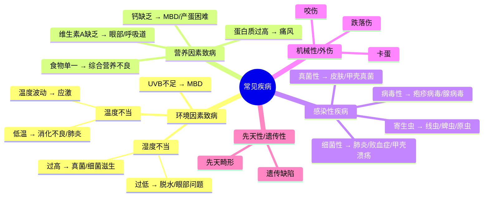
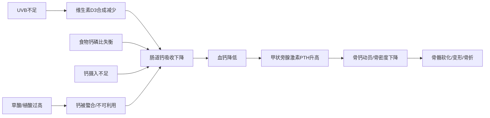
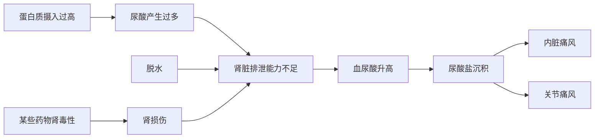
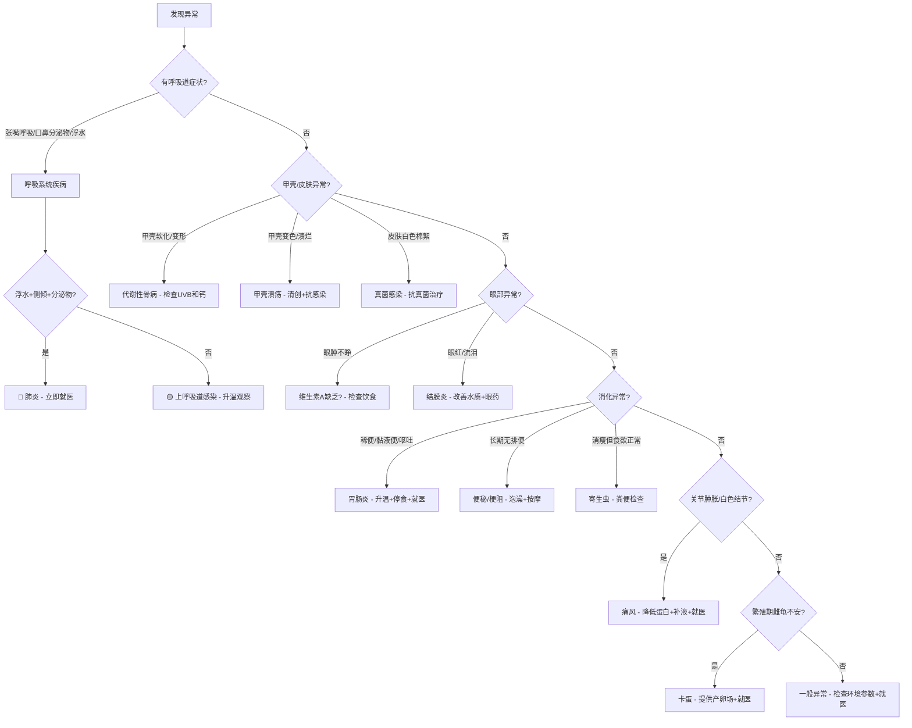
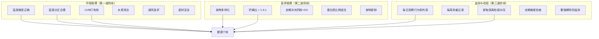

# 锯缘闭壳龟（*Cuora mouhotii*）常见疾病参考手册

> 本文档系统梳理锯缘闭壳龟常见疾病的病因、诊断要点与治疗原则。
> **重要声明**：本文档为知识框架参考，不替代专业爬行动物兽医的临床诊断。发现异常应尽快就医。

---

## 目录

1. [疾病总览与决策框架](#1-疾病总览与决策框架)
2. [呼吸系统疾病](#2-呼吸系统疾病)
3. [代谢性骨病（MBD）](#3-代谢性骨病mbd)
4. [消化系统疾病](#4-消化系统疾病)
5. [皮肤与甲壳疾病](#5-皮肤与甲壳疾病)
6. [眼部疾病](#6-眼部疾病)
7. [寄生虫病](#7-寄生虫病)
8. [泌尿系统疾病](#8-泌尿系统疾病)
9. [繁殖相关疾病](#9-繁殖相关疾病)
10. [营养代谢性疾病](#10-营养代谢性疾病)
11. [创伤与感染](#11-创伤与感染)
12. [急症与临终信号](#12-急症与临终信号)
13. [疾病诊断决策树](#13-疾病诊断决策树)
14. [预防体系](#14-预防体系)
15. [参考文献](#15-参考文献)

---

## 1. 疾病总览与决策框架

### 核心原则

> **在爬行动物医学中，环境问题是绝大多数疾病的首要病因。**
> 疾病往往是环境参数长期偏离最适范围的结果，而非孤立事件。
> （Mader et al., 2016; Divers & Mader, 2019）

### 疾病分类总览

### 紧急程度分级

| 级别 | 含义 | 响应时间 | 典型情况 |
|------|------|---------|---------|
| 🔴 **紧急** | 危及生命，需立即就医 | < 24小时 | 严重外伤、浮水侧倾、口鼻大量分泌物、拒食>2周 |
| 🟡 **重要** | 需要尽快干预 | 1-7天 | 轻度呼吸道症状、甲壳软化、眼肿不睁、粪便异常 |
| 🟢 **监测** | 早期信号，调整环境观察 | 持续观察 | 活动减少、食欲下降、泡水时间异常增加 |

---

## 2. 呼吸系统疾病

### 2.1 肺炎（Pneumonia）

**这是锯缘闭壳龟最常见且最危险的疾病之一。**

#### 病因

- **首要原因**：环境温度过低或剧烈波动，导致免疫功能下降
- **继发感染**：细菌（*Mycoplasma*, *Pseudomonas*, *Aeromonas*）或支原体感染
- **诱因**：湿度过高、通风不良、温差过大、冬眠管理不当（Mader et al., 2016）

#### 诊断要点

| 症状 | 说明 | 严重程度 |
|------|------|---------|
| 张嘴呼吸 | 呼吸时张口，可能伴有喘息声 | 🟡 中 |
| 口鼻分泌物 | 清亮或泡沫状液体；严重时为脓性 | 🟡→🔴 |
| 浮水/侧倾 | 因肺部充气不均导致身体倾斜或无法下潜 | 🔴 高 |
| 呼吸音异常 | 可闻及湿啰音或哨音 | 🔴 高 |
| 活动减少 | 不愿移动，四肢无力 | 🟡 中 |
| 食欲废绝 | 完全拒食 | 🔴 高 |

#### 鉴别诊断

- **正常行为**：偶尔张嘴可能是调节体温的行为，但**持续张嘴 + 分泌物 = 病理**
- **浮水**：需区分肠道胀气（按压腹部有弹性感）与肺部感染（侧倾、呼吸异常）

#### 治疗原则

1. **立即升温**：将环境温度升至 30-32°C（支持免疫系统功能）
2. **隔离**：防止传染其他个体
3. **保持干燥温暖**：减少湿度，提供干燥休息区
4. **就医**：
   - 细菌培养 + 药敏试验（确定致病菌和有效抗生素）
   - 常用抗生素：恩诺沙星（Enrofloxacin）、头孢他啶（Ceftazidime）、阿米卡星（Amikacin）
   - 给药途径：注射（IM/SC）为主，严重时可能需要雾化治疗
   - 疗程通常 14-30 天
5. **支持治疗**：补充维生素A（支持呼吸道黏膜修复）、补液

> **关键提醒**：肺炎进展迅速，从轻度到致命可能仅需数天。**不要等待观察**，出现浮水或口鼻分泌物应立即就医。

---

### 2.2 上呼吸道感染（URI）

#### 病因

与肺炎类似但程度较轻，通常由环境应激引发的轻度细菌或支原体感染。

#### 诊断要点

- 鼻孔有少量清亮分泌物
- 偶尔打喷嚏或甩头
- 呼吸频率略增快
- 食欲可能轻度下降

#### 治疗原则

- **首要措施**：纠正环境问题（升温、调湿、改善通风）
- 轻度病例可能通过环境调整自愈
- 持续 3-5 天无改善 → 就医评估是否需要抗生素

---

## 3. 代谢性骨病（MBD）

### 代谢性骨病 / 营养性继发性甲状旁腺功能亢进（NSHP）

**这是圈养龟类最常见的营养代谢性疾病，也是最具可预防性的疾病。**

#### 病因机制

**核心三角**：UVB + 钙摄入 + 维生素D3 —— 三者缺一则MBD不可避免（Holick, 1981; Mader et al., 2016）

#### 诊断要点

| 症状 | 说明 | 阶段 |
|------|------|------|
| 甲壳软化 | 背甲/腹甲按压有弹性感（正常应坚硬） | 中期 |
| 甲壳变形 | 边缘上翘、不对称生长 | 中晚期 |
| 四肢无力 | 行走时四肢颤抖、无法支撑体重 | 中期 |
| 下颌软化 | 下颌骨按压有弹性（正常应坚硬如骨） | 早期 |
| 脊柱弯曲 | 侧面观察脊柱呈S形弯曲 | 晚期 |
| 骨折 | 轻微外力即骨折 | 晚期 |
| 产蛋困难 | 蛋壳薄或无壳蛋 | 成体 |
| 生长迟缓 | 幼体生长速度明显低于正常 | 早期 |

#### 鉴别诊断

- **正常幼体**：幼体甲壳比成体略软是正常的，但不应有明显弹性
- **个体差异**：不同来源的龟可能有轻微差异，但甲壳"一按就凹"一定是病理

#### 治疗原则

1. **纠正根本原因**：
   - 安装合格的UVB灯（290-315nm），确保距离 < 30cm，定期更换
   - 调整食物钙磷比至 > 1.5:1
   - 每次投喂撒钙粉（碳酸钙或磷酸钙）
2. **补充治疗**：
   - 口服钙剂 + 维生素D3
   - 严重病例：注射降钙素（Calcitonin），促进骨钙沉积
   - 注射葡萄糖酸钙（严重低血钙时）
3. **环境支持**：
   - 升温至 28-30°C（促进代谢和钙吸收）
   - 提供晒点（即使使用人工UVB，自然阳光仍有不可替代的价值）
4. **预后**：
   - 早期发现 → 可完全恢复
   - 晚期骨骼变形 → 不可逆，但可阻止进一步恶化

---

## 4. 消化系统疾病

### 4.1 胃肠炎（Gastroenteritis）

#### 病因

- 食物变质或不洁
- 细菌感染（*Salmonella*, *E. coli*, *Clostridium*）
- 环境温度过低导致消化停滞 → 食物在肠道内发酵
- 寄生虫感染
- 突然更换食物种类

#### 诊断要点

| 症状 | 说明 |
|------|------|
| 粪便异常 | 稀便、水样便、黏液便、带血 |
| 泄殖腔周围污染 | 粪便黏附在泄殖腔口周围 |
| 呕吐 | 吐出未消化或部分消化的食物 |
| 食欲下降 | 拒食或食量明显减少 |
| 活动减少 | 精神萎靡 |
| 体重下降 | 长期慢性病例 |

#### 治疗原则

1. **升温**：28-30°C，促进消化功能恢复
2. **停食**：轻度病例停食 3-5 天，让肠道休息
3. **补液**：温水泡澡（浅水、28°C）促进水分吸收
4. **就医**：
   - 粪便镜检（寄生虫卵、细菌涂片）
   - 粪便培养 + 药敏
   - 根据结果使用抗生素或驱虫药
5. **恢复期**：逐步恢复投喂，从易消化的食物开始（如蚯蚓、蜗牛）

---

### 4.2 便秘 / 肠梗阻

#### 病因

- 温度过低 → 消化蠕动减慢
- 误食异物（底材、石块）
- 脱水
- 肠道寄生虫堵塞
- 体内肿块压迫

#### 诊断要点

- 长时间无排便（> 2周，排除冬眠期）
- 腹部膨胀、触诊可及硬块
- 食欲下降
- 不安行为（频繁挖地、扭动）

#### 治疗原则

1. **温水泡澡**：28-30°C温水，每天30分钟，促进肠蠕动
2. **腹部按摩**：轻柔按摩腹部（从前往后推）
3. **补液**：确保水分充足
4. **就医**：
   - X光检查（判断梗阻位置和性质）
   - 严重梗阻可能需要手术
   - 灌肠（兽医操作）

---

### 4.3 肠道寄生虫病

#### 常见寄生虫

| 寄生虫类型 | 说明 | 感染途径 |
|-----------|------|---------|
| **线虫**（Nematodes） | 最常见，种类多样 | 经口感染，环境中虫卵 |
| **蜱虫**（Ticks） | 体外寄生虫，*Amblyomma*属常见 | 野外环境、新引入个体 |
| **原虫**（Protozoa） | 鞭毛虫、阿米巴等 | 经口感染 |
| **绦虫**（Cestodes） | 较少见 | 中间宿主（昆虫等） |

#### 诊断要点

- 粪便镜检发现虫卵（需连续3次送检，因排卵有周期性）
- 体重下降但食欲正常或增加
- 粪便中有可见虫体
- 慢性消瘦、贫血
- 体表可见蜱虫附着

#### 治疗原则

1. **粪便检查**：确定寄生虫种类（不同寄生虫用药不同）
2. **驱虫药物**：
   - 线虫：芬苯达唑（Fenbendazole）口服，通常需重复给药
   - 蜱虫：手动移除 + 伊维菌素（Ivermectin）注射（**注意：龟类对伊维菌素敏感，需兽医精确计算剂量**）
   - 原虫：甲硝唑（Metronidazole）
3. **环境消毒**：彻底清洁饲养环境，防止再感染
4. **新龟隔离**：所有新引入个体必须隔离检疫 + 粪便检查

---

## 5. 皮肤与甲壳疾病

### 5.1 甲壳溃疡病 / 烂甲病（Shell Rot / Ulcerative Shell Disease）

#### 病因

- **细菌感染**：*Aeromonas*, *Pseudomonas*, *Citrobacter* 等革兰氏阴性菌
- **真菌感染**：*Candida*, *Aspergillus* 等
- **诱因**：甲壳损伤（擦伤、咬伤）+ 水质差 + 湿度过高
- 底材不洁或长期浸泡在脏水中

#### 诊断要点

| 症状 | 说明 | 严重程度 |
|------|------|---------|
| 甲壳局部变色 | 出现白色、灰色或黑色斑块 | 🟢 早期 |
| 甲壳表面粗糙 | 失去光泽，触感粗糙 | 🟡 中期 |
| 甲壳软化 | 患处按压变软，可刮下碎屑 | 🟡 中期 |
| 甲壳穿孔 | 严重时形成凹陷或穿孔，可见下方组织 | 🔴 晚期 |
| 异味 | 患处有明显腐臭味 | 🔴 晚期 |
| 渗出液 | 患处有脓性或血性分泌物 | 🔴 晚期 |

#### 治疗原则

1. **清创**：
   - 用软刷轻轻清除坏死组织（兽医操作）
   - 严重病例需要外科清创
2. **消毒**：
   - 碘伏（聚维酮碘）稀释液涂抹患处，每日1-2次
   - 氯己定（Chlorhexidine）溶液清洗
3. **抗感染**：
   - 局部涂抹抗菌药膏（如银磺嘧啶银霜）
   - 真菌性：抗真菌药膏（如特比萘芬）
   - 严重病例：全身性抗生素（注射）
4. **干养**：治疗期间保持干燥，每天仅泡水30分钟饮水进食
5. **改善环境**：彻底清洁饲养环境，改善水质

> **关键提醒**：甲壳溃疡如果深入骨质层，治疗极其困难且可能致命。**早期发现、早期处理是关键。**

---

### 5.2 皮肤真菌病

#### 病因

- 环境湿度过高 + 通风不良
- 皮肤损伤后继发真菌感染
- 免疫力低下

#### 诊断要点

- 皮肤表面出现白色/灰色棉絮状物
- 皮肤增厚、脱屑
- 常见于四肢、颈部

#### 治疗原则

- 局部涂抹抗真菌药膏
- 改善环境（降低湿度、增加通风）
- 严重病例：口服抗真菌药（伊曲康唑等，需兽医处方）
- 日光浴有助于抑制真菌生长

---

### 5.3 皮肤烧伤

#### 病因

- UVB灯距离过近
- 加热灯/加热垫直接接触皮肤
- 加热设备故障导致过热

#### 诊断要点

- 皮肤发红、起水泡
- 严重时皮肤坏死、脱落
- 龟可能回避特定区域

#### 治疗原则

- 移除热源
- 局部涂抹抗菌药膏防止继发感染
- 严重烧伤需就医处理
- 检查并修正加热设备设置

---

## 6. 眼部疾病

### 6.1 维生素A缺乏症（Hypovitaminosis A）

**这是圈养龟类极其常见但常被忽视的疾病。**

#### 病因

- 食物中维生素A或β-胡萝卜素不足
- 长期单一食物投喂（如只喂肉或只喂某种蔬菜）
- 肝脏疾病影响维生素A代谢

#### 病理机制

维生素A缺乏 → 上皮组织角化（squamous metaplasia）→ 泪腺/唾液腺/呼吸道黏膜功能受损

#### 诊断要点

| 症状 | 说明 |
|------|------|
| 眼睑肿胀 | 最常见表现，严重时完全无法睁眼 |
| 眼部干燥 | 角膜干燥、浑浊 |
| 眼部渗出 | 干酪样物质积聚在眼睑下 |
| 口腔病变 | 口腔黏膜出现白色斑块（与呼吸道症状相关） |
| 呼吸道症状 | 继发呼吸道感染（鼻腔黏膜角化） |
| 食欲下降 | 因看不见食物 + 嗅觉受影响 |

#### 治疗原则

1. **补充维生素A**：
   - 注射维生素A（兽医操作，剂量需精确——过量有毒）
   - 通常1-2次注射即可见效
2. **局部处理**：
   - 眼部清洗，清除干酪样物质
   - 抗生素眼膏防止继发感染
3. **调整饮食**：
   - 增加富含维生素A/β-胡萝卜素的食物：深色叶菜（红薯叶、胡萝卜）、动物肝脏（少量）
4. **预后**：及时治疗通常恢复良好；延误可导致永久性眼部损伤

---

### 6.2 结膜炎 / 角膜炎

#### 病因

- 细菌感染
- 水质不良（氯、氨刺激）
- 异物入眼
- 维生素A缺乏的继发表现
- 外伤

#### 诊断要点

- 眼睑红肿
- 流泪或眼部有分泌物
- 角膜浑浊或出现溃疡
- 频繁用前肢擦眼

#### 治疗原则

- 抗生素眼药水/眼膏（妥布霉素等）
- 改善水质
- 排除维生素A缺乏
- 角膜溃疡需眼科专科处理

---

## 7. 寄生虫病（详述体外寄生虫）

### 7.1 蜱虫感染

#### 病因

- 野外采集个体携带
- 新引入个体未检疫
- 使用野外采集的底材

#### 诊断要点

- 体表可见灰黑色蜱虫附着（常见于四肢腋下、颈部、泄殖腔周围）
- 蜱虫吸血后体膨大至米粒至黄豆大小
- 附着部位皮肤红肿

#### 治疗原则

1. **手动移除**：用镊子夹住蜱虫口器基部，完整拔出（勿残留口器）
2. **伊维菌素药浴**：需兽医精确计算浓度（**龟类对伊维菌素高度敏感，自行使用有中毒风险**）
3. **环境处理**：彻底更换底材，环境消毒
4. **隔离检疫**：新引入个体必须隔离观察至少30天

---

## 8. 泌尿系统疾病

### 8.1 痛风（Gout）

#### 病因机制

**核心问题**：爬行动物以尿酸为主要含氮废物，蛋白质代谢负担重 + 脱水 = 痛风高风险（Mader et al., 2016）

#### 诊断要点

| 症状 | 说明 | 类型 |
|------|------|------|
| 关节肿胀 | 四肢关节处可见白色结节状物 | 关节痛风 |
| 运动障碍 | 关节僵硬、跛行 | 关节痛风 |
| 食欲废绝 | 严重消瘦 | 内脏痛风 |
| 泄殖腔排出白色物 | 尿酸盐结晶 | 早期信号 |
| 突然死亡 | 内脏痛风可能无明显前驱症状 | 内脏痛风 |

#### 治疗原则

1. **降低蛋白质摄入**：减少动物性食物比例
2. **充分补液**：温水泡澡、皮下/腹腔补液（兽医操作）
3. **药物治疗**：
   - 别嘌醇（Allopurinol）：抑制尿酸合成
   - 秋水仙碱（Colchicine）：减轻炎症反应
   - 丙磺舒（Probenecid）：促进尿酸排泄
4. **预后**：内脏痛风预后极差；关节痛风早期干预可部分恢复

> **关键提醒**：痛风是"沉默杀手"，内脏痛风可能在出现明显症状前就已致命。**预防远重于治疗**——控制蛋白质摄入、确保充足饮水。

---

### 8.2 肾脏疾病

#### 病因

- 长期高蛋白饮食
- 慢性脱水
- 药物肾毒性（氨基糖苷类抗生素使用不当）
- 感染（细菌性肾盂肾炎）
- 尿酸盐沉积

#### 诊断要点

- 多尿或无尿
- 泄殖腔排出大量白色尿酸盐
- 后肢无力（肾脏肿大压迫坐骨神经）
- 食欲下降、消瘦
- 血液检查：尿酸、磷升高

#### 治疗原则

- 补液治疗（关键）
- 调整饮食（降低蛋白）
- 停用肾毒性药物
- 抗生素（如为感染性）
- 预后取决于病因和病程

---

## 9. 繁殖相关疾病

### 9.1 卡蛋 / 产蛋困难（Dystocia）

#### 病因

- 钙缺乏 → 子宫收缩无力
- 产卵场所不合适（无合适基质、空间不足）
- 蛋过大或胎位异常
- 肥胖
- 营养性继发性甲状旁腺功能亢进（MBD）
- 环境温度不适宜

#### 诊断要点

- 雌龟在繁殖期出现掘洞行为但不产蛋
- 腹部膨胀、不安
- 泄殖腔可见蛋或组织突出
- 食欲下降
- X光/超声确认蛋的位置和数量

#### 治疗原则

1. **保守治疗**：
   - 提供合适的产卵场所（松软基质、足够深度）
   - 温水泡澡（促进子宫收缩）
   - 补充钙剂 + 升温
   - 催产素（Oxytocin）注射（兽医操作）
2. **手术治疗**：
   - 保守治疗无效时，需手术取蛋
   - 风险较高，需经验丰富的爬行动物兽医
3. **预防**：
   - 确保充足的钙摄入和UVB照射
   - 繁殖期提供合适的产卵场所
   - 维持适宜的环境温度

---

### 9.2 卵黄滞留（Retained Yolk）

#### 病因

幼体出壳后卵黄囊未完全吸收。

#### 诊断要点

- 腹部可见未吸收的卵黄囊
- 脐带未闭合

#### 治疗原则

- **不要强行移除卵黄囊**
- 保持高湿度、清洁环境
- 碘伏消毒脐部
- 等待自然吸收（通常3-7天）
- 如感染需抗生素治疗

---

## 10. 营养代谢性疾病

### 10.1 维生素A缺乏（已在眼部疾病中详述）

### 10.2 维生素D3缺乏

- 常与MBD合并出现
- 治疗同MBD（UVB + 钙 + D3补充）

### 10.3 维生素E缺乏

#### 病因

- 食物中脂肪氧化（不新鲜的食物）
- 长期冷冻食物未补充维生素E

#### 诊断要点

- 肌肉营养不良（steatitis，黄脂病）
- 肌肉无力
- 脂肪组织变黄变硬

#### 治疗原则

- 补充维生素E
- 确保食物新鲜
- 避免长期投喂冷冻过久的食物

### 10.4 肥胖

#### 病因

- 过度投喂 + 运动不足
- 高脂肪食物比例过高

#### 诊断要点

- 四肢根部脂肪堆积明显
- 缩回壳内时明显过满
- 活动减少

#### 治疗原则

- 减少投喂频率和量
- 增加活动空间
- 调整食物组成（增加低热量蔬菜比例）

---

## 11. 创伤与感染

### 11.1 外伤

#### 常见原因

- 跌落（高处坠落导致甲壳破裂或内伤）
- 同类咬伤（混养时）
- 被其他宠物攻击
- 被设备夹伤

#### 处理原则

1. **止血**：压迫止血，严重时可用止血粉
2. **清创消毒**：碘伏清洗伤口
3. **隔离**：防止二次伤害和感染
4. **就医**：
   - 甲壳破裂需评估是否伤及内脏
   - 深部伤口可能需要缝合
   - 预防性抗生素

### 11.2 脓肿（Abscess）

#### 病因

- 外伤后继发细菌感染
- 爬行动物的脓液呈干酪样（固态），与哺乳动物不同

#### 诊断要点

- 局部肿胀、硬结
- 常见部位：眼周、耳部、口腔、四肢
- 可能伴有发热、食欲下降

#### 治疗原则

1. **外科切开引流**：兽医操作，彻底清除干酪样脓液
2. **冲洗消毒**：过氧化氢或碘伏冲洗
3. **全身抗生素**：根据药敏结果选择
4. **不要自行挤压**：可能导致感染扩散

---

## 12. 急症与临终信号

### 需要立即就医的急症信号

| 信号 | 可能原因 | 紧急程度 |
|------|---------|---------|
| 口鼻大量泡沫/血性分泌物 | 严重肺炎/肺出血 | 🔴 立即 |
| 甲壳大面积破损、出血 | 严重外伤 | 🔴 立即 |
| 完全无法闭眼 + 严重肿胀 | 维生素A严重缺乏/感染 | 🔴 24小时内 |
| 浮水 + 侧倾 + 拒食 | 肺炎晚期 | 🔴 立即 |
| 泄殖腔脱垂（组织外翻） | 脱垂/ prolapse | 🔴 立即 |
| 抽搐/痉挛 | 严重电解质紊乱/神经损伤 | 🔴 立即 |
| 体温过低（四肢冰冷、无反应） | 失温 | 🔴 立即缓慢回温 |

### 临终信号

- 完全拒食 > 2周
- 极度消瘦（四肢和尾部明显萎缩）
- 长时间不动、对外界刺激无反应
- 甲壳大面积软化或溃烂
- 呼吸极度困难

---

## 13. 疾病诊断决策树

---

## 14. 预防体系

### 核心原则

> **预防 = 环境管理 + 营养管理 + 监测**
>
> 80%以上的爬行动物疾病可以通过正确的环境管理来预防。

### 预防框架

### 每日健康检查清单

| 检查项目 | 正常表现 | 异常信号 |
|---------|---------|---------|
| 眼睛 | 明亮、睁开、无肿胀 | 肿胀、闭合、分泌物 |
| 鼻孔 | 干燥或微湿、无分泌物 | 流涕、气泡 |
| 口腔 | 粉色、无异常物质 | 白色斑块、分泌物 |
| 甲壳 | 坚硬、完整、无异味 | 软化、变色、溃烂、异味 |
| 皮肤 | 完整、无脱落/棉絮物 | 红肿、脱皮异常、棉絮物 |
| 四肢 | 有力、能支撑体重 | 无力、颤抖、肿胀 |
| 粪便 | 成形、有尿酸盐白色部分 | 稀便、带血、无尿酸盐 |
| 行为 | 活跃、有觅食行为 | 嗜睡、拒食、异常姿势 |
| 体重 | 稳定或缓慢增长 | 持续下降 |

---

## 15. 参考文献

### 爬行动物医学（综合）

- Mader, D. R., Divers, S. J., & Iglauer, K. (Eds.). (2016). *Mader's Reptile and Amphibian Medicine and Surgery* (3rd ed.). Elsevier.
- Divers, S. J., & Mader, D. R. (Eds.). (2019). *Reptile Medicine and Surgery in Clinical Practice*. CRC Press.
- Girling, S. J., & Raiti, P. (Eds.). (2004). *BSAVA Manual of Reptiles* (2nd ed.). British Small Animal Veterinary Association.

### 呼吸系统疾病

- Jacobson, E. R. (2007). *Infectious Diseases and Pathology of Reptiles*. CRC Press.
- McArthur, S., Wilkinson, R., & Gibbons, D. (Eds.). (2004). *Medicine and Surgery of Tortoises and Turtles*. Elsevier.

### 代谢性骨病与营养

- Holick, M. F. (1981). The cutaneous photosynthesis of previtamin D3: A unique photochemical process. *Photochemistry and Photobiology*, 34(6), 673–676.
- Ferguson, G. W., Gehrmann, H. A., & Chen, T. C. (2002). Photobiochemistry of vitamin D and its implications for the health of captive reptiles. In *Proceedings of the Association of Reptilian and Amphibian Veterinarians*.
- Wisepel, J., et al. (2020). Metabolic bone disease in reptiles. In *Reptile Medicine and Surgery in Clinical Practice* (pp. 432–445). CRC Press.

### 寄生虫学

- Clark, C. K., & Koprivnikar, J. (2015). Parasites of North American freshwater turtles. *Herpetological Conservation and Biology*, 10(2), 359–376.
- Upton, S. J. (2000). *Cryptosporidium spp. in Reptiles*. Iowa State University Press.

### 痛风与肾脏疾病

- Hernandez-Divers, S. M., et al. (2005). Effects of allopurinol on uric acid concentrations in red-eared slider turtles. *American Journal of Veterinary Research*, 66(8), 1487–1491.
- Divers, S. J. (2005). Reptile renal disease. *Veterinary Clinics of North America: Exotic Animal Practice*, 8(1), 109–130.

### 繁殖医学

- Mader, D. R. (2004). Reproductive biology and medicine of chelonians. *Veterinary Clinics of North America: Exotic Animal Practice*, 7(2), 427–447.
- Stahl, S. (2006). Chelonian reproductive medicine. In *Proceedings of the Association of Reptilian and Amphibian Veterinarians*.

### 应激与免疫

- Romero, L. M. (2004). Physiological stress in ecology: Lessons from biomedical systems. *Trends in Ecology & Evolution*, 19(5), 249–255.

---

*本文档为知识框架参考，旨在帮助饲养者建立疾病认知的心智模型。具体诊断和治疗方案应由具有爬行动物医学资质的专业兽医根据个体情况制定。*
