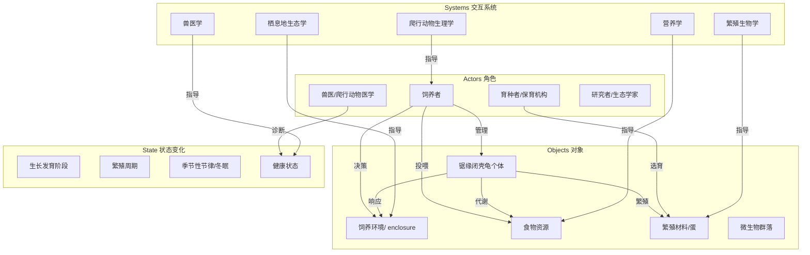
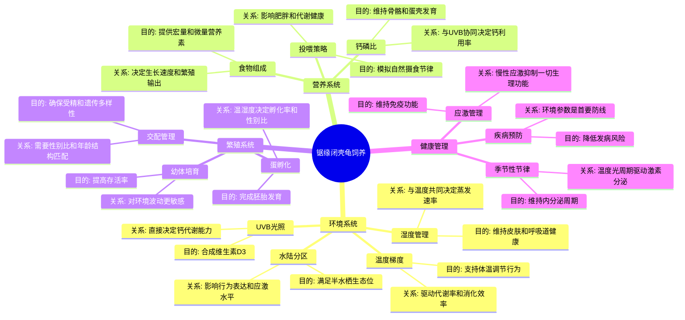
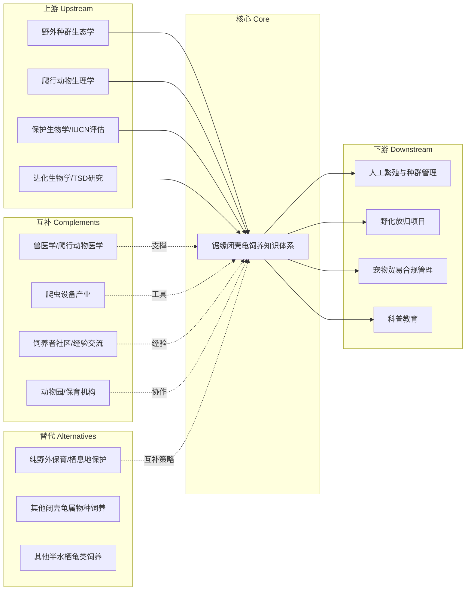

# 锯缘闭壳龟（*Cuora mouhotii*）饲养心智模型

> 本文档目标：帮助你建立关于锯缘闭壳龟饲养的 **心智模型** 与 **世界模型**，理解其背后的逻辑与决策框架，而非具体操作步骤。

---

## 1. 本质（Essence）

> **它究竟是什么？**
>
> 锯缘闭壳龟的饲养，本质上是在人工环境中**重建一个能支撑其完整生命史（摄食、生长、繁殖、休眠）的生态微系统**。

### 为什么它存在？

锯缘闭壳龟（*Cuora mouhotii*）是一种分布于中国南方及东南亚（缅甸、泰国、老挝、越南）的半水栖龟类（Ernst & Lovich, 2009; Zhou et al., 2020）。它的饲养需求存在，是因为：

- **生物体是环境的函数**：龟的生理状态（代谢、免疫、繁殖）直接由环境参数（温度、湿度、光照、食物组成）决定（Huey & Stevenson, 1979; Bennett & Ruben, 1979）。
- **人工环境 ≠ 自然环境**：圈养条件下，自然选择压力消失，饲养者必须**替代自然选择**，提供恰当的生态位（Mader et al., 2016）。
- **闭壳龟属的特殊性**：它们既非纯水龟也非纯陆龟，而是"林下溪流边缘"物种，需要同时满足水、陆、植被三重需求（Zhou et al., 2020; Ernst & Lovich, 2009）。

### 它解决什么根本问题？

**信息不对称问题**——在野外，龟通过本能选择微环境；在人工环境中，饲养者必须代替龟做出所有环境决策。这套知识体系解决的就是"如何做出正确决策"。

### 没有它时，人们通常怎么办？

- 凭直觉喂养（喂剩饭、单一食物）→ 代谢性骨病（MBD）、营养不良（Mader et al., 2016; Divers & Mader, 2019）
- 忽略微气候分区 → 应激、拒食、呼吸道感染（Mader et al., 2016）
- 不理解繁殖生物学 → 无法孵化、近交退化（Ewert et al., 2004; IUCN, 2023）

### 它带来了哪些新的可能？

- 从"养活"到"养好"：实现人工种群的长期稳定繁殖
- 从个体饲养到种群管理：建立谱系记录、遗传多样性管理
- 从消费到保育：参与濒危物种的迁地保护

---

## 2. 世界模型（World Model）



### 核心对象

| 对象 | 说明 |
|------|------|
| **龟个体** | 具有年龄、性别、健康状态、遗传背景的生物学实体 |
| **饲养环境** | 由温度梯度、湿度梯度、UVB光照、水陆比例构成的物理空间 |
| **食物资源** | 动物性蛋白 + 植物性物质 + 钙磷补充的动态组合 |
| **繁殖材料** | 交配后的受精卵，需要特定温湿度条件完成胚胎发育 |
| **微生物群落** | 肠道菌群 + 环境微生物，影响消化与免疫 |

### 关键状态变化

1. **个体发育**：幼体 → 亚成体 → 成体（约5-7年性成熟）
2. **年度周期**：活跃期（春夏）→ 摄食高峰期 → 繁殖期 → 降温和休眠期（秋冬）
3. **繁殖周期**：交配 → 卵泡发育 → 产蛋 → 孵化 → 幼体出壳

### 创造的价值

- **保育价值**：锯缘闭壳龟在IUCN红色名录中列为濒危（Endangered）物种，人工饲养是迁地保护的重要手段（IUCN, 2023; Asian Turtle Trade Working Group, 2000）
- **教育价值**：理解爬行动物生态学的活体窗口
- **科研价值**：为野外种群恢复提供繁殖技术和遗传管理基础（IUCN, 2023; Zhou et al., 2020）

---

## 3. 概念地图（Concept Map）



### 概念间的关键关系

| 概念A | 概念B | 关系类型 | 说明 |
|-------|-------|---------|------|
| 温度 | 代谢率 | 因果 | 爬行动物是变温动物，体温=环境温度，直接决定生化反应速率（Huey & Stevenson, 1979; Bennett & Ruben, 1979） |
| UVB | 钙代谢 | 协同 | UVB合成D3 → 肠道吸收钙 → 骨骼/蛋壳矿化（Holick, 1981; Mader et al., 2016） |
| 湿度 | 呼吸道健康 | 因果 | 过低→黏膜干燥→感染；过高→真菌滋生（Mader et al., 2016） |
| 食物组成 | 繁殖输出 | 因果 | 蛋白质和钙的充足程度直接决定卵泡数量和蛋壳质量（Mader et al., 2016） |
| 温度（孵化）| 性别比 | 因果 | TSD（温度依赖性别决定）：高温→雌性，低温→雄性（Ewert et al., 2004; Bull, 1980） |
| 应激 | 免疫功能 | 抑制 | 皮质醇升高→免疫抑制→疾病易感性增加（Romero, 2004; Mader et al., 2016） |

---

## 4. 决策地图（Decision Map）

### 场景1：环境搭建

```
Situation: 准备为锯缘闭壳龟搭建饲养环境
    ↓
Decision: 设计温度梯度（冷端22-24°C → 热端28-30°C）+ 湿度分区（60-80%）
    ↓
Reason: 龟需要通过行为性体温调节（behavioral thermoregulation）来维持最佳体温；
        梯度比恒温更重要，因为龟会主动选择微环境（Huey & Stevenson, 1979;
        Mader et al., 2016）
    ↓
Expected Outcome: 龟能自主调节体温，消化效率最优，应激最小化
```

### 场景2：食物选择

```
Situation: 日常投喂，不确定该喂什么
    ↓
Decision: 以动物性蛋白为主（昆虫、蠕虫、少量鱼虾）+ 植物性补充（叶菜、水果）
         + 定期钙粉补充
    ↓
Reason: 锯缘闭壳龟是杂食性偏肉食，幼体更偏肉食，成体植物比例增加；
        钙磷比需达到1.5:1以上，否则MBD风险极高
    ↓
Expected Outcome: 生长速率正常，骨骼发育良好，繁殖期能产出高质量蛋
```

### 场景3：繁殖决策

```
Situation: 成体龟出现交配行为，雌龟开始掘洞
    ↓
Decision: 准备产卵场（松软基质深度>15cm）→ 取出蛋 → 孵化介质设定28-30°C/湿度80-90%
    ↓
Reason: 自然条件下雌龟选择特定湿度的松软土壤产蛋；
        孵化温度决定性别（TSD机制），28.5°C附近为临界温度
        （Ewert et al., 2004; Bull, 1980; Janzen, 1994）
    ↓
Expected Outcome: 孵化率>80%，获得目标性别比例的幼体
```

### 场景4：季节性管理

```
Situation: 进入秋冬，环境温度下降，龟活动减少、拒食
    ↓
Decision: 逐步降温（每周降2°C）→ 停食清肠 → 维持冬眠温度（10-15°C）→ 春季逐步回温
    ↓
Reason: 锯缘闭壳龟在野外有冬眠节律；人工维持冬眠对繁殖周期和内分泌健康必要；
        冬眠前必须清肠，否则残留食物发酵导致肠炎
    ↓
Expected Outcome: 维持正常内分泌周期，来年繁殖成功率提高
```

### 场景5：健康异常

```
Situation: 龟出现浮水、张嘴呼吸、口鼻有分泌物
    ↓
Decision: 立即隔离 → 升温至30-32°C（支持免疫）→ 就医（爬行动物兽医）
    ↓
Reason: 这些是呼吸道感染的典型症状；升温是最紧急的支持性治疗，
        但爬行动物疾病进展快，需要专业诊断和抗生素治疗
    ↓
Expected Outcome: 早期干预存活率高；延误则可能发展为肺炎，致死率高
```

### 场景6：幼体培育

```
Situation: 刚孵化的幼体，脐带未完全吸收
    ↓
Decision: 不移动 → 等待卵黄完全吸收（3-7天）→ 提供高湿度小空间 → 开始投喂小型活饵
    ↓
Reason: 幼体出壳后卵黄囊提供初始营养，过早移动可能损伤脐带导致感染；
        幼体脱水速度远快于成体，高湿度是存活关键
    ↓
Expected Outcome: 幼体顺利过渡到独立摄食，第一年存活率>90%
```

---

## 5. 搜索空间扩展（Search Space Expansion）

### 你不知道自己不知道的问题

| 维度 | 初学者通常不会想到 | 专家真正关心 |
|------|-------------------|-------------|
| **微生物** | "环境干净就好" | 肠道菌群建立、益生菌补充、环境微生物多样性 |
| **光照光谱** | "有光就行" | UVB波长（290-315nm）、UVA/UVB比例、灯管衰减周期 |
| **基质化学** | "铺点土就行" | 基质pH、保水性、是否含尖锐颗粒、是否支持微生物活动 |
| **遗传管理** | "有公有母就能繁殖" | 近交系数、谱系记录、有效种群大小（Ne） |
| **行为丰容** | "有吃有喝就行" | 觅食行为表达、探索刺激、社会结构、领地行为 |
| **孵化物理** | "温度够就能孵" | 孵化介质含水量（影响蛋内水分交换）、气体交换（O₂/CO₂） |
| **TSD机制** | "性别由基因决定" | 温度依赖性别决定（TSD）、敏感期、温度波动的影响 |
| **冬眠生理** | "冬天让它睡就行" | 冬眠前脂肪储备、清肠时机、冬眠期间水分流失监测 |
| **应激阈值** | "不碰它就没事" | 慢性低水平应激的累积效应、环境变化频率的耐受阈值 |
| **物种特异性** | "龟都差不多" | 闭壳龟属内不同种的微生态位差异、杂交风险 |

### 决定这个领域上限的关键问题

1. **如何量化"福利"？** —— 目前缺乏爬行动物福利的客观指标
2. **人工种群如何维持遗传多样性？** —— 小种群管理是保育的核心挑战
3. **冬眠的精确生理机制是什么？** —— 理解冬眠调控才能优化人工冬眠方案
4. **肠道菌群与健康的因果关系？** —— 微生物组研究在爬行动物中仍处早期
5. **TSD的温度敏感窗口有多精确？** —— 气候变化对野外种群的性别比影响

---

## 6. 生态系统（Ecosystem）



### 关键关系说明

| 关系 | 说明 |
|------|------|
| 野外生态学 → 饲养 | 野外研究揭示微栖息地参数，指导人工环境设计 |
| 生理学 → 饲养 | 理解代谢、内分泌、繁殖机制，指导温度/光照/营养管理 |
| 饲养 → 人工繁殖 | 饲养知识是人工繁殖的前提 |
| 人工繁殖 → 野化放归 | 人工种群是野外种群恢复的种源 |
| 兽医学 ↔ 饲养 | 疾病诊断治疗与预防管理互为补充 |
| 设备产业 → 饲养 | UVB灯、温控器、孵化器等设备使精确环境控制成为可能 |

---

## 7. 可迁移原则（Transferable Principles）

### 第一性原理（长期稳定）

| 原理 | 说明 |
|------|------|
| **变温动物的热生物学** | 爬行动物的代谢率、消化效率、免疫功能直接由环境温度决定。这条原则适用于所有爬行动物（Huey & Stevenson, 1979; Bennett & Ruben, 1979）。 |
| **行为性体温调节** | 动物需要温度梯度而非恒温，因为它们通过行为选择微环境。提供梯度是基本福利（Huey & Stevenson, 1979; Mader et al., 2016）。 |
| **钙-维生素D3-UVB三角** | 没有UVB就没有D3合成，没有D3就没有钙吸收。这是所有日行性爬行动物的刚性需求（Holick, 1981; Mader et al., 2016）。 |
| **环境-免疫-应激三角** | 环境参数偏离最适范围 → 应激 → 皮质醇升高 → 免疫抑制。所有动物通用，爬行动物尤为敏感（Romero, 2004; Dhabhar, 2014）。 |
| **TSD（温度依赖性别决定）** | 许多龟类的后代性别由孵化温度决定，而非遗传。这是龟类繁殖生物学的核心特征（Bull, 1980; Ewert et al., 2004）。 |

### 可迁移的方法论

| 方法论 | 适用范围 |
|--------|---------|
| **梯度设计思维** | 不只温度——湿度、光照、空间都应提供梯度，让动物自主选择 |
| **物种生态位还原** | 研究野外微栖息地参数，作为人工环境设计的基准 |
| **预防优于治疗** | 环境参数是最第一道防线；疾病往往是环境问题的结果 |
| **生命周期思维** | 不同发育阶段需求不同，管理策略必须随阶段调整 |
| **系统耦合思维** | 温度-湿度-光照-营养-微生物是耦合系统，改变一个参数会影响其他 |

### 当前实现细节（容易变化）

| 细节 | 为什么容易变化 |
|------|--------------|
| 具体温度数值（如"28°C"） | 来自有限研究，可能因个体差异、海拔来源不同而调整 |
| 特定品牌设备推荐 | 设备技术快速迭代 |
| 特定食物配方 | 营养学研究在进展，新食物资源不断被发现 |
| 孵化介质配方 | 经验性知识，不同孵化者有不同成功方案 |

---

## 8. 最小心智模型（Minimum Mental Model）

> 如果只能记住 **15 个概念**，按重要性排序：

| 排名 | 概念 | 为什么重要 |
|------|------|-----------|
| 1 | **变温性（Ectothermy）** | 一切饲养决策的起点：温度=代谢=生命 |
| 2 | **温度梯度** | 不是"设定温度"，而是"提供选择" |
| 3 | **UVB-钙-D3三角** | 没有这个三角，一切营养努力都白费 |
| 4 | **半水栖生态位** | 理解它"是什么"决定了环境设计的基本框架 |
| 5 | **杂食性（幼体偏肉食）** | 食物组成的基本原则 |
| 6 | **钙磷比（>1.5:1）** | 骨骼和蛋壳健康的定量指标 |
| 7 | **TSD（温度依赖性别决定）** | 繁殖的核心机制，孵化温度的意义 |
| 8 | **冬眠节律** | 年度周期的关键阶段，影响全年繁殖成功 |
| 9 | **应激-免疫轴** | 理解"为什么龟会生病"的核心逻辑 |
| 10 | **行为性体温调节** | 理解龟的行为（晒背、躲藏、泡水）的意义 |
| 11 | **湿度-呼吸健康** | 湿度管理的生理学基础 |
| 12 | **孵化介质含水量** | 蛋内水分交换决定胚胎存活 |
| 13 | **幼体-成体需求差异** | 不同阶段需要不同管理策略 |
| 14 | **清肠-冬眠安全** | 冬眠前不排空肠道=致命风险 |
| 15 | **遗传多样性** | 人工种群长期存续的关键 |

---

## 9. 常见误区（Common Misconceptions）

### 误区1：「龟不需要晒太阳，有灯就行」

- **误解来源**：将"光照"等同于"照明"
- **准确模型**：需要的是特定波长（290-315nm UVB）的紫外线，普通LED/节能灯不含UVB（Holick, 1981; Mader et al., 2016）。且灯管会衰减，6-12个月需更换。距离也关键——UVB强度随距离平方衰减（Ferguson et al., 2002）。

### 误区2：「喂龟粮就够了」

- **误解来源**：商业龟粮的营养设计多针对水龟（如巴西龟），不一定匹配锯缘闭壳龟的需求
- **准确模型**：需要多样化的食物来源模拟自然食谱。单一食物=营养不均衡。钙磷比是核心指标，多数商业粮磷偏高。

### 误区3：「温度高点低点没关系」

- **误解来源**：人类是恒温动物，对温度波动的生理后果缺乏直觉
- **准确模型**：对变温动物而言，温度=生化反应速率。低5°C可能意味着消化完全停止、免疫应答延迟数天。温度不是"舒适度"问题，是"生死"问题。

### 误区4：「冬眠就是让它睡觉，不用管」

- **误解来源**：将冬眠等同于"不动"
- **准确模型**：冬眠是主动的生理过程，需要精确的温度控制、冬眠前的脂肪储备和肠道清空。温度过高→消耗过大→死亡；温度过低→冻伤。期间仍需监测体重和水分。

### 误区5：「孵化温度差不多就行」

- **误解来源**：不了解TSD机制
- **准确模型**：孵化温度不仅决定孵化率，还决定性别。28.5°C附近是性别转换临界点。±1°C的偏差可能导致全雄或全雌（Ewert et al., 2004; Bull, 1980; Janzen, 1994）。且温度波动模式也影响发育（Shine, 2004）。

### 误区6：「水盆放着就行，龟会自己喝」

- **误解来源**：认为龟能从水盆中获取足够水分
- **准确模型**：锯缘闭壳龟主要通过泡水和食物获取水分，但也需要环境湿度来减少蒸发失水。水质同样重要——氯、重金属、细菌污染都会影响健康。

### 误区7：「公母各一只就能繁殖」

- **误解来源**：将繁殖简化为"有公有母"
- **准确模型**：还需要——性成熟年龄匹配、体型兼容、交配行为触发条件（温度/光周期）、合适的产卵场所、正确的孵化条件。且近亲繁殖会导致后代畸形和存活率下降。

---

## 10. 总结（Summary）

> 我真正获得的不是 **一份养龟指南**，
> 而是 **理解一个完整生态微系统如何运转的思维框架** ——
> 从变温动物的热生物学出发，通过温度梯度、UVB-钙代谢、TSD性别决定等核心机制，
> 建立起"环境即处方"的决策模型：
> **每一个饲养决策，本质上都是在回答"这个参数是否支撑了它的完整生命史"。**

---

## 附录：核心参数速查

| 参数 | 范围 | 备注 |
|------|------|------|
| 环境温度（冷端） | 22-24°C | 提供行为选择空间 |
| 环境温度（热端） | 28-30°C | 晒点可略高 |
| 环境湿度 | 60-80% | 需要干湿分区 |
| UVB | 290-315nm | 灯管距离<30cm，6-12月更换 |
| 食物钙磷比 | >1.5:1 | 定期补充钙粉 |
| 冬眠温度 | 10-15°C | 必须清肠后进入 |
| 孵化温度 | 28-30°C | ~28.5°C为性别临界点 |
| 孵化湿度 | 80-90% | 介质含水量~10-15% |
| 水盆 | 浅水，可轻松进出 | 定期换水 |

---

*本文档基于爬行动物生理学、生态学和保育生物学的一般原理编写。具体参数可能因个体来源（海拔、亚种）和最新研究而有所调整。建议结合最新文献和专业兽医指导进行实践。*

---

## 参考文献（References）

### 分类学与物种生物学

- Ernst, C. H., & Lovich, J. E. (2009). *Turtles of the United States and Canada* (2nd ed.). Johns Hopkins University Press.
- Zhou, T., Shi, H., & Murphy, R. W. (2020). Phylogeny, taxonomy and biogeography of the genus *Cuora* (Testudines: Geoemydidae). *Zoological Research*, 41(3), 231–243.
- Asian Turtle Trade Working Group. (2000). *Cuora mouhotii*. The IUCN Red List of Threatened Species 2000: e.T6010A189458028.

### 爬行动物生理学与热生物学

- Huey, R. B., & Stevenson, R. D. (1979). Integrating thermal physiology and ecology of ectotherms: A discussion of approaches. *American Zoologist*, 19(1), 357–366.
- Bennett, A. F., & Ruben, J. A. (1979). Endothermy and activity in vertebrates. *Science*, 204(4399), 1458–1463.

### 爬行动物医学

- Mader, D. R., Divers, S. J., & Iglauer, K. (Eds.). (2016). *Mader's Reptile and Amphibian Medicine and Surgery* (3rd ed.). Elsevier.
- Divers, S. J., & Mader, D. R. (Eds.). (2019). *Reptile Medicine and Surgery in Clinical Practice*. CRC Press.

### 维生素D3与钙代谢

- Holick, M. F. (1981). The cutaneous photosynthesis of previtamin D3: A unique photochemical process. *Photochemistry and Photobiology*, 34(6), 673–676.
- Ferguson, G. W., Gehrmann, H. A., & Chen, T. C. (2002). Photobiochemistry of vitamin D and its implications for the health of captive reptiles. In *Proceedings of the Association of Reptilian and Amphibian Veterinarians*.

### 温度依赖性别决定（TSD）

- Bull, J. J. (1980). Sex determination in reptiles. *The Quarterly Review of Biology*, 55(1), 3–21.
- Ewert, M. A., Etchberger, J. M., & Nelson, C. E. (2004). Temperature-dependent sex determination in turtles. In *Turtles: Biology, Conservation, and Husbandry* (pp. 275–294). Johns Hopkins University Press.
- Janzen, F. J. (1994). Climate change and temperature-dependent sex determination in an endangered reptile, the painted turtle (*Chrysemys picta*). *Proceedings of the National Academy of Sciences*, 91(16), 7487–7490.
- Shine, R. (2004). Does fluctuating incubation temperature alter phenotypes of hatchling reptiles? *Physiological and Biochemical Zoology*, 77(3), 420–431.

### 应激生理学

- Romero, L. M. (2004). Physiological stress in ecology: Lessons from biomedical systems. *Trends in Ecology & Evolution*, 19(5), 249–255.
- Dhabhar, F. S. (2014). Effects of stress on immune function: The good, the bad, and the beautiful. *Immunologic Research*, 58(2–3), 193–210.

### 保育与种群管理

- IUCN. (2023). *Cuora mouhotii*. The IUCN Red List of Threatened Species 2023: e.T6010A189458028. https://doi.org/10.2305/IUCN.UK.2023-1.RLTS.T6010A189458028.en
- van Dijk, P. P., Iverson, J. B., Shaffer, H. B., Bour, R., & Rhodin, A. G. J. (Eds.). (2017). *Turtles of the World: Annotated Checklist and Atlas of Taxonomy, Synonymy, Distribution, and Conservation Status* (8th ed.). Chelonian Research Foundation.

### 冬眠与繁殖生物学

- Costanzo, J. P., & Lee, R. E. (2008). Physiology of freezing in the painted turtle, *Chrysemys picta*. *Journal of Experimental Biology*, 211(15), 2430–2437.
- Obbard, M. E. (1991). Reproduction in the painted turtle (*Chrysemys picta*). In *Freshwater Turtles of Canada* (pp. 55–71). Ontario Ministry of Natural Resources.
