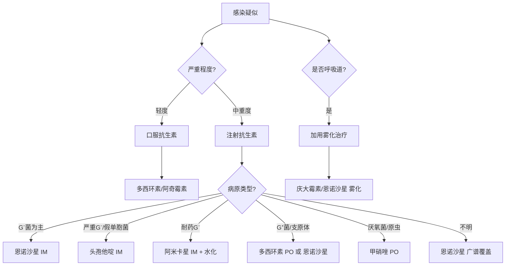
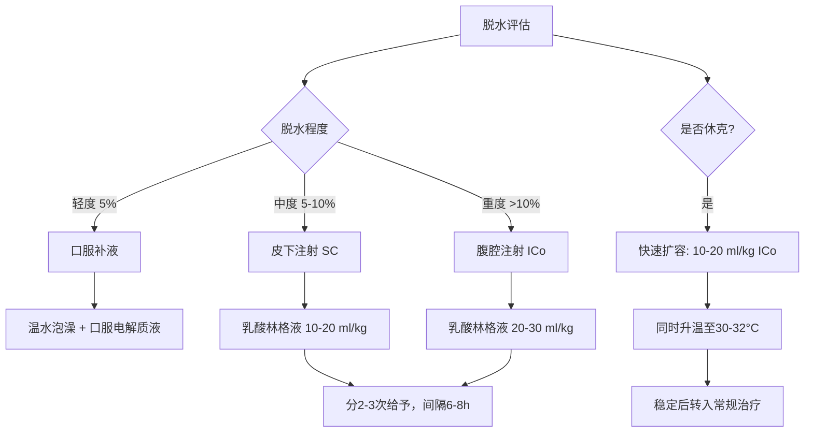

# 锯缘闭壳龟（*Cuora mouhotii*）用药参考手册

> 本文档系统梳理锯缘闭壳龟常见疾病的雾化治疗方案与日常用药参考。
>
> **重要声明**：
> - 爬行动物药代动力学（PK）数据远不如哺乳动物完善，许多剂量来源于经验性用药（empirical dosing）和种间外推（allometric scaling）（Mader et al., 2016）。
> - **所有药物使用必须在具有爬行动物医学资质的兽医指导下进行。**
> - 本文档为知识框架参考，不替代临床处方。

---

## 目录

1. [雾化治疗（Nebulization Therapy）](#1-雾化治疗nebulization-therapy)
2. [抗生素用药参考](#2-抗生素用药参考)
3. [抗真菌用药参考](#3-抗真菌用药参考)
4. [抗寄生虫用药参考](#4-抗寄生虫用药参考)
5. [止痛与抗炎药物](#5-止痛与抗炎药物)
6. [营养补充与代谢调节](#6-营养补充与代谢调节)
7. [消化系统用药](#7-消化系统用药)
8. [急救与支持治疗用药](#8-急救与支持治疗用药)
9. [用药核心原则](#9-用药核心原则)
10. [药物速查表](#10-药物速查表)
11. [参考文献](#11-参考文献)

---

## 1. 雾化治疗（Nebulization Therapy）

### 1.1 雾化的原理与意义

雾化治疗（nebulization）是将药物溶液转化为微小气溶胶颗粒（1-5 μm），通过呼吸道吸入到达肺部及支气管表面的局部给药方式。

**为什么雾化在爬行动物中特别重要？**

- 爬行动物肺部的解剖结构特殊（非肺泡结构，而是 faveolar 结构），全身性抗生素到达肺部的浓度可能有限（Mader et al., 2016）
- 雾化可使药物**直接作用于感染部位**，局部浓度高、全身副作用小
- 同时起到**呼吸道湿化**作用，有助于稀释和排出分泌物
- 对于肝功能可能受损的个体，雾化可**绕过肝脏首过效应**

### 1.2 雾化设备选择

| 设备类型 | 适用性 | 说明 |
|---------|-------|------|
| **压缩式雾化器**（jet nebulizer） | ✅ 推荐 | 颗粒大小合适（2-5 μm），性价比高 |
| **超声雾化器** | ✅ 可用 | 颗粒更细（1-3 μm），适合下呼吸道 |
| **网筛式雾化器**（mesh nebulizer） | ✅ 可用 | 便携、安静，但部分型号颗粒偏大 |
| 蒸汽加湿器 | ❌ 不适用 | 颗粒太大（>10 μm），无法到达肺部 |

**关键参数**：颗粒直径（MMAD）应在 **1-5 μm** 范围内。> 5 μm 的颗粒主要沉积在上呼吸道，< 1 μm 的颗粒会被呼出。

### 1.3 雾化容器

- 使用密闭的透明容器（如塑料饲养箱），大小以龟能舒适放置为宜
- 容器应留有少量通气孔，避免完全密封导致缺氧
- 容器底部不放水，龟直接放置在干燥容器中
- 每次雾化后将龟取出，放回正常饲养环境

### 1.4 雾化用药方案

#### 方案一：抗生素雾化（细菌性呼吸道感染）

| 药物 | 雾化液配制 | 单次用量 | 频次 | 疗程 | 适应症 |
|------|-----------|---------|------|------|-------|
| **庆大霉素**（Gentamicin） | 注射液直接用或生理盐水 1:1 稀释 | 5-10 mg/kg（按体重计算药液总量） | 每日 2 次 | 7-14 天 | 革兰氏阴性菌为主的感染 |
| **阿米卡星**（Amikacin） | 注射液 + 生理盐水稀释至总量 2-5 ml | 5-10 mg/kg | 每日 2 次 | 7-14 天 | 耐药革兰氏阴性菌 |
| **恩诺沙星**（Enrofloxacin） | 注射液 + 生理盐水稀释至总量 2-5 ml | 5 mg/kg | 每日 2 次 | 7-14 天 | 广谱，支原体 |
| **头孢他啶**（Ceftazidime） | 粉针用注射用水复溶后 + 生理盐水稀释 | 10-20 mg/kg | 每日 2 次 | 7-14 天 | 严重革兰氏阴性菌感染 |

> **配制说明**：雾化液的总体积通常为 **2-5 ml**（取决于容器大小和雾化器输出量）。药物剂量按龟的体重计算，然后将计算出的药量加入适量生理盐水至总体积。

#### 方案二：抗真菌雾化（真菌性呼吸道感染）

| 药物 | 雾化液配制 | 单次用量 | 频次 | 疗程 | 适应症 |
|------|-----------|---------|------|------|-------|
| **两性霉素B**（Amphotericin B） | 粉针用注射用水复溶 + 生理盐水稀释 | 0.5-1 mg/kg | 每日 1-2 次 | 14-30 天 | 深部真菌感染 |
| **氟康唑**（Fluconazole） | 注射液直接用 | 5-10 mg/kg | 每日 1-2 次 | 14-30 天 | 念珠菌等酵母菌 |
| **特比萘芬**（Terbinafine） | 片剂研磨后溶于少量生理盐水 | 5-10 mg/kg | 每日 2 次 | 14-30 天 | 丝状真菌 |

#### 方案三：联合雾化（细菌+真菌混合感染或不明病原）

| 组合 | 说明 |
|------|------|
| 庆大霉素 + 两性霉素B | 可同时覆盖细菌和真菌，分别配制后混合 |
| 恩诺沙星 + 氟康唑 | 广谱抗菌 + 抗酵母菌 |

#### 方案四：辅助雾化（非药物）

| 溶液 | 用途 | 说明 |
|------|------|------|
| **0.9% 生理盐水** | 呼吸道湿化 | 不含药物，纯粹湿化气道，稀释分泌物 |
| **乳酸林格液** | 呼吸道湿化 + 轻度补液 | 含电解质，可经呼吸道少量吸收 |
| **乙酰半胱氨酸**（NAC） | 黏液溶解 | 加入生理盐水中（浓度 3-5%），帮助稀释黏稠分泌物 |
| **地塞米松**（Dexamethasone） | 减轻气道炎症 | 0.5-1 mg 加入雾化液，短期使用（3-5天），减轻严重炎症 |

### 1.5 雾化操作流程

```
准备阶段
  ├── 称量龟体重（精确到克）
  ├── 计算药物剂量和雾化液总量
  ├── 配制雾化液（无菌操作）
  └── 将龟放入雾化容器

雾化阶段
  ├── 启动雾化器，持续 15-30 分钟
  ├── 观察龟的状态（有无应激、呼吸困难加重）
  ├── 如龟出现严重应激 → 立即停止
  └── 雾化结束后取出龟

后续处理
  ├── 清洗雾化容器和雾化器
  ├── 记录用药情况（药物、剂量、时间、龟的反应）
  └── 将龟放回温暖（28-30°C）、干燥的环境
```

### 1.6 雾化注意事项

| 注意事项 | 说明 |
|---------|------|
| **温度** | 雾化环境温度应维持在 28-30°C，低温会加重病情 |
| **应激监测** | 雾化过程中密切观察，严重应激反而抑制免疫 |
| **无菌操作** | 雾化液现配现用，配制过程注意无菌 |
| **疗程完整** | 即使症状改善也不应提前停药，防止耐药 |
| **联合全身用药** | 严重感染时，雾化应作为**辅助手段**，配合注射或口服全身性抗生素 |
| **药物配伍禁忌** | 氨基糖苷类（庆大/阿米卡星）与头孢类可在雾化液中混合；但避免将过多药物混合 |

---

## 2. 抗生素用药参考

### 2.1 常用抗生素速查

| 药物 | 给药途径 | 剂量 | 频次 | 疗程 | 主要适应症 | 注意事项 |
|------|---------|------|------|------|-----------|---------|
| **恩诺沙星**（Enrofloxacin） | IM/SC | 5-10 mg/kg | q24-48h | 7-14天 | 广谱G⁻/G⁺，支原体 | 注射部位可能疼痛；避免与含钙/铁同服 |
| 恩诺沙星 | PO（口服） | 5-10 mg/kg | q24h | 7-14天 | 同上 | 口服生物利用度因种而异 |
| **头孢他啶**（Ceftazidime） | IM/SC | 20 mg/kg | q72h | 7-14天 | 严重G⁻感染，假单胞菌 | 半衰期长，间隔给药 |
| **阿米卡星**（Amikacin） | IM/SC | 5-10 mg/kg | q48-72h | 7-14天 | 耐药G⁻菌 | **肾毒性**——必须确保充分水化 |
| **庆大霉素**（Gentamicin） | IM/SC | 2.5-5 mg/kg | q48-72h | 7-14天 | G⁻菌 | **肾毒性+耳毒性**——监测肾功能 |
| **甲硝唑**（Metronidazole） | PO | 20-50 mg/kg | q24-72h | 7-14天 | 厌氧菌，原虫（阿米巴、鞭毛虫） | 可能引起神经毒性（高剂量长期） |
| **多西环素**（Doxycycline） | PO | 5-10 mg/kg | q24-48h | 14-30天 | 支原体，衣原体，立克次体 | 与食物同服减少胃肠刺激 |
| **阿奇霉素**（Azithromycin） | PO | 5 mg/kg | q24-72h | 7-14天 | 支原体，G⁺/G⁻ | 爬行动物PK数据有限 |
| **马波沙星**（Marbofloxacin） | PO/IM | 2-5 mg/kg | q24-48h | 7-14天 | 广谱G⁻ | 恩诺沙星的升级版，组织穿透力更强 |

> **缩写说明**：IM = 肌肉注射；SC = 皮下注射；PO = 口服；q24h = 每24小时；q48h = 每48小时；q72h = 每72小时
>
> **G⁻ = 革兰氏阴性菌；G⁺ = 革兰氏阳性菌**

### 2.2 抗生素选择决策



### 2.3 注射部位选择

| 部位 | 说明 | 注意事项 |
|------|------|---------|
| **前肢/前部肌肉** | 胸肌或前肢大腿肌肉 | ✅ **推荐**——药物经前部静脉回流，减少肾脏首过 |
| **后肢/后部肌肉** | 后肢大腿肌肉 | ❌ **不推荐**——药物经肾门静脉（renal portal system）先到肾脏，增加肾毒性风险 |

> **关键原则**：爬行动物存在肾门静脉系统，后肢注射的药物会先经过肾脏再进入全身循环。因此，**所有注射都应选择身体前半部**（Mader et al., 2016）。

---

## 3. 抗真菌用药参考

| 药物 | 给药途径 | 剂量 | 频次 | 疗程 | 适应症 | 注意事项 |
|------|---------|------|------|------|-------|---------|
| **两性霉素B**（Amphotericin B） | IM | 0.5-1 mg/kg | q24-48h | 14-30天 | 深部真菌感染 | **肾毒性最强**——需充分水化，监测肾功能 |
| 两性霉素B | 雾化 | 0.5-1 mg/kg | q12-24h | 14-30天 | 呼吸道真菌 | 局部用药，全身吸收少 |
| **氟康唑**（Fluconazole） | PO | 5-10 mg/kg | q24-72h | 14-60天 | 念珠菌，隐球菌 | 相对安全，肝毒性较低 |
| **伊曲康唑**（Itraconazole） | PO | 5-10 mg/kg | q24h | 14-60天 | 丝状真菌，皮肤真菌 | 肝毒性——监测肝功能 |
| **特比萘芬**（Terbinafine） | PO | 5-10 mg/kg | q24-48h | 14-30天 | 皮肤真菌，丝状真菌 | 相对安全 |
| 特比萘芬 | 外用 | 乳膏直接涂抹 | q12-24h | 至痊愈 | 甲壳/皮肤浅表真菌 | 清创后涂抹 |
| **制霉菌素**（Nystatin） | PO | 100,000-200,000 IU/kg | q12-24h | 14-30天 | 消化道念珠菌 | 不吸收入血，仅肠道局部作用 |

---

## 4. 抗寄生虫用药参考

### 4.1 体内寄生虫

| 药物 | 靶标寄生虫 | 给药途径 | 剂量 | 频次 | 疗程 | 注意事项 |
|------|-----------|---------|------|------|------|---------|
| **芬苯达唑**（Fenbendazole） | 线虫、绦虫 | PO | 50-100 mg/kg | q24h | 3-5天，2周后重复 | 广谱驱虫首选；安全性高 |
| **甲苯咪唑**（Albendazole） | 线虫 | PO | 25-50 mg/kg | q24h | 3天 | 骨髓抑制风险（高剂量） |
| **甲硝唑**（Metronidazole） | 鞭毛虫、阿米巴 | PO | 20-50 mg/kg | q24-72h | 7-14天 | 原虫感染首选 |
| **伊维菌素**（Ivermectin） | 线虫、蜱虫 | SC/PO | 0.2 mg/kg | 单次，2周后重复 | 1-2次 | ⚠️ **龟类敏感**——部分个体可出现神经毒性；**不建议用于闭壳龟属**（个体耐受差异大） |
| **左旋咪唑**（Levamisole） | 线虫 | PO/IM | 10-20 mg/kg | 单次 | 1次，2周后重复 | 免疫刺激作用；数据有限 |
| **吡喹酮**（Praziquantel） | 绦虫、吸虫 | PO/IM | 5-10 mg/kg | 单次 | 1次，2周后重复 | 绦虫特效 |

### 4.2 体外寄生虫（蜱虫）

| 方法 | 说明 | 注意事项 |
|------|------|---------|
| **手动移除** | 镊子夹住口器基部，旋转拔出 | 勿残留口器；勿用火烧/涂油等偏方 |
| **伊维菌素药浴** | 0.025% 溶液浸泡 30 分钟 | 浓度必须精确；龟类敏感，风险较高 |
| **氟虫腈**（Fipronil）喷雾 | 稀释后喷洒体表 | **仅限陆龟**——水龟/半水栖龟避免使用（毒性风险） |
| **环境处理** | 彻底更换底材，环境清洁消毒 | 防止再感染 |

---

## 5. 止痛与抗炎药物

| 药物 | 类别 | 给药途径 | 剂量 | 频次 | 适应症 | 注意事项 |
|------|------|---------|------|------|-------|---------|
| **美洛昔康**（Meloxicam） | NSAIDs | PO/IM/SC | 0.1-0.5 mg/kg | q24-48h | 疼痛、炎症、术后 | 爬行动物最常用的NSAIDs；肾毒性——确保水化 |
| **卡洛芬**（Carprofen） | NSAIDs | PO/SC | 2-4 mg/kg | q24-72h | 疼痛、炎症 | 数据有限 |
| **地塞米松**（Dexamethasone） | 糖皮质激素 | IM/SC/PO | 0.5-2 mg/kg | 单次或q24-72h | 严重炎症、休克、过敏 | **免疫抑制**——仅在必要时短期使用；感染时须同时用抗生素 |
| **曲马多**（Tramadol） | 阿片类 | PO/IM | 5-10 mg/kg | q12-24h | 中重度疼痛 | 爬行动物口服生物利用度低；注射效果更好 |
| **丁丙诺啡**（Buprenorphine） | 阿片类 | IM/SC | 0.01-0.05 mg/kg | q24-72h | 中重度疼痛 | 长效；可能引起呼吸抑制 |
| **利多卡因**（Lidocaine） | 局麻药 | 局部 | 2-5 mg/kg | 单次 | 局部麻醉、清创止痛 | 避免过量——心脏毒性 |

---

## 6. 营养补充与代谢调节

| 药物/补充剂 | 适应症 | 给药途径 | 剂量 | 频次 | 注意事项 |
|------------|-------|---------|------|------|---------|
| **维生素A**（Vitamin A） | V-A缺乏（眼肿、呼吸道黏膜角化） | IM | 5,000-10,000 IU/kg | 单次，2-4周后评估是否重复 | **过量有毒**——不可频繁给药 |
| 维生素A | 预防 | PO | 混入食物 | 每周1-2次 | 通过食物补充更安全 |
| **维生素D3**（Vitamin D3） | MBD辅助治疗 | PO/IM | 50-100 IU/kg（口服）；500 IU/kg（注射） | q24h（口服）；单次（注射） | 注射剂量需精确——过量导致异位钙化 |
| **葡萄糖酸钙**（Calcium gluconate） | 低血钙、MBD急性期 | IM/SC/PO | IM: 10-50 mg/kg；PO: 100-200 mg/kg | q24-48h（IM）；每日（PO） | IM注射需缓慢；与UVB治疗同步 |
| **碳酸钙**（Calcium carbonate） | 日常钙补充 | PO（拌食） | 每次投喂撒粉 | 每次投喂 | 钙磷比调节的核心手段 |
| **降钙素**（Calcitonin） | MBD严重病例 | IM | 50-100 IU/kg | q24-48h × 3-5次 | 促进骨钙沉积；须先确保血钙不低 |
| **维生素B族**（Vitamin B complex） | 食欲恢复、神经功能 | IM/PO | 1-5 mg/kg | q24-72h | 水溶性，安全性高 |
| **维生素E**（Vitamin E） | 黄脂病、抗氧化 | PO/IM | 5-20 IU/kg | q24-48h | 脂溶性——避免长期过量 |
| **维生素K1**（Vitamin K1） | 凝血障碍 | IM/PO | 0.5-2.5 mg/kg | q12-24h | 出血性疾病辅助 |

---

## 7. 消化系统用药

| 药物 | 适应症 | 给药途径 | 剂量 | 频次 | 注意事项 |
|------|-------|---------|------|------|---------|
| **甲硝唑**（Metronidazole） | 厌氧菌感染、原虫性肠炎 | PO | 20-50 mg/kg | q48-72h | 爬行动物代谢慢，间隔长 |
| **芬苯达唑**（Fenbendazole） | 肠道线虫 | PO | 50-100 mg/kg | q24h × 3-5天 | 2周后重复一个疗程 |
| **蒙脱石散**（Smectite） | 腹泻（对症止泻） | PO | 0.5-1 g/kg | q12-24h | 吸附毒素；与其他药物间隔2小时 |
| **益生菌**（Probiotics） | 肠道菌群恢复 | PO | 按产品说明 | 每日 | 抗生素疗程后使用；帮助恢复消化功能 |
| **乳酶生** | 消化不良 | PO | 0.5-1 g/kg | q12h | 辅助消化 |
| **多潘立酮**（Domperidone） | 胃动力不足 | PO | 0.5-1 mg/kg | q12-24h | 促进胃排空 |

---

## 8. 急救与支持治疗用药

| 药物/方案 | 适应症 | 剂量/方法 | 说明 |
|----------|-------|----------|------|
| **乳酸林格液**（Lactated Ringer's） | 脱水、休克 | 10-30 ml/kg/天，分次给予 | 给药途径：PO（轻度）、SC（中度）、ICo（腹腔内，重度） |
| **葡萄糖溶液**（5% Dextrose） | 低血糖、能量支持 | SC: 5-10 ml/kg | 严重低血糖时可腹腔注射 |
| **肾上腺素**（Epinephrine） | 心脏骤停 | 0.1 mg/kg，IC（心内注射） | 仅用于心肺复苏 |
| **纳洛酮**（Naloxone） | 阿片类药物过量 | 0.1-0.5 mg/kg，IM | 逆转阿片类呼吸抑制 |
| **活性炭**（Activated charcoal） | 经口中毒 | 1-3 g/kg，PO | 吸附毒物；不适用于腐蚀性毒物 |
| **维生素C**（Vitamin C） | 应激支持、抗氧化 | 10-50 mg/kg | PO或注射；减轻氧化应激 |

### 补液方案详解



---

## 9. 用药核心原则

### 9.1 爬行动物药理学特殊性

| 原则 | 说明 | 来源 |
|------|------|------|
| **变温动物代谢特点** | 体温决定代谢速率 → 药物代谢速率也受温度影响。低温时药物半衰期延长，需调整给药间隔 | Huey & Stevenson, 1979 |
| **肾门静脉系统** | 后肢/尾部注射的药物经肾门静脉先到肾脏 → 增加肾毒性。**所有注射选前半身** | Mader et al., 2016 |
| **PK数据匮乏** | 大多数药物的爬行动物PK数据来自少量研究或种间外推 → 经验性用药为主 | Divers & Mader, 2019 |
| **肝功能差异** | 爬行动物肝脏代谢酶活性与哺乳动物不同 → 某些药物代谢途径和半衰期差异大 | Mader et al., 2016 |
| **排泄途径** | 爬行动物以尿酸为主要含氮废物 → 肾脏负担重 → 肾毒性药物需格外谨慎 | Divers, 2005 |

### 9.2 用药安全清单

在给予任何药物前，确认以下事项：

- [ ] **准确称重**：剂量基于体重，必须精确到克
- [ ] **正确计算**：mg/kg × 体重(kg) = 实际用药量(mg)；再根据药物浓度换算体积(ml)
- [ ] **注射部位**：选择身体前半部（前肢/胸部肌肉）
- [ ] **水化状态**：使用肾毒性药物（氨基糖苷类、两性霉素B）前必须确保充分水化
- [ ] **药物有效期**：检查药物是否过期
- [ ] **配伍禁忌**：确认混合用药无禁忌
- [ ] **温度支持**：用药期间维持环境温度在最适范围上限（28-30°C）
- [ ] **记录**：记录每次用药的时间、剂量、途径和龟的反应

### 9.3 绝对禁忌

| 禁忌 | 原因 |
|------|------|
| **后肢/尾部注射** | 肾门静脉系统导致药物先到肾脏，增加肾毒性 |
| **伊维菌素用于闭壳龟属** | 个体耐受差异极大，神经毒性风险高 |
| **含磷钙补充剂用于MBD** | 磷会拮抗钙吸收，MBD时应使用纯钙制剂 |
| **长期/高剂量糖皮质激素** | 免疫抑制 → 感染扩散 |
| **人用复方感冒药** | 含多种成分（伪麻黄碱、对乙酰氨基酚等），对龟有毒 |
| **酒精/碘酒直接接触伤口** | 组织毒性，延缓愈合——应使用碘伏（聚维酮碘） |

---

## 10. 药物速查表

### 按疾病快速查找

| 疾病 | 首选药物 | 备选药物 | 辅助治疗 |
|------|---------|---------|---------|
| **肺炎** | 恩诺沙星 IM 5-10 mg/kg q24-48h | 头孢他啶 IM 20 mg/kg q72h | 雾化（庆大霉素）；升温30-32°C |
| **上呼吸道感染** | 恩诺沙星 PO 5 mg/kg q24h | 多西环素 PO 5 mg/kg q24-48h | 雾化（生理盐水+抗生素） |
| **MBD** | 碳酸钙 PO + UVB | 葡萄糖酸钙 IM + 降钙素 | 维生素D3；升温促代谢 |
| **胃肠炎** | 甲硝唑 PO 20-50 mg/kg q48-72h | 恩诺沙星 PO | 蒙脱石散；益生菌；补液 |
| **肠道寄生虫** | 芬苯达唑 PO 50-100 mg/kg × 3-5天 | 吡喹酮（绦虫） | 2周后重复疗程 |
| **甲壳溃疡** | 局部碘伏 + 抗菌药膏 | 全身恩诺沙星 IM | 清创；干养 |
| **真菌感染** | 特比萘芬 外用/PO | 伊曲康唑 PO | 改善环境湿度 |
| **V-A缺乏** | 维生素A IM 5,000-10,000 IU/kg | 饮食调整 | 眼部局部清洗+抗生素膏 |
| **痛风** | 别嘌醇 PO + 补液 | 秋水仙碱 | 降低蛋白摄入；大量补液 |
| **卡蛋** | 催产素 IM + 补钙 | 手术 | 温水泡澡；提供产卵场 |
| **外伤/脓肿** | 外科清创 + 恩诺沙星 IM | 头孢他啶 IM | 碘伏消毒；美洛昔康止痛 |
| **脱水** | 乳酸林格液 SC/ICo | 口服补液 | 温水泡澡 |

### 家庭常备药物清单

| 类别 | 药物 | 用途 |
|------|------|------|
| **消毒** | 碘伏（聚维酮碘） | 伤口消毒、甲壳清创 |
| **消毒** | 氯己定溶液 | 环境消毒、皮肤清洗 |
| **外用** | 银磺嘧啶银霜 | 甲壳/皮肤抗感染 |
| **外用** | 特比萘芬乳膏 | 浅表真菌 |
| **外用** | 妥布霉素眼膏 | 眼部感染 |
| **口服** | 芬苯达唑 | 驱虫 |
| **口服** | 蒙脱石散 | 腹泻对症 |
| **口服** | 碳酸钙粉 | 日常钙补充 |
| **补充** | 维生素B族 | 食欲恢复 |
| **补充** | 益生菌 | 肠道恢复 |
| **补液** | 口服补液盐（ORS） | 轻度脱水 |
| **器械** | 压缩式雾化器 | 呼吸道治疗 |
| **器械** | 精密电子秤（0.1g） | 称体重计算剂量 |

---

## 11. 参考文献

### 爬行动物药理学

- Mader, D. R., Divers, S. J., & Iglauer, K. (Eds.). (2016). *Mader's Reptile and Amphibian Medicine and Surgery* (3rd ed.). Elsevier. — **第35-42章：药理学与治疗学**
- Divers, S. J., & Mader, D. R. (Eds.). (2019). *Reptile Medicine and Surgery in Clinical Practice*. CRC Press. — **Part III: Therapeutics**
- Girling, S. J., & Raiti, P. (Eds.). (2004). *BSAVA Manual of Reptiles* (2nd ed.). British Small Animal Veterinary Association.

### 雾化治疗

- McArthur, S., Wilkinson, R., & Gibbons, D. (Eds.). (2004). *Medicine and Surgery of Tortoises and Turtles*. Elsevier. — Chapter 15: Therapeutics
- Divers, S. J. (2004). Diagnostic and therapeutic techniques. In *Reptile Medicine and Surgery* (pp. 140–162). Elsevier.
- Hernandez-Divers, S. M., et al. (2005). Nebulization therapy in reptiles. *Journal of Exotic Pet Medicine*, 14(3), 166–173.

### 抗生素药代动力学

- Jacobson, E. R. (2007). Antimicrobial drug use in reptiles. In *Infectious Diseases and Pathology of Reptiles* (pp. 241–275). CRC Press.
- Whittaker, A. L., et al. (2020). Pharmacokinetics of antimicrobial agents in reptiles. *Journal of Veterinary Pharmacology and Therapeutics*, 43(5), 445–461.
- Martinez, M., et al. (2006). Fluoroquinolones in reptiles. *Compendium on Continuing Education for the Practicing Veterinarian*, 28(Suppl), 12–20.

### 爬行动物特殊生理学

- Huey, R. B., & Stevenson, R. D. (1979). Integrating thermal physiology and ecology of ectotherms. *American Zoologist*, 19(1), 357–366.
- Divers, S. J. (2005). Reptile renal disease. *Veterinary Clinics of North America: Exotic Animal Practice*, 8(1), 109–130.

---

*本文档为知识框架参考。爬行动物药理学数据仍在快速发展中，具体用药方案应由具有爬行动物医学资质的专业兽医根据个体情况、最新文献和药物敏感性试验结果制定。*
