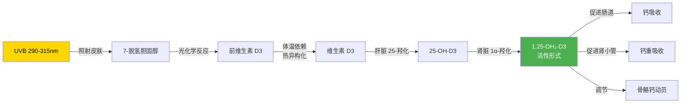

# 黄额/锯缘闭壳龟 — UV 灯具参数与选购准则

> **核心认知**：UV 灯具不是一个"买了就行"的配件，而是一个**需要匹配物种生态位的处方参数**。黄额和锯缘都是**林下/林缘物种**，不是沙漠晒背龟——用错参数（UVB 过强）和不用一样有害。

---

## 一、三种 UV 的本质区别

```
电磁波谱（与龟饲养相关的 UV 段）

100nm         280nm       315nm           400nm      700nm
  │             │           │               │          │
  ├─── UVC ────┼──── UVB ──┼──── UVA ──────┼── 可见光 ─┤
  │             │           │               │          │
  杀菌/破坏DNA   D3合成       行为/视觉       照明
  对龟有害       钙代谢瓶颈    食欲/节律
```

| 波段 | 波长 | 对龟的生理作用 | 是否需要提供 | 风险 |
|:---:|:---:|------|:---:|------|
| **UVC** | 100-280nm | 破坏 DNA/RNA（杀菌机制） | ❌ **绝对不需要** | 角膜灼伤、皮肤损伤、DNA 突变 |
| **UVB** | 280-315nm | 皮肤中 7-脱氢胆固醇 → 前维生素 D3 → D3 | ✅ **必须，但需匹配强度** | 过强→光角膜炎/应激；不足→MBD |
| **UVA** | 315-400nm | 龟可见 UVA（人类不可见）；调节行为、食欲、昼夜节律、繁殖信号 | ✅ **推荐** | 几乎没有风险 |

### UVC：为什么不需要且有害

| 要点 | 说明 |
|------|------|
| **自然暴露** | 大气臭氧层完全吸收 UVC，野生龟**终生不接触 UVC** |
| **市场产品** | 标称"全光谱含 UVC"的灯具是营销噱头或用于消毒场景，不是爬宠日常照明 |
| **伤害机制** | UVC 直接断裂 DNA 双链中的嘧啶二聚体 → 角膜上皮细胞坏死（光角膜炎）→ 皮肤表皮层损伤 |
| **判断标准** | 任何灯具如果声称输出 UVC → **不买** |

### UVB：钙代谢的瓶颈



**关键细节**：
- UVB 的**有效波段是 290-315nm**，不是所有标注"UVB"的灯都输出这个窄带
- D3 合成的**最佳波长在 295-300nm**（峰值 ~297nm），低于 290 或高于 315 效率急剧下降
- D3 合成需要**足够的体温**（> 25°C），冷龟即使有 UVB 也合成不了 D3
- **过强 UVB 会导致光降解**：前 D3 → 惰性代谢物（lumisterol/tachysterol），这是自然保护机制——不会"合成过量 D3"，但会浪费 UVB 效率

### UVA：被低估的行为调节器

| 作用 | 机制 | 影响 |
|------|------|------|
| **视觉** | 龟的四色视觉系统含 UVA 感受器（人类只有三色） | UVA 让龟"看到"更多——食物颜色更鲜艳、环境信息更丰富 |
| **食欲刺激** | UVA 暴露增加觅食行为和食物辨识度 | 无 UVA → 龟可能食欲下降、对新食物兴趣低 |
| **昼夜节律** | UVA 参与松果体褪黑素调节 | 影响活动-休息周期和季节性繁殖信号 |
| **社交/繁殖** | 许多龟的甲壳/皮肤在 UVA 下有荧光或反射信号 | 影响个体识别和求偶行为 |
| **不合成 D3** | UVA 波长不够短，无法触发 7-脱氢胆固醇光解 | UVA 不能替代 UVB |

**操作标准**：UVB 灯管通常同时输出 UVA（荧光粉配比决定）。选购时关注 UVA 占比，但**不要买"只有 UVA 没有 UVB"的灯**——那只是一个昂贵的紫光灯。

---

## 二、Ferguson Zone —— 物种匹配的定量框架

### 2.1 什么是 Ferguson Zone

Ferguson Zone 是由兽医学教授 Gary Ferguson 等人（2010）提出的爬行动物 UVB 需求分类系统，基于**野外紫外线暴露测量数据**，将爬行动物按自然栖息地的 UV 暴露水平分为 4 个区。

| Zone | 生态位描述 | UVB 强度（μW/cm²） | UVI（UV Index） | 代表物种 |
|:---:|------|:---:|:---:|------|
| **Zone 1** | 林下/洞穴/夜行 | 0-37 | 0-0.7 | 豹纹守宫、球蟒、**林下龟类** |
| **Zone 2** | 林缘/部分日晒/晨昏活动 | 37-87 | 0.7-1.6 | **箱龟属多数物种**、红耳龟 |
| **Zone 3** | 开阔地/充分日晒 | 87-290 | 1.6-5.5 | 陆龟（苏卡达、豹龟）、鬃狮蜥 |
| **Zone 4** | 正午烈日/沙漠 | 290-660 | 5.5-12.6 | 沙漠陆龟、变色龙（部分） |

### 2.2 黄额和锯缘的 Ferguson Zone 定位

```
黄额闭壳龟（C. galbinifrons）
  ├─ 生态位：热带/亚热带山地森林底层
  ├─ 光照环境：林冠遮蔽，仅有斑驳散射光（dappled light）
  ├─ 活动模式：晨昏为主，避免正午直射
  └─ Ferguson Zone：Zone 1（低限）~ Zone 2（高限）
     → 目标晒点 UVB：25-75 μW/cm²
     → 对应 UVI：~0.5-1.4

锯缘闭壳龟（C. mouhotii）
  ├─ 生态位：亚热带山地林缘溪流旁
  ├─ 光照环境：林缘半遮蔽，偶有直射光
  ├─ 活动模式：日间活动，会利用溪流边日晒斑块
  └─ Ferguson Zone：Zone 2
     → 目标晒点 UVB：37-87 μW/cm²
     → 对应 UVI：~0.7-1.6
```

**关键结论**：两者都属于 **Zone 1-2（低 UVB 需求）**，不是 Zone 3-4 的沙漠/开阔地物种。这是选购灯具的最重要参数。

### 2.3 用错 Zone 的后果

| 错误 | 后果 | 严重程度 |
|------|------|:---:|
| **Zone 3-4 灯具用于 Zone 1-2 物种** | UVB 过强 → 龟产生回避行为（躲藏/不入晒点）→ 实际获得的 UVB 反而更少；长期可致光角膜炎、皮肤色素沉着 | ⭐⭐⭐⭐ |
| **Zone 1 灯具用于 Zone 2 物种** | UVB 不足 → D3 合成不足 → 长期 MBD 风险 | ⭐⭐⭐⭐⭐ |
| **灯管距离过远** | UVB 强度按距离平方衰减 → 实际到达龟的 UVB 远低于标称 | ⭐⭐⭐⭐ |
| **灯管超期使用** | UVB 荧光粉衰减 → 灯仍亮但 UVB 输出已降至 50% 以下 | ⭐⭐⭐⭐⭐ |

---

## 三、灯具类型与参数

### 3.1 灯具类型对比

| 类型 | 管径 | UVB 输出 | UVA 输出 | 发热 | 适用场景 | 典型品牌 |
|------|:---:|:---:|:---:|:---:|------|------|
| **T8 荧光灯管** | 26mm | 低-中（5%/10%） | 中 | 低 | 标准饲养箱，Zone 1-2 物种 | Zoo-Med Reptisun、Arcadia |
| **T5 HO 荧光灯管** | 16mm | 中-高（6%/12%/14%） | 中-高 | 中 | 较深/较高饲养箱 | Arcadia ProT5、Zoo-Med Reptisun T5 HO |
| **节能灯（CFL）** | 螺旋/管状 | 低（5%/10%） | 低 | 低 | 小空间/临时方案 | Zoo-Med Reptisun CFL |
| **水银蒸汽灯（MVB）** | 灯泡型 | 高 | 高 | **高（兼做加热灯）** | 大型/高箱 | Arcadia D3+ Basking、Zoo-Med PowerSun |
| **LED（UV 专用）** | 芯片 | 可控 | 可控 | 极低 | 新技术，参数需精确标定 | 少量专业品牌 |

### 3.2 UVB 百分比的含义

灯具标注的"5%""10%""12%"是指**总光输出中 UVB 所占的比例**，不是绝对强度。

| 标注 | 含义 | 适用 Zone | 适合黄额/锯缘？ |
|:---:|------|:---:|:---:|
| **2%** | 极低 UVB | Zone 1 | ⚠️ 可能不足（除非距离很近） |
| **5%** (T8) | 低 UVB | Zone 1-2 | ✅ **推荐（T8 首选）** |
| **6%** (T5 HO) | 低-中 UVB | Zone 1-2 | ✅ **推荐（T5 首选）** |
| **10%** (T8) | 中 UVB | Zone 2-3 | ⚠️ 对 Zone 1 物种可能过强 |
| **12%** (T5 HO) | 高 UVB | Zone 3 | ❌ 对黄额/锯缘**过强** |
| **14%** (T5 HO) | 极高 UVB | Zone 3-4 | ❌ **远超出需求** |

### 3.3 距离与 UVB 衰减

UVB 强度遵循**平方反比定律**：距离翻倍，强度降至 1/4。

| 距离变化 | 强度变化 | 实操含义 |
|---------|---------|---------|
| 15cm → 30cm | 降至 ~25% | 同一灯管，距离从 15cm 移到 30cm，UVB 只剩 1/4 |
| 20cm → 40cm | 降至 ~25% | 高箱（40cm+）必须用更强灯管或更近 |
| 30cm → 60cm | 降至 ~25% | 大缸顶部安装 → 底部几乎无 UVB |

**这意味着**：灯管标注的"UVB 5%"不等于龟实际接收到的 UVB 5%——**距离决定了最终剂量**。

### 3.4 针对黄额/锯缘的推荐参数

| 参数 | 黄额（Zone 1-2 低限） | 锯缘（Zone 2） |
|------|:---:|:---:|
| **T8 推荐** | 5% UVB | 5% 或 10% UVB |
| **T5 HO 推荐** | 6% UVB | 6% UVB |
| **CFL 推荐** | 5% UVB | 5-10% UVB |
| **水银蒸汽灯** | ❌ 通常过强（除非大型高箱+远距离） | ⚠️ 需确认距离后 UVB ≤ 87 μW/cm² |
| **晒点距离** | 25-30cm | 25-35cm |
| **晒点 UVB 实测目标** | 25-75 μW/cm² | 37-87 μW/cm² |
| **光周期** | 10-12h/天 | 10-12h/天（夏季可 12-14h） |
| **更换周期** | **≤ 12 个月** | **≤ 12 个月** |
| **UVA 占比** | 灯具自然伴随输出（通常 15-30%） | 同左 |

---

## 四、市场主流产品评价

### 4.1 产品速查表

| 品牌/产品 | 类型 | UVB% | UVA | 距晒点建议 | 适合黄额？ | 适合锯缘？ | 更换周期 |
|----------|:---:|:---:|:---:|:---:|:---:|:---:|:---:|
| **Zoo-Med Reptisun 5.0** | T8 | 5% | ✅ | 15-30cm | ✅✅ 首选 | ✅ | 6-12 月 |
| **Zoo-Med Reptisun 10.0** | T8 | 10% | ✅ | 30-45cm | ⚠️ 距离拉远可用 | ✅ | 6-12 月 |
| **Zoo-Med Reptisun T5 HO 6%** | T5 HO | 6% | ✅ | 20-35cm | ✅✅ 首选 | ✅✅ | 12 月 |
| **Zoo-Med Reptisun T5 HO 12%** | T5 HO | 12% | ✅ | 45-60cm | ❌ 过强 | ❌ 过强 | 12 月 |
| **Arcadia D3 6%** | T8 | 6% | ✅ | 20-30cm | ✅ | ✅ | 12 月 |
| **Arcadia ProT5 6%** | T5 HO | 6% | ✅✅ | 25-35cm | ✅✅ | ✅✅ | 12 月 |
| **Arcadia ProT5 12%** | T5 HO | 12% | ✅✅ | 40-60cm | ❌ | ❌ | 12 月 |
| **Arcadia D3+ 14%** | T5 HO | 14% | ✅✅ | 50-70cm | ❌ | ❌ | 12 月 |
| **Zoo-Med PowerSun UV** | MVB | 高 | 高 | 30-60cm | ⚠️ 需远距离 | ⚠️ 需确认 | 6-12 月 |
| **Arcadia D3+ Basking** | MVB | 高 | 高 | 30-60cm | ⚠️ 需远距离 | ⚠️ 需确认 | 6-12 月 |
| **国产/杂牌 "UVB 灯"** | 各异 | 标称不准 | 不确定 | 不确定 | ❌ 风险高 | ❌ 风险高 | — |

### 4.2 不推荐的产品类型

| 类型 | 原因 |
|------|------|
| **全光谱 LED（无 UV 输出）** | "全光谱"是营销术语，多数 LED 只覆盖可见光，**不含 UVB**。看光谱图确认 |
| **标称"含 UVC"的灯** | UVC 对龟有害 |
| **无品牌的廉价 UVB 灯** | UVB 输出不稳定、无质检、衰减快、光谱可能偏移 |
| **普通日光灯/节能灯** | 不含 UVB，只提供照明 |
| **12%/14% T5 HO 用于 Zone 1-2** | 输出远超需求，除非大型高箱+很远距离 |

---

## 五、实测验证——不要相信标称值

### 5.1 为什么需要实测

- 灯具标称 UVB% 是**出厂时的初始值**，随使用衰减
- 距离、反射器、玻璃/亚克力遮挡都会改变实际到达龟的 UVB
- 不同批次的荧光粉配比可能有差异

### 5.2 Solarmeter 6.5 —— UVB 实测工具

| 参数 | 说明 |
|------|------|
| 设备 | Solarmeter 6.5（或 6.5R）UVB 测量仪 |
| 测量值 | μW/cm² UVB |
| 价格 | ~$200-300 USD |
| 使用方式 | 在晒点位置、龟背甲高度处测量 |

**测量步骤**：

1. 将灯管安装在目标位置
2. 让灯管预热 **30 分钟**（荧光灯需要预热才能稳定输出）
3. 将 Solarmeter 放在**晒点表面**（龟背甲高度）
4. 读取数值
5. 对比 Ferguson Zone 目标值

| 读数 | 对黄额的含义 | 对锯缘的含义 |
|:---:|------|------|
| < 25 μW/cm² | ⚠️ 偏低，检查距离/灯管年龄 | ❌ 不足 |
| 25-50 μW/cm² | ✅ 理想 | ✅ 可接受 |
| 50-75 μW/cm² | ✅ 可接受（高限） | ✅ 理想 |
| 75-87 μW/cm² | ⚠️ 偏高，拉远距离 | ✅ 可接受（高限） |
| > 87 μW/cm² | ❌ 过强，拉远距离或换低功率 | ⚠️ 偏高 |

### 5.3 没有测量仪时的保守策略

| 策略 | 操作 |
|------|------|
| **选低不选高** | 5% T8 或 6% T5 HO，而非 10%/12% |
| **距离宁可近不可远** | 25-30cm 是安全范围 |
| **更换宁可早不可晚** | 10 个月更换，不要拖到 12 个月 |
| **提供遮蔽** | 龟可以自己选择晒/不晒——**UVB 梯度比 UVB 强度更重要** |
| **观察行为** | 龟频繁躲藏不入晒点 → 可能 UVB 过强或温度不适 |

---

## 六、UVB 梯度设计——比强度更重要的概念

### 6.1 什么是 UVB 梯度

```
饲养箱横截面

灯管正下方（晒点）          远离灯管端（阴凉区）
UVB: 50-75 μW/cm²         UVB: 0-10 μW/cm²
温度: 28-32°C              温度: 22-25°C
    │                           │
    ├─── UVB 高 ───→ UVB 低 ───┤
    ├─── 温度高 ───→ 温度低 ───┤
    │                           │
    龟需要同时获得：              龟需要同时获得：
    高温 + 高UVB（消化+D3合成）   低温 + 低UVB（休息/降温）
```

### 6.2 为什么梯度比强度重要

| 原理 | 说明 |
|------|------|
| **行为性自我调节** | 龟会根据自身需要主动选择 UVB 暴露量——D3 不足时多晒，充足时减少 |
| **自然行为模拟** | 野生龟在林下活动 = 低 UVB；到林缘晒斑 = 高 UVB。梯度模拟了这个选择权 |
| **安全冗余** | 即使晒点 UVB 偏高，龟可以自行退到低 UVB 区域；没有梯度 = 无处可退 |
| **避免过暴露** | Zone 1 物种如果被"锁定"在高 UVB 区域 → 回避行为 → 反而获得更少有效 UVB |

### 6.3 操作标准

| 区域 | UVB 水平 | 温度 | 面积占比 |
|------|:---:|:---:|:---:|
| **晒点（basking spot）** | 目标 Zone 值（黄额 25-75；锯缘 37-87） | 28-32°C | 饲养面积的 15-25% |
| **中间过渡区** | 晒点值的 30-50% | 25-28°C | 30-40% |
| **阴凉区** | < 10 μW/cm² | 22-25°C | 35-50% |

---

## 七、季节性光周期管理

### 7.1 黄额闭壳龟（热带物种）

| 季节 | 光周期 | 理由 |
|------|:---:|------|
| 全年 | **10-12 小时** | 热带地区日照长度变化小（赤道附近全年 ~12h） |
| 繁殖期（如适用） | 可延长至 **12-13 小时** | 模拟雨季延长日照，可能刺激繁殖行为 |

### 7.2 锯缘闭壳龟（亚热带物种）

| 季节 | 光周期 | 理由 |
|------|:---:|------|
| 春夏（4-9 月） | **12-14 小时** | 模拟亚热带夏季长日照 |
| 秋冬（10-3 月） | **8-10 小时** | 模拟冬季短日照；配合降温→冬眠准备 |
| 过渡期 | 每 2-4 周调整 1 小时 | 不要突然改变光周期 |

### 7.3 定时器

**必须使用定时器控制灯具开关**。手动开关不可靠——1 小时的偏差长期累积会扰乱龟的内分泌节律。

---

## 八、灯管更换——最容易被忽视的关键环节

### 8.1 衰减曲线

荧光灯管的 UVB 输出**不是突然消失**的，而是持续衰减：

```
UVB 输出（相对值）

100% ┤■
 90% ┤■■
 80% ┤■■■
 70% ┤■■■■
 60% ┤■■■■■
 50% ┤■■■■■■          ← 12 个月时通常降至 ~50-60%
 40% ┤■■■■■■■
 30% ┤■■■■■■■■
     └──────────────────
      0  3  6  9  12  15  18 月
```

**可见光不衰减（或衰减很慢），但 UVB 荧光粉衰减快**。所以灯管"还亮着"不等于"还有 UVB"。

### 8.2 更换标准

| 条件 | 操作 |
|------|------|
| **达到 12 个月** | **更换，无论是否还亮** |
| **达到 10 个月** | 推荐更换（保守策略） |
| **有 Solarmeter 实测** | 晒点 UVB 低于目标值 70% → 更换 |
| **灯管闪烁/不稳定** | 立即更换 |
| **灯管两端发黑** | 电极老化，准备更换 |

### 8.3 标记策略

在灯管或灯具支架上**贴标签写明安装日期**。不要依赖记忆。

---

## 九、加热灯 vs UVB 灯——区分与协调

| 功能 | UVB 灯 | 加热灯（陶瓷/红外） | 水银蒸汽灯 |
|------|:---:|:---:|:---:|
| 提供 UVB | ✅ | ❌ | ✅ |
| 提供 UVA | ✅ | ❌ | ✅ |
| 提供热量 | 低（荧光灯） | ✅✅✅ | ✅✅ |
| 可见光 | ✅ | ❌（红外）或低 | ✅ |
| 独立控温 | ❌（不能单独调温） | ✅ | ❌（UVB+热绑定） |

### 推荐配置

**最佳实践：UVB 灯 + 独立加热灯分开使用**

| 组件 | 作用 | 控制方式 |
|------|------|---------|
| UVB 灯管（T5 HO 6% 或 T8 5%） | 提供 UVB + UVA + 可见光 | 定时器控制光周期 |
| 陶瓷加热灯/红外加热板 | 提供晒点温度 | 温控器控制（目标 28-32°C） |

**为什么不推荐水银蒸汽灯（MVB）作为黄额/锯缘的主灯**：

| 问题 | 说明 |
|------|------|
| UVB 输出通常偏高 | 多数 MVB 设计给 Zone 3-4 物种 |
| UVB 和热量绑定 | 不能独立调节——降温就得关 UVB，补 UVB 就过热 |
| 照射距离要求大 | 通常需 30-60cm，低矮饲养箱不适用 |
| 闪烁问题 | 部分 MVB 有高频闪烁，可能影响龟视觉舒适度 |

---

## 十、综合选购决策树

```
我需要为黄额/锯缘买 UV 灯具
    │
    ├─ Q1: 饲养箱高度？
    │   ├─ < 30cm → T8 5% UVB（距离近，低功率够用）
    │   ├─ 30-45cm → T5 HO 6% UVB（穿透力更强）
    │   └─ > 45cm → T5 HO 6% UVB（需更近或更强反射器）
    │
    ├─ Q2: 物种是？
    │   ├─ 纯黄额 → Zone 1-2 低限 → 5% T8 或 6% T5 HO
    │   ├─ 纯锯缘 → Zone 2 → 5-10% T8 或 6% T5 HO
    │   └─ 混养 → 按黄额标准选（偏低更安全）
    │
    ├─ Q3: 预算？
    │   ├─ 有限 → Zoo-Med Reptisun 5.0 T8 + 国产灯具支架
    │   └─ 充足 → Arcadia ProT5 6% + 配套反射器 + Solarmeter 6.5
    │
    ├─ Q4: 加热方案？
    │   └─ 独立加热灯 + UVB 灯管（分开控制） ← 首选
    │
    └─ 最终检查：
        ├─ ✅ 产品标注 UVB% ≤ 6%（T5 HO）或 ≤ 5-10%（T8）
        ├─ ✅ 产品不含 UVC
        ├─ ✅ 有品牌质检（非杂牌）
        ├─ ✅ 安装距离 25-35cm
        ├─ ✅ 贴标签记录安装日期
        └─ ✅ 提供 UVB 梯度（晒点 + 阴凉区）
```

---

## 十一、速查表

| 参数 | 黄额闭壳龟 | 锯缘闭壳龟 |
|------|:---:|:---:|
| Ferguson Zone | 1-2（低限） | 2 |
| 晒点 UVB 目标 | 25-75 μW/cm² | 37-87 μW/cm² |
| UVI 目标 | 0.5-1.4 | 0.7-1.6 |
| T8 推荐 | 5% UVB | 5-10% UVB |
| T5 HO 推荐 | 6% UVB | 6% UVB |
| CFL 推荐 | 5% UVB | 5-10% UVB |
| 水银蒸汽灯 | ❌ 通常过强 | ⚠️ 需实测确认 |
| 晒点距离 | 25-30cm | 25-35cm |
| 光周期 | 10-12h 全年 | 12-14h 夏季 / 8-10h 冬季 |
| 更换周期 | ≤ 12 个月 | ≤ 12 个月 |
| UVB 梯度 | **必须**（晒点+阴凉区） | **必须** |
| UVA | 灯管自然伴随输出即可 | 同左 |
| UVC | ❌ 绝对不需要 | ❌ 绝对不需要 |

### 一句话准则

> **黄额和锯缘都是林下/林缘物种（Ferguson Zone 1-2），不是沙漠龟。选 5% T8 或 6% T5 HO，距离 25-35cm，12 个月必换，提供 UVB 梯度让龟自己选择晒/不晒。UVC 永远不要。有预算就买个 Solarmeter 6.5 实测——标称值不可信。**

---

## 参考文献

- Ferguson, G. W., Gehrmann, H. A., & Chen, T. C. (2010). *Photobiology and UV nutrition of reptiles*. In: Mader, D. R. (Ed.), Reptile Medicine and Surgery.
- Ferguson, G. W., et al. (2010). UVB exposure and vitamin D3 synthesis in captive reptiles: Ferguson Zone methodology.
- Holick, M. F. (1981). The cutaneous photosynthesis of previtamin D3. *Photochemistry and Photobiology*, 34(6), 673-676.
- Mader, D. R., Divers, S. J. (Eds.). (2016). *Mader's Reptile and Amphibian Medicine and Surgery* (3rd ed.). Elsevier.
- Oonincx, D. G. A. B., et al. (2018). Effects of UVB radiation on vitamin D3 synthesis in reptiles. *Journal of Zoo and Aquarium Research*.
- Baines, F., et al. (2016). UV-B lighting for reptiles: review of current knowledge and recommendations. *Veterinary Record*.

---

*版本：v1.0 | 2026-09*
*配套文档：黄额闭壳龟_食物配比与喂养 | 黄额锯缘_活饵与植物饲料_Best_Practices*
