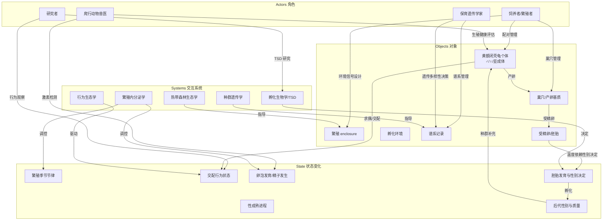
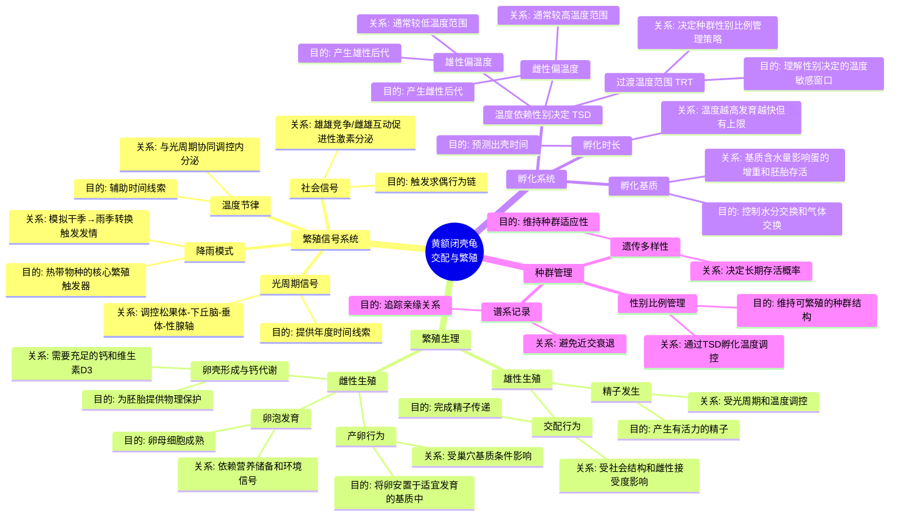
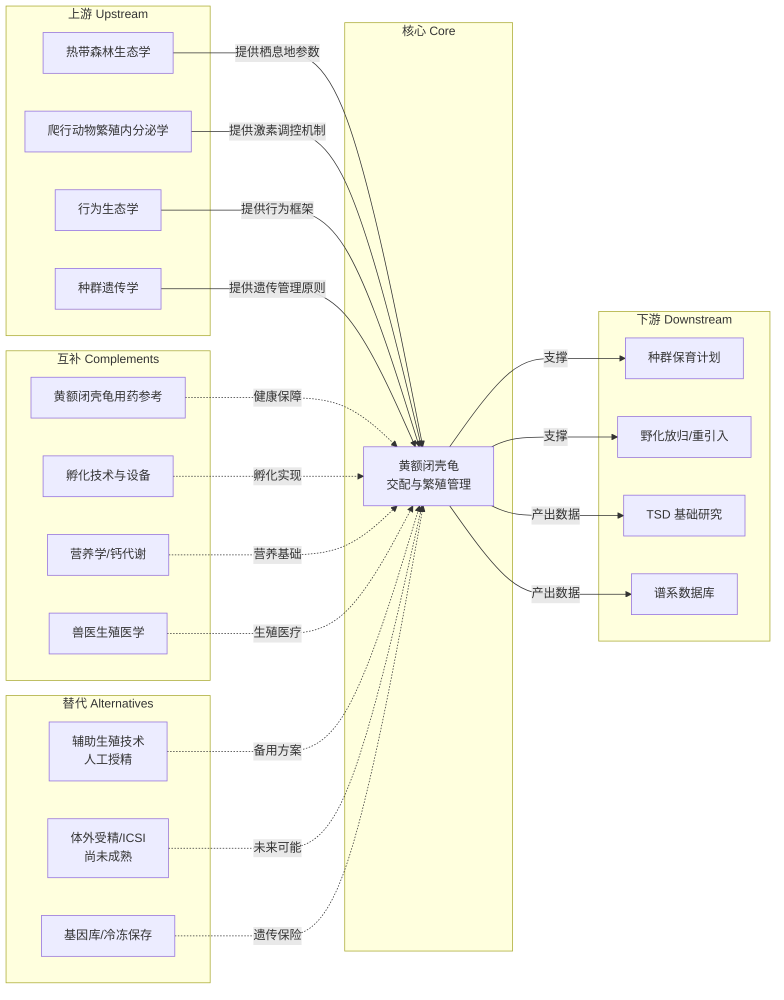

# 黄额闭壳龟（*Cuora galbinifrons*）交配条件与繁殖心智模型

> 本文档目标：帮助你建立关于黄额闭壳龟交配与繁殖的 **心智模型** 与 **世界模型**，理解其背后的生物学逻辑与决策框架，而非具体操作步骤。
>
> **物种说明**：黄额闭壳龟（*Cuora galbinifrons*），含三个亚种（*C. g. galbinifrons*、*C. g. bourreti*、*C. g. picturata*），分布于越南、老挝及中国海南岛。IUCN 红色名录列为**极危（Critically Endangered）**物种（Asian Turtle Trade Working Group, 2000）。相比锯缘闭壳龟（*C. mouhotii*），黄额闭壳龟**更偏陆栖**，栖息于热带/亚热带山地森林底层，繁殖生态有其独特性。

---

## 目录

1. [本质（Essence）](#1-本质essence)
2. [世界模型（World Model）](#2-世界模型world-model)
3. [概念地图（Concept Map）](#3-概念地图concept-map)
4. [决策地图（Decision Map）](#4-决策地图decision-map)
5. [搜索空间扩展（Search Space Expansion）](#5-搜索空间扩展search-space-expansion)
6. [生态系统（Ecosystem）](#6-生态系统ecosystem)
7. [可迁移原则（Transferable Principles）](#7-可迁移原则transferable-principles)
8. [最小心智模型（Minimum Mental Model）](#8-最小心智模型minimum-mental-model)
9. [常见误区（Common Misconceptions）](#9-常见误区common-misconceptions)
10. [总结（Summary）](#10-总结summary)
11. [参考文献](#11-参考文献)

---

## 1. 本质（Essence）

> **它究竟是什么？**
>
> 黄额闭壳龟的交配与繁殖，本质上是**在人工环境中重建一套完整的热带山地森林繁殖生态信号系统**——通过精确调控光周期、温度节律、湿度动态、社会结构和营养状态，使圈养个体的内分泌系统"认为"自己正处于野外繁殖栖息地中，从而自然表达交配行为与繁殖生理。

### 为什么它存在？

黄额闭壳龟的繁殖问题之所以构成一个独立且复杂的知识领域，是因为：

- **极危物种的保育紧迫性**：野外种群因宠物贸易和栖息地丧失已极度衰退（Asian Turtle Trade Working Group, 2000; IUCN, 2023），人工繁殖是避免物种灭绝的核心策略之一。与锯缘闭壳龟相比，黄额闭壳龟的人工繁殖记录更为稀少，繁殖成功率更低，这使得理解其繁殖条件尤为关键。
- **热带物种 ≠ 温带物种**：黄额闭壳龟分布区（越南、老挝北部、海南岛）属于热带/亚热带气候，**没有典型的冬眠需求**，但存在干季-雨季的季节性转换（Zhou et al., 2020; Ernst & Lovich, 2009）。这一节律信号与温带闭壳龟（如锯缘闭壳龟）的繁殖触发机制存在根本差异。
- **温度依赖型性别决定（TSD）**：龟类的蛋在孵化过程中，温度决定后代的性别（Ewert et al., 2004; Valenzuela & Lance, 2004）。这意味着繁殖不仅是"产出后代"，还涉及**种群性别比例的精确管理**。
- **行为生态的复杂性**：交配不是简单的"放在一起"——它涉及性选择、领地行为、求偶仪式、社会等级等一系列行为学前提（Ernst & Lovich, 2009）。

### 它解决什么根本问题？

**繁殖信号缺失问题**——在野外，光周期变化、降雨模式、温度波动、食物丰度变化等多重环境信号协同触发繁殖行为与生理（Crews, 1996; Licht et al., 1985）。人工环境中这些信号要么缺失，要么失真，导致个体"有能力繁殖但不表达繁殖"。

### 没有它时，人们通常怎么办？

- 将雌雄简单混养 → 无交配行为，或雄性攻击导致雌性受伤（Ernst & Lovich, 2009）
- 忽略季节性信号 → 雌性不排卵或产无精蛋（空蛋）
- 孵化温度随意设定 → 后代性别比例严重偏斜，甚至胚胎死亡（Ewert et al., 2004）
- 近亲交配 → 遗传多样性丧失，后代存活率和适应性下降（Frankham et al., 2010）

### 它带来了哪些新的可能？

- 从"养着等它自己繁殖"到**主动设计繁殖条件**
- 从随机孵化到**性别比例可控**的种群管理
- 从个体繁殖到**谱系管理**（studbook）支撑的系统性保育
- 为野外重引入（reintroduction）提供遗传健康的后备种群

---

## 2. 世界模型（World Model）



### 核心对象

| 对象 | 说明 |
|------|------|
| **繁殖个体** | 达到性成熟的雌雄龟（通常 ≥5-7 龄），需满足体重、健康状态和营养储备的繁殖门槛 |
| **繁殖环境** | 模拟热带山地森林底层微气候的封闭/半封闭空间，含温度梯度、湿度分区、遮蔽物和产卵区 |
| **巢穴/产卵基质** | 由特定粒径和湿度的基质构成的产卵场所，影响雌性产卵意愿和蛋的水分交换 |
| **受精卵与胚胎** | 受精后在孵化基质中发育的胚胎，其发育速率和性别由孵化温度决定（TSD） |
| **谱系记录** | 追踪每个个体的亲缘关系、繁殖历史和后代存活的数据库，是种群管理的核心工具 |

### 关键状态变化

1. **性成熟进程**：幼体 → 亚成体 → 性成熟（黄额闭壳龟约 5-7 龄，体重达到物种特征阈值）；雄性通常比雌性更早成熟（Ernst & Lovich, 2009）
2. **年度繁殖节律**：热带物种的繁殖节律主要由**降雨模式**（干季→雨季转换）驱动，而非温带的**温度/光周期**信号（Crews, 1996）
3. **繁殖生理序列**：雄性精子发生 → 求偶行为 → 交配 → 雌性卵泡发育 → 卵壳形成 → 产卵 → 受精 → 胚胎发育 → 孵化
4. **TSD 性别决定窗口**：孵化中期（通常为总孵化期的中间 1/3）的温度决定胚胎性别——恒温偏雄、偏雌或波动温度产生混合性别（Ewert et al., 2004; Valenzuela & Lance, 2004）

### 创造的价值

- **物种存续**：黄额闭壳龟为 IUCN 极危物种，人工繁殖是防止灭绝的最后防线之一（IUCN, 2023）
- **遗传资源保存**：通过谱系管理维持圈养种群的遗传多样性，为未来重引入保存基因库
- **科研平台**：为 TSD 机制、热带龟类繁殖内分泌、行为生态等基础研究提供活体模型
- **知识外溢**：繁殖技术的积累可惠及其他濒危龟类物种的保育

---

## 3. 概念地图（Concept Map）



### 概念关系详解

#### 第一层：繁殖信号系统 → 繁殖生理

| 概念（Entity） | 动作（Action） | 目标（Purpose） | 关系（Relationship） |
|---|---|---|---|
| 光周期 | 调控 | 提供年度时间线索 | 通过松果体→下丘脑→垂体→性腺轴（HPG axis）调控生殖激素分泌 |
| 降雨模式 | 触发 | 模拟热带季节性繁殖信号 | 黄额闭壳龟作为热带物种，降雨是比温度更核心的繁殖触发因子 |
| 社会信号 | 激活 | 启动求偶行为链 | 雄性视觉/化学信号刺激雌性接受行为，雄雄竞争提升雄性激素水平 |
| 营养状态 | 许可 | 设定繁殖的"代谢门槛" | 雌性必须达到一定的体脂和钙储备才能启动卵泡发育 |

#### 第二层：繁殖生理 → 孵化系统

| 概念（Entity） | 动作（Action） | 目标（Purpose） | 关系（Relationship） |
|---|---|---|---|
| 交配受精 | 传递 | 完成遗传物质组合 | 受精率取决于精子质量、交配频率和雌性生殖道环境 |
| 卵泡发育 | 成熟 | 产生可受精的卵母细胞 | 受 FSH/LH 调控，依赖营养和环境信号 |
| 产卵 | 安置 | 将卵置于适宜发育环境 | 雌性选择巢位的行为受基质湿度、温度和遮蔽度影响 |
| TSD | 决定 | 孵化温度决定后代性别 | 温度影响芳香化酶（aromatase）活性→雌激素合成→卵巢分化 |

#### 第三层：孵化系统 → 种群管理

| 概念（Entity） | 动作（Action） | 目标（Purpose） | 关系（Relationship） |
|---|---|---|---|
| 孵化温度 | 调控 | 管理后代性别比例 | 通过设定恒温或波动温度方案控制♂:♀比例 |
| 谱系记录 | 追踪 | 避免近交、优化配对 | 每个个体的遗传贡献被量化，指导未来配对决策 |
| 遗传多样性 | 维持 | 保障种群长期适应性 | 有效种群大小（Ne）是核心指标 |

---

## 4. 决策地图（Decision Map）

### 场景 1：新引入成体——判断是否具备繁殖条件

```
Situation
你获得了一对成年黄额闭壳龟，希望评估它们是否具备繁殖潜力。

    ↓

Decision
首先进行全面的生殖健康评估（生殖激素水平、超声检查卵泡/睾丸状态），
而非直接尝试配对。

    ↓

Reason
黄额闭壳龟的繁殖失败往往不是因为"不配对"，
而是因为个体本身未达到繁殖的生理条件——
营养储备不足、亚临床疾病、或尚未完全性成熟
（Mader et al., 2016; Divers & Mader, 2019）。

    ↓

Expected Outcome
明确个体的繁殖就绪状态（breeding readiness），
避免无效配对带来的应激和资源浪费。
```

### 场景 2：设计繁殖季节的环境信号

```
Situation
个体健康，但需要触发繁殖行为。

    ↓

Decision
模拟热带原产地的干季→雨季转换：
先降低湿度和/或减少降水频率 4-6 周（模拟干季），
然后逐步增加湿度和降雨频率（模拟雨季来临）。

    ↓

Reason
黄额闭壳龟分布于热带/亚热带区域，其繁殖节律主要由降雨模式驱动，
而非温带龟类依赖的降温/光周期信号（Crews, 1996）。
干季代表资源匮乏期，雨季代表资源丰沛期——
后者是养育后代的最佳时机，因此进化选择了降雨作为繁殖触发信号。

    ↓

Expected Outcome
雌性启动卵泡发育，雄性求偶行为增强，
自然交配行为在"雨季"信号出现后 2-6 周内发生。
```

### 场景 3：交配后雌性产蛋评估

```
Situation
交配后数周，需要判断雌性是否成功受精。

    ↓

Decision
通过超声检查和/或X光确认蛋的存在和发育状态，
同时检查蛋的形态（是否正常钙化）。
产蛋后检查蛋的受精斑（fertile egg 的乳白色带）。

    ↓

Reason
黄额闭壳龟可能产无精蛋（slugs）——
这可能是因为交配失败、精子储存耗尽、
或雌性生殖道异常（Mader et al., 2016）。
早期识别可以指导是否需要调整配对或进行人工授精。

    ↓

Expected Outcome
区分受精卵与无精蛋，避免将无精蛋放入孵化器浪费资源，
并为下一轮繁殖决策提供依据。
```

### 场景 4：孵化温度策略制定

```
Situation
获得受精卵，需要制定孵化温度方案。

    ↓

Decision
根据种群管理目标（需要更多雄性还是雌性），
选择对应的孵化温度。若需混合性别，
采用波动温度方案或分批设置不同恒温。

    ↓

Reason
TSD（温度依赖型性别决定）意味着孵化温度直接决定后代性别
（Ewert et al., 2004; Valenzuela & Lance, 2004）。
对于极危物种，每一只后代都珍贵——
性别比例失衡将严重影响未来种群的繁殖效率。

    ↓

Expected Outcome
获得预期性别的健康幼体，
同时保持孵化率在可接受范围内（温度极端化会降低孵化率）。
```

### 场景 5：近交风险管理

```
Situation
圈养种群规模有限，需要决定下一代如何配对。

    ↓

Decision
查阅谱系记录，计算个体间的亲缘系数（kinship coefficient），
优先选择亲缘关系最远的配对组合。
必要时与其他保育机构交换个体。

    ↓

Reason
小种群中近交衰退（inbreeding depression）会导致
后代存活率下降、畸形率升高、免疫能力减弱
（Frankham et al., 2010）。
黄额闭壳龟的圈养种群极为有限，
遗传管理是种群存续的长期关键。

    ↓

Expected Outcome
最大化有效种群大小（Ne），
维持圈养种群的遗传多样性和长期繁殖潜力。
```

### 场景 6：雌性难产/蛋滞留

```
Situation
雌性出现食欲下降、后肢无力、泄殖腔区域肿胀，
超声显示蛋滞留。

    ↓

Decision
首先评估环境因素（巢穴条件是否适宜、温度是否足够），
排除环境原因后，进行兽医干预（催产素、钙剂补充、
必要时手术取蛋）。

    ↓

Reason
蛋滞留（dystocia/egg-binding）在圈养龟类中常见，
可能由巢穴条件不适宜、钙缺乏、
或生殖道异常引起（Mader et al., 2016）。
黄额闭壳龟偏陆栖，对产卵基质的要求可能比半水栖种类更严格。

    ↓

Expected Outcome
解除蛋滞留，保护雌性生殖健康，
同时诊断根本原因以防止复发。
```

---

## 5. 搜索空间扩展（Search Space Expansion）

### 初学者通常不会想到的问题

| 盲区 | 为什么重要 |
|------|-----------|
| **精子储存（Sperm Storage）** | 雌性龟类可以在泄殖腔腺体中储存存活精子数月甚至数年（Rostal & Lance, 1994）。这意味着一只雌龟在最后一次交配后很久仍能产出受精卵——你可能在没有雄性的情况下突然获得受精卵。 |
| **TSD 的种群级后果** | 气候变化导致的温度偏移可能在几代内将种群性别比推向极端——这不是个体繁殖问题，而是物种存续问题（Janzen, 1994; Mitchell et al., 2008）。 |
| **亚种差异** | 三个亚种（*galbinifrons*、*bourreti*、*picturata*）的繁殖生态可能存在差异（如窝卵数、繁殖季节时间），混合管理可能导致不适应。 |
| **雌性繁殖成本** | 产蛋对雌性的钙和能量消耗极大——频繁繁殖而缺乏恢复期会导致雌性体质崩溃（"产蛋疲劳"）（Mader et al., 2016）。 |
| **孵化中的水分动态** | 蛋不是密封的——它们通过壳与外界进行水分和气体交换。基质太干→蛋脱水萎缩；太湿→蛋吸水胀裂或霉菌感染。 |
| **交配行为的攻击性** | 黄额闭壳龟雄性在繁殖期可能变得极具攻击性，咬伤雌性导致严重外伤甚至死亡——交配不等于安全。 |

### 专家真正关心的问题

| 关注点 | 深层逻辑 |
|--------|---------|
| **有效种群大小（Ne）而非种群总数（N）** | 10 只龟如果有 8 只是同一家的兄弟姐妹，Ne 可能只有 3-4——遗传多样性远低于表面数字（Frankham et al., 2010）。 |
| **TSD 曲线的精确测定** | 每个种群的 TSD 响应曲线（pivotal temperature, TRT 范围）可能不同——用近缘种的数据替代可能产生系统性偏差。 |
| **表观遗传效应** | 孵化温度不仅影响性别，还可能影响后代的生长速率、行为表型、热偏好等（Shine, 2013; Noble et al., 2018）——"温度编程"效应。 |
| **繁殖内分泌的非侵入性监测** | 通过粪便激素代谢物监测繁殖状态，避免反复采血造成的应激（Rostal & Lance, 1994）。 |
| **跨代效应（Transgenerational Effects）** | 母体的营养状态、热经历可以影响后代的表型——"母体效应"可能跨代传递（Noble et al., 2018）。 |

### 下一步值得探索的问题

1. 黄额闭壳龟三个亚种的繁殖参数（窝卵数、蛋大小、繁殖季节）是否存在可量化差异？
2. 该物种的 TSD 模式是 Ia 型（低温♂/高温♀，如大多数龟类）还是存在变异？
3. 精子储存的持续时间上限是多少？储存精子的受精能力如何随时间衰减？
4. 波动温度孵化（fluctuating temperature）是否比恒温孵化产生更健康的幼体？
5. 圈养种群的 Ne 是否已达到"50/500 规则"的最低可存活阈值？

### 决定领域上限的问题

- **遗传瓶颈能否突破？** 极危物种的圈养种群往往源于少数捕获个体，遗传多样性先天不足。
- **人工繁殖能否替代野外保护？** 如果栖息地持续丧失，人工繁殖的个体放归何处？
- **TSD 物种如何应对气候变化？** 如果野外巢穴温度持续升高，种群可能走向"全雌化"灭绝。

---

## 6. 生态系统（Ecosystem）



### 上游（Upstream）

| 领域 | 贡献 |
|------|------|
| **热带森林生态学** | 提供原栖息地的温度、湿度、降雨模式等环境参数，是设计繁殖信号的蓝图 |
| **爬行动物繁殖内分泌学** | 揭示 HPG 轴调控机制、激素季节性变化、TSD 的分子机制（芳香化酶等） |
| **行为生态学** | 解释求偶行为、配偶选择、交配系统的进化逻辑 |
| **种群遗传学** | 提供谱系管理、近交系数计算、有效种群大小评估的理论框架 |

### 下游（Downstream）

| 领域 | 关系 |
|------|------|
| **种群保育计划（SSP/EEP）** | 人工繁殖是保育计划的个体来源 |
| **野化放归** | 人工繁殖个体经野化训练后放归野外种群 |
| **TSD 基础研究** | 孵化实验为温度性别决定机制提供实证数据 |
| **谱系数据库** | 繁殖记录汇入全球龟类谱系管理系统（如 ISIS 等） |

### 互补方案（Complements）

| 领域 | 互补关系 |
|------|---------|
| **用药参考** | 生殖系统疾病的诊断和治疗（如蛋滞留、生殖道感染） |
| **孵化技术** | 孵化基质配方、温湿度控制设备、胚胎检测（照蛋） |
| **营养学** | 繁殖期的钙磷比调控、维生素 D3 补充、能量储备管理 |
| **兽医生殖医学** | 超声诊断、激素检测、人工授精、难产处理 |

### 替代方案（Alternatives）

| 方案 | 现状 |
|------|------|
| **人工授精（AI）** | 已在部分龟类中成功应用，可作为自然交配失败时的备选（Lance et al., 2001） |
| **精子冷冻保存** | 技术可行但龟类精子冷冻方案尚未标准化，是重要的遗传保险手段 |
| **体外受精/ICSI** | 在龟类中尚处于探索阶段，距离常规应用仍有距离 |

---

## 7. 可迁移原则（Transferable Principles）

### 第一性原理（First Principles）

| 原理 | 说明 |
|------|------|
| **生物体是环境的函数** | 所有生理过程（包括繁殖）都是基因型与环境互作的产物——改变环境信号就改变了生理输出 |
| **繁殖是奢侈活动** | 繁殖只有在生存需求被充分满足后才会启动——营养、健康、安全感是繁殖的前提而非结果 |
| **信号决定响应** | 内分泌系统不"知道"自己在人工环境中——它只响应接收到的信号（光、温度、降雨、社会线索） |
| **性别是可塑的** | 对 TSD 物种而言，性别不是由染色体"固定"的，而是由孵化温度"决定"的——这是一个发育可塑性问题 |

### 可迁移的方法论（Transferable Methods）

| 方法论 | 适用范围 |
|--------|---------|
| **环境信号逆向工程** | 从野外气象数据反推繁殖触发信号 → 适用于所有依赖环境信号的繁殖物种 |
| **繁殖就绪评估框架** | 健康→营养→激素→行为的层级评估 → 适用于所有圈养繁殖管理 |
| **谱系管理方法** | 亲缘系数计算、Ne 最大化策略 → 适用于所有小种群遗传管理 |
| **TSD 温度管理策略** | 恒温/波动温度方案设计 → 适用于所有 TSD 物种 |

### 当前实现细节（易变）

| 内容 | 为什么易变 |
|------|-----------|
| 具体的孵化温度数值 | 可能随亚种、种群来源、最新研究而修正 |
| 特定的激素检测方案 | 检测技术和参考范围持续更新 |
| 窝卵数的具体范围 | 样本量有限，新发现可能修正 |

### 长期稳定的知识

| 内容 | 为什么稳定 |
|------|-----------|
| TSD 的存在及其机制 | 已有大量实证支持，基本框架不会改变 |
| HPG 轴调控繁殖的基本逻辑 | 脊椎动物共有的内分泌架构 |
| 近交衰退的遗传学原理 | 群体遗传学的基本定理 |
| 热带物种以降雨为繁殖信号 | 生态生理学的基本模式 |

---

## 8. 最小心智模型（Minimum Mental Model）

如果只能记住 **15 个概念**，按重要性排序：

| 排名 | 概念 | 为什么重要 |
|------|------|-----------|
| 1 | **繁殖信号系统（Reproductive Cue System）** | 一切繁殖管理的起点——没有正确的信号，就没有繁殖行为 |
| 2 | **温度依赖型性别决定（TSD）** | 黄额闭壳龟后代的性别由你设定的孵化温度决定，这是最独特的管理维度 |
| 3 | **HPG 轴（下丘脑-垂体-性腺轴）** | 所有繁殖信号的最终汇聚点——理解它就理解了"为什么信号能触发繁殖" |
| 4 | **繁殖就绪（Breeding Readiness）** | 不是所有成体都能繁殖——必须满足健康、营养、年龄的门槛 |
| 5 | **降雨模式作为热带繁殖触发器** | 黄额闭壳龟区别于温带龟类的核心差异——降雨 > 温度作为繁殖信号 |
| 6 | **精子储存（Sperm Storage）** | 雌性可以在交配后很久仍产受精卵——影响你对"是否需要雄性"的判断 |
| 7 | **谱系管理（Studbook/Pedigree Management）** | 极危物种的每一只个体都珍贵——必须追踪亲缘关系以避免近交 |
| 8 | **有效种群大小（Ne）** | 种群存续的遗传学底线——Ne 太低 = 遗传多样性不可逆丧失 |
| 9 | **卵泡发育的能量成本** | 繁殖对雌性的巨大消耗——管理繁殖频率就是保护雌性健康 |
| 10 | **孵化基质水分动态** | 蛋不是密封的——水分交换直接影响胚胎存活 |
| 11 | **亚种差异** | 三个亚种可能有不同的繁殖参数——不能用一个方案覆盖所有 |
| 12 | **交配攻击性** | 繁殖期雄性可能伤害雌性——配对≠安全 |
| 13 | **蛋滞留（Dystocia）** | 常见的繁殖急症——环境因素和营养因素都可触发 |
| 14 | **表观遗传/母体效应** | 孵化温度和母体状态的影响超越性别——影响后代的整体表型 |
| 15 | **保育目标 vs. 繁殖目标的区分** | 繁殖数量 ≠ 保育成效——遗传多样性和后代质量才是终极指标 |

---

## 9. 常见误区（Common Misconceptions）

### 误区 1：「把公母放在一起就会交配繁殖」

**为什么会产生这个误解？**
直觉认为"性别齐全 = 能繁殖"，忽略了繁殖需要一系列环境信号和生理前提。

**更准确的模型：**
繁殖 = 个体就绪（健康+营养+年龄）× 环境信号（光+温度+降雨+社会线索）× 行为兼容（配对相容性+求偶成功）。三者缺一不可。

---

### 误区 2：「黄额闭壳龟需要冬眠才能繁殖」

**为什么会产生这个误解？**
许多温带龟类（包括同属的锯缘闭壳龟）确实需要降温/冬眠来同步繁殖节律，人们将此推广到所有闭壳龟。

**更准确的模型：**
黄额闭壳龟是热带/亚热带物种，其自然栖息地没有真正的"冬季"。它们的繁殖节律由**干季→雨季转换**驱动，而非降温。模拟干季（降低湿度/减少降水）+ 雨季来临（增加湿度/降水）才是正确的繁殖触发策略。

---

### 误区 3：「孵化温度只影响出壳时间，不影响性别」

**为什么会产生这个误解？**
鸟类和哺乳类的性别由染色体决定，人们将此经验投射到龟类。

**更准确的模型：**
绝大多数龟类（包括黄额闭壳龟）具有 TSD——孵化温度的中间范围产生雄性，偏离中间范围（偏高或偏低，取决于 TSD 类型）产生雌性。温度不仅影响出壳时间，**直接决定性别**。

---

### 误区 4：「产蛋多 = 繁殖成功」

**为什么会产生这个误解？**
数量是最直观的指标。

**更准确的模型：**
繁殖成功的衡量标准是**遗传多样性的维持和可存活后代的产出**，而非蛋的数量。10 只同父同母的蛋的保育价值可能低于 3 只来自不同亲本的蛋。频繁产蛋还可能损害雌性健康。

---

### 误区 5：「没有雄性，雌性不可能产受精卵」

**为什么会产生这个误解？**
不了解龟类的精子储存能力。

**更准确的模型：**
雌性龟类可以在泄殖腔的精子储存腺体（sperm storage tubules）中维持存活精子数月甚至超过一年（Rostal & Lance, 1994）。一只"独居"雌龟可能在最后一次交配后很久仍产出受精卵。

---

### 误区 6：「恒温孵化最好」

**为什么会产生这个误解？**
恒温控制简单、可重复，是实验室的默认选择。

**更准确的模型：**
自然界巢穴温度是波动的（昼夜温差）。波动温度孵化可能产生更健康的幼体、更大的蛋重、更好的运动表现（Les et al., 2007; Du & Ji, 2011）。对 TSD 物种，波动温度还可能产生混合性别后代。

---

## 10. 总结（Summary）

> 我真正获得的不是 **一套黄额闭壳龟繁殖的操作手册**，
> 而是 **理解"如何在人工环境中重建一个热带物种的繁殖生态信号系统"的思维框架**——
> 一套从环境信号到内分泌响应、从个体行为到种群遗传、从孵化温度到性别决定的多层级因果推理能力。

这个框架的核心洞察是：

1. **繁殖不是"事件"，而是"过程"**——它是多重信号在时间轴上精确排列的结果
2. **人工环境的本质是"信号设计"**——你不是在"养龟"，你是在用环境参数"编程"一个内分泌系统
3. **极危物种的繁殖管理是遗传学问题，不只是生物学问题**——每一只个体的遗传贡献都需要被计算和管理
4. **热带物种的繁殖逻辑不同于温带**——降雨 > 温度，这是最根本的认知转换

---

## 11. 参考文献

- Asian Turtle Trade Working Group. (2000). *Cuora galbinifrons*. The IUCN Red List of Threatened Species 2000: e.T6213A12548497.
- Crews, D. (1996). Organizational and activational processes in sex determination: toward an integrated model. *Hormones and Behavior*, 30(4), 434-443.
- Du, W. G., & Ji, X. (2011). The effects of incubation thermal environments on timing of hatching, hatchling phenotypes and fitness in a lizard. *Journal of Thermal Biology*, 36(4), 213-218.
- Ernst, C. H., & Lovich, J. E. (2009). *Turtles of the United States and Canada* (2nd ed.). Johns Hopkins University Press.
- Ewert, M. A., Jackson, D. R., & Lang, J. W. (2004). Environmental sex determination in crocodilians: implications for understanding turtle TSD. In *Temperature-Dependent Sex Determination in Vertebrates* (pp. 52-67). Springer.
- Frankham, R., Ballou, J. D., & Briscoe, D. A. (2010). *Introduction to Conservation Genetics* (2nd ed.). Cambridge University Press.
- Janzen, F. J. (1994). Climate change and temperature-dependent sex determination in reptiles. *Proceedings of the National Academy of Sciences*, 91(16), 7487-7490.
- Lance, V. A., Rostal, D. C., & Sahlstrom, L. L. (2001). Artificial insemination in the desert tortoise (*Gopherus agassizii*). *Zoo Biology*, 20(4), 329-337.
- Les, D. M., et al. (2007). Fluctuating incubation temperatures produce heavier hatchlings in the painted turtle. *Journal of Thermal Biology*, 32(7-8), 379-384.
- Licht, P., et al. (1985). Environmental and endocrine control of reproduction in the painted turtle, *Chrysemys picta*. *General and Comparative Endocrinology*, 59(1), 121-134.
- Mader, D. R., Divers, S. J., & Kumar, K. (Eds.). (2016). *Mader's Reptile and Amphibian Medicine and Surgery* (3rd ed.). Elsevier.
- Mitchell, N. J., et al. (2008). The thermal significance of the nest site used by the loggerhead turtle *Caretta caretta*: predicted sex ratios in response to climate change. *Journal of Experimental Marine Biology and Ecology*, 356(1-2), 1-8.
- Noble, D. W. A., et al. (2018). How to make a sexy lizard: genetic architecture of temperature-dependent sex determination. *Proceedings of the Royal Society B*, 285(1873), 20172576.
- Rostal, D. C., & Lance, V. A. (1994). Reproductive cycles of male and female desert tortoises, *Gopherus agassizii*, in the Mojave Desert. *Copeia*, 1994(4), 978-987.
- Shine, R. (2013). How to make a sexy lizard. *Science*, 342(6163), 1198-1199.
- Valenzuela, N., & Lance, V. A. (Eds.). (2004). *Temperature-Dependent Sex Determination in Vertebrates: Diversity and Conservation*. Smithsonian Books.
- Zhou, T., et al. (2020). Phylogenetic and biogeographic analysis of the genus *Cuora*. *Molecular Phylogenetics and Evolution*, 145, 106732.
