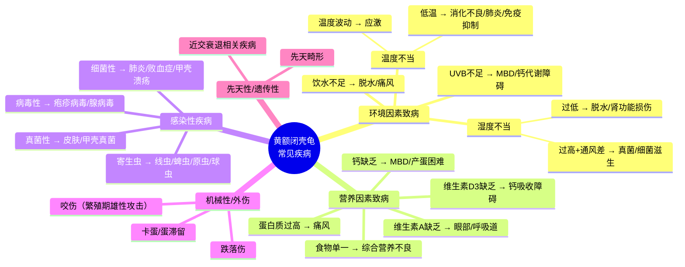
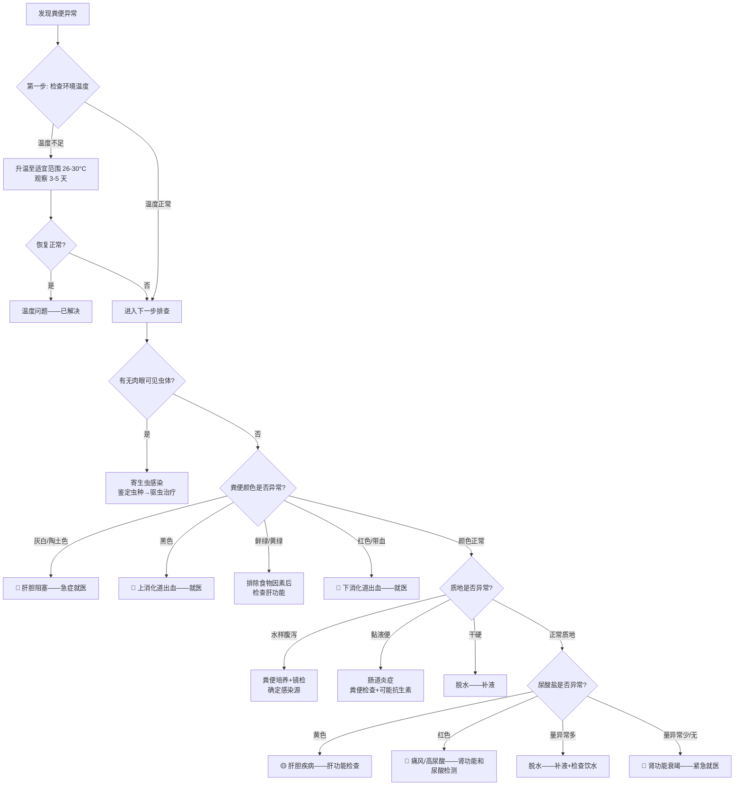
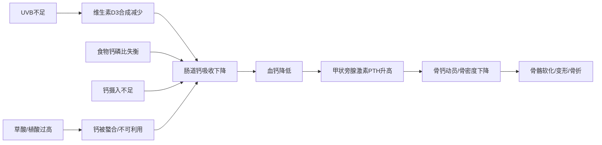
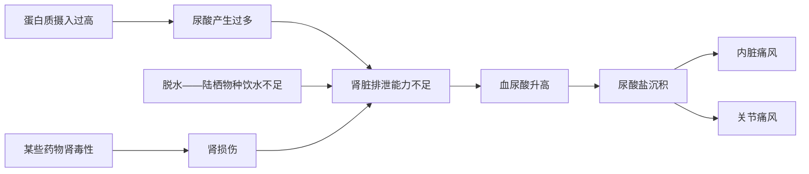
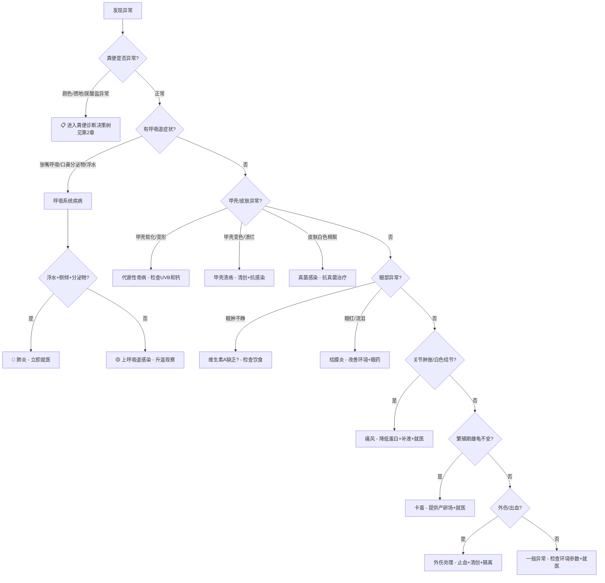

# 黄额闭壳龟（*Cuora galbinifrons*）常见疾病参考手册

> 本文档系统梳理黄额闭壳龟常见疾病的病因、诊断要点与治疗原则，**特别包含通过粪便状态推断疾病的完整诊断框架**。
>
> **物种说明**：黄额闭壳龟（*Cuora galbinifrons*），含三个亚种（*C. g. galbinifrons*、*C. g. bourreti*、*C. g. picturata*），分布于越南、老挝及中国海南岛。IUCN 红色名录列为**极危（Critically Endangered）**物种。相比锯缘闭壳龟，黄额闭壳龟**更偏陆栖**，栖息于热带/亚热带山地森林底层，对湿度的要求更高，但水域需求相对较少。这一生态位差异直接影响其疾病谱。
>
> **重要声明**：
> - 爬行动物药代动力学（PK）数据远不如哺乳动物完善，许多剂量来源于经验性用药和种间外推（Mader et al., 2016）。
> - **所有药物使用必须在具有爬行动物医学资质的兽医指导下进行。**
> - 本文档为知识框架参考，不替代临床处方。

---

## 目录

1. [疾病总览与决策框架](#1-疾病总览与决策框架)
2. [粪便诊断专题——从排泄物推断疾病](#2-粪便诊断专题从排泄物推断疾病)
3. [呼吸系统疾病](#3-呼吸系统疾病)
4. [代谢性骨病（MBD）](#4-代谢性骨病mbd)
5. [消化系统疾病](#5-消化系统疾病)
6. [皮肤与甲壳疾病](#6-皮肤与甲壳疾病)
7. [眼部疾病](#7-眼部疾病)
8. [寄生虫病](#8-寄生虫病)
9. [泌尿系统疾病](#9-泌尿系统疾病)
10. [繁殖相关疾病](#10-繁殖相关疾病)
11. [营养代谢性疾病](#11-营养代谢性疾病)
12. [创伤与感染](#12-创伤与感染)
13. [急症与临终信号](#13-急症与临终信号)
14. [疾病诊断决策树](#14-疾病诊断决策树)
15. [预防体系](#15-预防体系)
16. [参考文献](#16-参考文献)

---

## 1. 疾病总览与决策框架

### 核心原则

> **在爬行动物医学中，环境问题是绝大多数疾病的首要病因。**
> 疾病往往是环境参数长期偏离最适范围的结果，而非孤立事件。
> （Mader et al., 2016; Divers & Mader, 2019）

### 黄额闭壳龟的特殊疾病风险

与锯缘闭壳龟相比，黄额闭壳龟因**更偏陆栖、热带分布**，具有以下特殊疾病风险：

| 风险因素 | 机制 | 相关疾病 |
|---------|------|---------|
| 偏陆栖 | 水域需求少 → 饮水可能不足 | 脱水、痛风、肾功能损伤 |
| 热带物种 | 无冬眠需求 → 低温不是信号而是威胁 | 低温导致消化停滞、免疫抑制 |
| 林下物种 | 自然 UVB 暴露较低 | UVB 不足 → MBD、钙代谢障碍 |
| 高湿度需求 | 森林底层湿度高但需通风 | 湿度高 + 通风差 → 真菌/细菌感染 |
| 极危物种 | 圈养个体少 → 遗传多样性低 | 近交衰退 → 免疫力低下、先天缺陷 |

### 疾病分类总览

### 紧急程度分级

| 级别 | 含义 | 响应时间 | 典型情况 |
|------|------|---------|---------|
| 🔴 **紧急** | 危及生命，需立即就医 | < 24小时 | 严重外伤、浮水侧倾、口鼻大量分泌物、拒食>2周、泄殖腔脱垂、抽搐 |
| 🟡 **重要** | 需要尽快干预 | 1-7天 | 轻度呼吸道症状、甲壳软化、眼肿不睁、粪便异常（带血/变色） |
| 🟢 **监测** | 早期信号，调整环境观察 | 持续观察 | 活动减少、食欲下降、粪便质地轻微改变、泡水时间异常增加 |

---

## 2. 粪便诊断专题——从排泄物推断疾病

> **粪便是爬行动物最直观的非侵入性诊断窗口。** 它同时反映消化系统、寄生虫状态、代谢功能（肝肾）、水分状态甚至生殖系统的信息。
>
> 对于黄额闭壳龟这类偏陆栖物种，粪便观察尤为重要——因为它们不像水龟那样粪便容易在水中扩散观察。

### 2.1 正常粪便的基线

健康的黄额闭壳龟粪便由**三个组分**构成：

| 组分 | 正常外观 | 来源 |
|------|---------|------|
| **粪便主体（feces）** | 深褐色/棕绿色，成形条状或团状，质地 firm | 消化后的食物残渣 |
| **尿酸盐（urates）** | 白色/乳白色，糊状或半固体团块 | 含氮代谢终产物（龟类以尿酸为主要氮废物） |
| **尿液（urine）** | 透明至淡黄色液体 | 水分排泄 |

> **关键认知**：龟类的排泄物不是"一坨"——它是粪便 + 尿酸盐 + 尿液的组合体。观察时要**分别评估每个组分**。

#### 正常粪便参考参数

| 参数 | 正常范围 | 说明 |
|------|---------|------|
| 颜色 | 棕褐色至深绿色 | 与食物组成相关——偏动物性蛋白则偏深褐，偏植物则偏绿 |
| 质地 | 成形、有一定硬度 | 不应过稀也不应过硬 |
| 气味 | 轻微腥味，不刺鼻 | 强烈恶臭提示消化异常 |
| 频率 | 与进食频率和环境温度相关 | 温度低→代谢慢→排便间隔长 |
| 尿酸盐 | 白色/乳白，量适中 | 过多或变色为异常信号 |

### 2.2 粪便颜色异常 → 疾病推断

| 粪便颜色 | 可能原因 | 机制 | 伴随症状 | 严重程度 |
|----------|---------|------|---------|---------|
| **鲜绿色/黄绿色** | ① 食物色素（正常）② 肝胆疾病 ③ 肠道通过过快 | 胆绿素/胆汁未充分代谢即排出 | 若为肝胆疾病：食欲下降、嗜睡、可能黄疸 | 🟡 |
| **灰白色/陶土色** | **肝胆阻塞**——胆道梗阻 | 胆汁无法进入肠道→粪便失去正常棕色 | 黄疸、食欲废绝、可能发热 | 🔴 急症 |
| **黑色/柏油样** | **上消化道出血**（melena） | 血液经消化后变黑 | 食欲下降、虚弱、可能呕吐 | 🔴 |
| **红色/带血丝** | **下消化道/泄殖腔出血** | 结肠、泄殖腔或 cloacal bursa 出血 | 排便困难、泄殖腔脱垂 | 🔴 |
| **黄色/泡沫状** | ① 消化不良 ② 肠道感染 ③ 温度过低 | 食物未充分消化/肠道发酵 | 食欲下降、环境温度可能偏低 | 🟡 |

### 2.3 粪便质地异常 → 疾病推断

| 质地 | 可能原因 | 机制 | 伴随症状 | 严重程度 |
|------|---------|------|---------|---------|
| **水样腹泻** | ① 肠道感染（细菌/病毒/寄生虫）② 应激 ③ 饮食突变 ④ 温度过低 | 肠道吸收功能障碍/分泌增加 | 脱水、食欲下降、体重减轻 | 🟡→🔴 |
| **糊状/不成形** | ① 轻度消化不良 ② 寄生虫负担中等 ③ 食物纤维不足 | 消化不完全 | 可能无明显全身症状 | 🟢→🟡 |
| **干硬/颗粒状** | **脱水** | 水分重吸收过度→粪便干燥 | 皮肤弹性下降、眼窝凹陷、尿量减少 | 🟡 |
| **黏液包裹** | **肠道炎症**——结肠炎/肠炎 | 肠道黏膜分泌黏液保护受损上皮 | 排便频繁、可能带血 | 🟡→🔴 |

### 2.4 尿酸盐异常——极重要的早期诊断信号

> **尿酸盐的变化往往是疾病最早的信号之一**，比粪便主体变化更敏感。龟类的氮代谢终产物是**尿酸**（而非哺乳动物的尿素），尿酸溶解度低，容易在脱水或肾功能异常时形成结晶。

| 尿酸盐表现 | 可能原因 | 机制 | 严重程度 | 建议 |
|-----------|---------|------|---------|------|
| **黄色/黄绿色尿酸盐** | **肝胆疾病** | 胆红素代谢异常→尿酸盐被染黄 | ⚠️ 中-重度 | 肝功能检查（胆汁酸、AST） |
| **红色/粉红色尿酸盐** | **痛风/高尿酸血症** | 尿酸盐结晶沉积→炎症→微出血 | 🔴 严重 | 检测血尿酸；肾功能评估 |
| **尿酸盐量显著增多** | **脱水** | 水分不足→尿酸盐浓缩析出增多 | ⚠️ 中度 | 补液；检查饮水供应和环境湿度 |
| **尿酸盐量显著减少/消失** | **肾功能衰竭** | 肾脏无法产生尿酸盐 | 🔴 严重 | 肾功能检查（尿酸、磷、钙） |
| **尿酸盐呈砂砾感/颗粒粗大** | **痛风前期/慢性脱水** | 尿酸盐过饱和→结晶变大 | ⚠️ 中度 | 长期水分管理；饮食嘌呤含量评估 |

### 2.5 含未消化食物 → 疾病推断

| 表现 | 可能原因 | 机制 | 建议 |
|------|---------|------|------|
| 食物形态基本完整 | **消化功能不全** | ① 温度过低→酶活性不足 ② 进食过快 ③ 消化酶分泌不足 | **首先检查温度！** |
| 间歇性出现 | 正常变异——某些食物（高纤维植物）本身难消化 | 正常 | 无需干预 |
| 持续性出现 + 体重下降 | **慢性消化不良/吸收不良** | 慢性胰腺炎、肠道菌群失调、慢性感染 | 需系统检查 |

> **最重要的排查第一步**：环境温度是否足够？龟类是变温动物——**温度不够 = 消化酶不工作 = 食物不消化**。这是最常见也最容易被忽视的原因。

### 2.6 寄生虫相关的粪便表现

| 粪便表现 | 可能寄生虫 | 诊断方法 | 备注 |
|----------|-----------|---------|------|
| **可见白色线状虫体** | 线虫（蛔虫/蛲虫类） | 肉眼可见 + 镜检确认 | 最常见的大型寄生虫 |
| **粪便中有节片（米粒状）** | 绦虫 | 肉眼可见节片 + 镜检虫卵 | 绦虫节片可随粪便排出 |
| **无明显肉眼异常但长期消瘦** | 原虫（鞭毛虫/阿米巴/球虫） | **必须粪便镜检**（浮集法/涂片法） | 原虫肉眼不可见 |
| **黏液血便** | 阿米巴/球虫感染 | 粪便涂片镜检 | 肠道组织损伤严重 |
| **间歇性腹泻 + 体重缓慢下降** | 多种寄生虫混合感染 | 连续 3 次粪便浮集检查 | 单次检查可能漏检 |

> **黄额闭壳龟特殊风险**：作为偏陆栖物种，黄额闭壳龟在土壤/落叶层中活动，**土壤中的寄生虫卵暴露风险高于半水栖种类**。建议每季度做一次常规粪便镜检。

### 2.7 粪便诊断决策树

### 2.8 粪便 + 伴随症状 → 最可能的诊断

| 粪便表现 | 伴随症状 | 最可能的诊断方向 |
|----------|---------|----------------|
| 水样腹泻 + 食欲废绝 + 嗜睡 | 急性感染（细菌性肠炎/沙门氏菌等） |
| 黏液血便 + 体重下降 + 食欲下降 | 原虫感染（阿米巴/球虫）或慢性炎症性肠病 |
| 未消化食物 + 嗜睡 + 环境温度低 | 消化功能停滞（低温导致）——**首先排除** |
| 黄色尿酸盐 + 食欲下降 + 皮肤发黄 | 肝胆疾病 |
| 红色尿酸盐 + 关节肿胀 + 食欲下降 | 痛风 |
| 干硬粪便 + 眼窝凹陷 + 皮肤弹性差 | 脱水 |
| 黑色粪便 + 虚弱 + 食欲下降 | 上消化道出血 |
| 长期消瘦 + 粪便时好时坏 + 食欲正常 | 慢性寄生虫感染 / 吸收不良综合征 |
| 正常粪便但体重持续下降 | 隐性寄生虫（原虫）/ 代谢疾病 / 慢性感染 |

### 2.9 粪便监测实操建议

#### 粪便记录模板

| 记录项 | 内容 |
|--------|------|
| 日期 | |
| 粪便主体颜色 | 棕褐 / 深绿 / 黄绿 / 灰白 / 黑色 / 其他 |
| 粪便质地 | 成形 / 糊状 / 水样 / 干硬 / 黏液 |
| 尿酸盐颜色 | 白色 / 黄色 / 红色 / 其他 |
| 尿酸盐量 | 正常 / 偏多 / 偏少 / 无 |
| 有无血液 | 无 / 鲜血 / 暗血 |
| 有无可见虫体 | 无 / 有（描述） |
| 有无未消化食物 | 无 / 少量 / 大量 |
| 气味 | 正常 / 异常恶臭 |
| 备注 | 近期饮食变化/环境变化/其他症状 |

#### 监测频率

| 监测类型 | 频率 | 方法 |
|----------|------|------|
| **日常肉眼观察** | 每次清理时 | 记录颜色、质地、尿酸盐状态、有无异物 |
| **粪便镜检** | 每季度 1 次（常规）/ 异常时立即 | 浮集法（查虫卵）+ 直接涂片（查原虫） |
| **粪便培养** | 异常时 | 细菌培养 + 药敏试验 |
| **粪便 PCR** | 必要时 | 特定病原体检测（如阿米巴种属鉴定） |

---

## 3. 呼吸系统疾病

### 3.1 肺炎（Pneumonia）

**这是圈养龟类最危险的疾病之一。黄额闭壳龟作为热带物种，对低温导致的免疫抑制尤为敏感。**

#### 病因

- **首要原因**：环境温度过低或剧烈波动，导致免疫功能下降
- **继发感染**：细菌（*Mycoplasma*, *Pseudomonas*, *Aeromonas*）或支原体感染
- **诱因**：湿度过高、通风不良、温差过大（Mader et al., 2016）

#### 诊断要点

| 症状 | 说明 | 严重程度 |
|------|------|---------|
| 张嘴呼吸 | 呼吸时张口，可能伴有喘息声 | 🟡 中 |
| 口鼻分泌物 | 清亮或泡沫状液体；严重时为脓性 | 🟡→🔴 |
| 浮水/侧倾 | 因肺部充气不均导致身体倾斜或无法下潜 | 🔴 高 |
| 呼吸音异常 | 可闻及湿啰音或哨音 | 🔴 高 |
| 活动减少 | 不愿移动，四肢无力 | 🟡 中 |
| 食欲废绝 | 完全拒食 | 🔴 高 |

#### 鉴别诊断

- **正常行为**：偶尔张嘴可能是调节体温的行为，但**持续张嘴 + 分泌物 = 病理**
- **浮水**：需区分肠道胀气（按压腹部有弹性感）与肺部感染（侧倾、呼吸异常）

#### 治疗原则

1. **立即升温**：将环境温度升至 30-32°C（支持免疫系统功能）
2. **隔离**：防止传染其他个体
3. **保持干燥温暖**：减少湿度，提供干燥休息区
4. **就医**：
   - 细菌培养 + 药敏试验
   - 常用抗生素：恩诺沙星（Enrofloxacin）、头孢他啶（Ceftazidime）、阿米卡星（Amikacin）
   - 给药途径：注射（IM/SC）为主，严重时可能需要雾化治疗
   - 疗程通常 14-30 天
5. **支持治疗**：补充维生素A（支持呼吸道黏膜修复）、补液

> **关键提醒**：肺炎进展迅速，从轻度到致命可能仅需数天。**不要等待观察**，出现浮水或口鼻分泌物应立即就医。

### 3.2 上呼吸道感染（URI）

#### 病因

与肺炎类似但程度较轻，通常由环境应激引发的轻度细菌或支原体感染。

#### 诊断要点

- 鼻孔有少量清亮分泌物
- 偶尔打喷嚏或甩头
- 呼吸频率略增快
- 食欲可能轻度下降

#### 治疗原则

- **首要措施**：纠正环境问题（升温、调湿、改善通风）
- 轻度病例可能通过环境调整自愈
- 持续 3-5 天无改善 → 就医评估是否需要抗生素

---

## 4. 代谢性骨病（MBD）

### 代谢性骨病 / 营养性继发性甲状旁腺功能亢进（NSHP）

**黄额闭壳龟作为林下物种，自然 UVB 暴露较低，MBD 风险可能高于开阔地物种。**

#### 病因机制

**核心三角**：UVB + 钙摄入 + 维生素D3 —— 三者缺一则MBD不可避免（Holick, 1981; Mader et al., 2016）

#### 诊断要点

| 症状 | 说明 | 阶段 |
|------|------|------|
| 甲壳软化 | 背甲/腹甲按压有弹性感（正常应坚硬） | 中期 |
| 甲壳变形 | 边缘上翘、不对称生长 | 中晚期 |
| 四肢无力 | 行走时四肢颤抖、无法支撑体重 | 中期 |
| 下颌软化 | 下颌骨按压有弹性（正常应坚硬如骨） | 早期 |
| 脊柱弯曲 | 侧面观察脊柱呈S形弯曲 | 晚期 |
| 骨折 | 轻微外力即骨折 | 晚期 |
| 产蛋困难 | 蛋壳薄或无壳蛋 | 成体 |
| 生长迟缓 | 幼体生长速度明显低于正常 | 早期 |

#### 治疗原则

1. **纠正根本原因**：
   - 安装合格的UVB灯（290-315nm），确保距离 < 30cm，定期更换
   - 调整食物钙磷比至 > 1.5:1
   - 每次投喂撒钙粉（碳酸钙或磷酸钙）
2. **补充治疗**：
   - 口服钙剂 + 维生素D3
   - 严重病例：注射降钙素（Calcitonin）
   - 注射葡萄糖酸钙（严重低血钙时）
3. **环境支持**：
   - 升温至 28-30°C（促进代谢和钙吸收）
   - 提供晒点
4. **预后**：
   - 早期发现 → 可完全恢复
   - 晚期骨骼变形 → 不可逆，但可阻止进一步恶化

---

## 5. 消化系统疾病

### 5.1 胃肠炎（Gastroenteritis）

#### 病因

- 食物变质或不洁
- 细菌感染（*Salmonella*, *E. coli*, *Clostridium*）
- 环境温度过低导致消化停滞 → 食物在肠道内发酵
- 寄生虫感染
- 突然更换食物种类

#### 诊断要点

| 症状 | 说明 |
|------|------|
| 粪便异常 | 稀便、水样便、黏液便、带血（详见第2章粪便诊断） |
| 泄殖腔周围污染 | 粪便黏附在泄殖腔口周围 |
| 呕吐 | 吐出未消化或部分消化的食物 |
| 食欲下降 | 拒食或食量明显减少 |
| 活动减少 | 精神萎靡 |
| 体重下降 | 长期慢性病例 |

#### 治疗原则

1. **升温**：28-30°C，促进消化功能恢复
2. **停食**：轻度病例停食 3-5 天，让肠道休息
3. **补液**：温水泡澡（浅水、28°C）促进水分吸收
4. **就医**：
   - 粪便镜检（寄生虫卵、细菌涂片）
   - 粪便培养 + 药敏
   - 根据结果使用抗生素或驱虫药
5. **恢复期**：逐步恢复投喂，从易消化的食物开始（如蚯蚓、蜗牛）

### 5.2 便秘 / 肠梗阻

#### 病因

- 温度过低 → 消化蠕动减慢
- 误食异物（底材、石块）
- 脱水（黄额闭壳龟偏陆栖，饮水不足风险更高）
- 肠道寄生虫堵塞
- 体内肿块压迫

#### 诊断要点

- 长时间无排便（> 2周，排除冬眠期）
- 腹部膨胀、触诊可及硬块
- 食欲下降
- 不安行为（频繁挖地、扭动）

#### 治疗原则

1. **温水泡澡**：28-30°C温水，每天30分钟，促进肠蠕动
2. **腹部按摩**：轻柔按摩腹部（从前往后推）
3. **补液**：确保水分充足
4. **就医**：
   - X光检查（判断梗阻位置和性质）
   - 严重梗阻可能需要手术
   - 灌肠（兽医操作）

---

## 6. 皮肤与甲壳疾病

### 6.1 甲壳溃疡病 / 烂甲病（Shell Rot / Ulcerative Shell Disease）

#### 病因

- **细菌感染**：*Aeromonas*, *Pseudomonas*, *Citrobacter* 等革兰氏阴性菌
- **真菌感染**：*Candida*, *Aspergillus* 等
- **诱因**：甲壳损伤（擦伤、咬伤）+ 湿度过高 + 通风不良
- 底材不洁

#### 诊断要点

| 症状 | 说明 | 严重程度 |
|------|------|---------|
| 甲壳局部变色 | 出现白色、灰色或黑色斑块 | 🟢 早期 |
| 甲壳表面粗糙 | 失去光泽，触感粗糙 | 🟡 中期 |
| 甲壳软化 | 患处按压变软，可刮下碎屑 | 🟡 中期 |
| 甲壳穿孔 | 严重时形成凹陷或穿孔，可见下方组织 | 🔴 晚期 |
| 异味 | 患处有明显腐臭味 | 🔴 晚期 |
| 渗出液 | 患处有脓性或血性分泌物 | 🔴 晚期 |

#### 治疗原则

1. **清创**：用软刷轻轻清除坏死组织（兽医操作）
2. **消毒**：碘伏（聚维酮碘）稀释液涂抹患处，每日1-2次；氯己定溶液清洗
3. **抗感染**：局部涂抹抗菌药膏；真菌性用抗真菌药膏；严重时全身性抗生素
4. **干养**：治疗期间保持干燥，每天仅泡水30分钟饮水进食
5. **改善环境**：彻底清洁饲养环境

> **关键提醒**：甲壳溃疡如果深入骨质层，治疗极其困难且可能致命。**早期发现、早期处理是关键。**

### 6.2 皮肤真菌病

#### 病因

- 环境湿度过高 + 通风不良（黄额闭壳龟需要高湿度但必须通风）
- 皮肤损伤后继发真菌感染
- 免疫力低下

#### 诊断要点

- 皮肤表面出现白色/灰色棉絮状物
- 皮肤增厚、脱屑
- 常见于四肢、颈部

#### 治疗原则

- 局部涂抹抗真菌药膏
- 改善环境（增加通风，同时维持湿度）
- 严重病例：口服抗真菌药（伊曲康唑等，需兽医处方）

### 6.3 皮肤烧伤

#### 病因

- UVB灯距离过近
- 加热灯/加热垫直接接触皮肤
- 加热设备故障导致过热

#### 诊断要点

- 皮肤发红、起水泡
- 严重时皮肤坏死、脱落

#### 治疗原则

- 移除热源
- 局部涂抹抗菌药膏防止继发感染
- 严重烧伤需就医处理

---

## 7. 眼部疾病

### 7.1 维生素A缺乏症（Hypovitaminosis A）

**这是圈养龟类极其常见但常被忽视的疾病。**

#### 病因

- 食物中维生素A或β-胡萝卜素不足
- 长期单一食物投喂
- 肝脏疾病影响维生素A代谢

#### 病理机制

维生素A缺乏 → 上皮组织角化（squamous metaplasia）→ 泪腺/唾液腺/呼吸道黏膜功能受损

#### 诊断要点

| 症状 | 说明 |
|------|------|
| 眼睑肿胀 | 最常见表现，严重时完全无法睁眼 |
| 眼部干燥 | 角膜干燥、浑浊 |
| 眼部渗出 | 干酪样物质积聚在眼睑下 |
| 口腔病变 | 口腔黏膜出现白色斑块 |
| 呼吸道症状 | 继发呼吸道感染 |
| 食欲下降 | 因看不见食物 + 嗅觉受影响 |

#### 治疗原则

1. **补充维生素A**：注射维生素A（兽医操作，剂量需精确——过量有毒）
2. **局部处理**：眼部清洗，清除干酪样物质；抗生素眼膏防止继发感染
3. **调整饮食**：增加富含维生素A/β-胡萝卜素的食物：深色叶菜（红薯叶、胡萝卜）、动物肝脏（少量）

### 7.2 结膜炎 / 角膜炎

#### 病因

- 细菌感染、水质不良、异物入眼、维生素A缺乏的继发表现、外伤

#### 诊断要点

- 眼睑红肿、流泪或眼部有分泌物、角膜浑浊、频繁用前肢擦眼

#### 治疗原则

- 抗生素眼药水/眼膏（妥布霉素等）
- 排除维生素A缺乏
- 改善环境

---

## 8. 寄生虫病

### 8.1 体内寄生虫

#### 常见寄生虫

| 寄生虫类型 | 说明 | 感染途径 | 黄额闭壳龟特殊风险 |
|-----------|------|---------|-------------------|
| **线虫**（Nematodes） | 最常见，种类多样 | 经口感染，环境中虫卵 | 偏陆栖，土壤接触多 |
| **原虫**（Protozoa） | 鞭毛虫、阿米巴、球虫 | 经口感染 | 土壤/落叶层中卵囊存活率高 |
| **绦虫**（Cestodes） | 较少见 | 中间宿主（昆虫等） | 捕食昆虫时感染 |

#### 诊断要点

- 粪便镜检发现虫卵（需连续3次送检）
- 体重下降但食欲正常或增加
- 粪便中有可见虫体
- 慢性消瘦、贫血

#### 治疗原则

1. **粪便检查**：确定寄生虫种类
2. **驱虫药物**：
   - 线虫：芬苯达唑（Fenbendazole）口服
   - 原虫：甲硝唑（Metronidazole）
   - **注意**：龟类对伊维菌素敏感，需兽医精确计算剂量
3. **环境消毒**：彻底清洁饲养环境，防止再感染
4. **新龟隔离**：所有新引入个体必须隔离检疫 + 粪便检查

### 8.2 体外寄生虫——蜱虫感染

#### 诊断要点

- 体表可见灰黑色蜱虫附着（常见于四肢腋下、颈部、泄殖腔周围）
- 蜱虫吸血后体膨大至米粒至黄豆大小

#### 治疗原则

1. **手动移除**：用镊子夹住蜱虫口器基部，完整拔出
2. **环境处理**：彻底更换底材，环境消毒
3. **隔离检疫**：新引入个体必须隔离观察至少30天

---

## 9. 泌尿系统疾病

### 9.1 痛风（Gout）

**黄额闭壳龟作为偏陆栖物种，饮水不足的风险更高，痛风风险相应增加。**

#### 病因机制

#### 诊断要点

| 症状 | 说明 | 类型 |
|------|------|------|
| 关节肿胀 | 四肢关节处可见白色结节状物 | 关节痛风 |
| 运动障碍 | 关节僵硬、跛行 | 关节痛风 |
| 食欲废绝 | 严重消瘦 | 内脏痛风 |
| **红色/粉红色尿酸盐** | 尿酸盐结晶→微出血 | 早期信号 |
| 突然死亡 | 内脏痛风可能无明显前驱症状 | 内脏痛风 |

#### 治疗原则

1. **降低蛋白质摄入**
2. **充分补液**：温水泡澡、皮下/腹腔补液
3. **药物治疗**：别嘌醇（Allopurinol）、秋水仙碱、丙磺舒
4. **预后**：内脏痛风预后极差；关节痛风早期干预可部分恢复

> **关键提醒**：痛风是"沉默杀手"。**预防远重于治疗**——控制蛋白质摄入、确保充足饮水。

### 9.2 肾脏疾病

#### 病因

- 长期高蛋白饮食、慢性脱水、药物肾毒性、感染、尿酸盐沉积

#### 诊断要点

- 多尿或无尿
- 泄殖腔排出大量白色尿酸盐（或尿酸盐消失——肾功能衰竭）
- 后肢无力（肾脏肿大压迫坐骨神经）
- 血液检查：尿酸、磷升高

#### 治疗原则

- 补液治疗（关键）
- 调整饮食（降低蛋白）
- 停用肾毒性药物
- 预后取决于病因和病程

---

## 10. 繁殖相关疾病

### 10.1 卡蛋 / 蛋滞留（Dystocia）

**黄额闭壳龟偏陆栖，对产卵基质的要求可能比半水栖种类更严格。**

#### 病因

- 钙缺乏 → 子宫收缩无力
- 产卵场所不合适（无合适基质、空间不足、深度不够）
- 蛋过大或胎位异常
- 肥胖
- MBD
- 环境温度不适宜

#### 诊断要点

- 雌龟在繁殖期出现掘洞行为但不产蛋
- 腹部膨胀、不安
- 泄殖腔可见蛋或组织突出
- X光/超声确认蛋的位置和数量

#### 治疗原则

1. **保守治疗**：提供合适产卵场所、温水泡澡、补充钙剂+升温、催产素注射
2. **手术治疗**：保守治疗无效时手术取蛋
3. **预防**：确保钙摄入和UVB、提供合适产卵场所（深层基质 ≥15-20cm）、维持适宜温度

### 10.2 卵黄滞留（Retained Yolk）

#### 诊断要点

- 幼体出壳后卵黄囊未完全吸收

#### 治疗原则

- **不要强行移除卵黄囊**
- 保持高湿度、清洁环境
- 碘伏消毒脐部
- 等待自然吸收（通常3-7天）

---

## 11. 营养代谢性疾病

### 11.1 维生素D3缺乏

- 常与MBD合并出现
- 黄额闭壳龟作为林下物种，UVB 需求可能不同于开阔地物种——但仍需 UVB
- 治疗同MBD（UVB + 钙 + D3补充）

### 11.2 维生素E缺乏

#### 病因

- 食物中脂肪氧化（不新鲜的食物）
- 长期冷冻食物未补充维生素E

#### 诊断要点

- 肌肉营养不良（steatitis，黄脂病）
- 肌肉无力
- 脂肪组织变黄变硬

#### 治疗原则

- 补充维生素E
- 确保食物新鲜

### 11.3 肥胖

#### 病因

- 过度投喂 + 运动不足
- 高脂肪食物比例过高

#### 诊断要点

- 四肢根部脂肪堆积明显
- 缩回壳内时明显过满
- 活动减少

#### 治疗原则

- 减少投喂频率和量
- 增加活动空间
- 调整食物组成

---

## 12. 创伤与感染

### 12.1 外伤

#### 常见原因

- 跌落、同类咬伤（**繁殖期雄性攻击性极强**）、被其他宠物攻击、被设备夹伤

#### 处理原则

1. **止血**：压迫止血
2. **清创消毒**：碘伏清洗伤口
3. **隔离**：防止二次伤害
4. **就医**：甲壳破裂需评估是否伤及内脏

### 12.2 脓肿（Abscess）

#### 病因

- 外伤后继发细菌感染
- 爬行动物的脓液呈干酪样（固态）

#### 诊断要点

- 局部肿胀、硬结
- 常见部位：眼周、耳部、口腔、四肢

#### 治疗原则

1. **外科切开引流**：兽医操作
2. **冲洗消毒**
3. **全身抗生素**
4. **不要自行挤压**

---

## 13. 急症与临终信号

### 需要立即就医的急症信号

| 信号 | 可能原因 | 紧急程度 |
|------|---------|---------|
| 口鼻大量泡沫/血性分泌物 | 严重肺炎/肺出血 | 🔴 立即 |
| 甲壳大面积破损、出血 | 严重外伤 | 🔴 立即 |
| 完全无法闭眼 + 严重肿胀 | 维生素A严重缺乏/感染 | 🔴 24小时内 |
| 浮水 + 侧倾 + 拒食 | 肺炎晚期 | 🔴 立即 |
| 泄殖腔脱垂（组织外翻） | 脱垂/ prolapse | 🔴 立即 |
| 抽搐/痉挛 | 严重电解质紊乱/神经损伤 | 🔴 立即 |
| 灰白色粪便 + 食欲废绝 | 肝胆阻塞 | 🔴 立即 |
| 黑色粪便 + 虚弱 | 上消化道出血 | 🔴 立即 |
| 红色尿酸盐 + 关节肿胀 | 痛风 | 🔴 24小时内 |
| 体温过低（四肢冰冷、无反应） | 失温 | 🔴 立即缓慢回温 |

### 临终信号

- 完全拒食 > 2周
- 极度消瘦
- 长时间不动、对外界刺激无反应
- 甲壳大面积软化或溃烂
- 呼吸极度困难

---

## 14. 疾病诊断决策树

---

## 15. 预防体系

### 核心原则

> **预防 = 环境管理 + 营养管理 + 监测**
>
> 80%以上的爬行动物疾病可以通过正确的环境管理来预防。

### 预防框架

```mermaid
graph TB
    subgraph "环境管理（第一道防线）"
        E1[温度梯度正确 24-30°C]
        E2[湿度分区合理 60-90%]
        E3[UVB灯有效]
        E4[通风良好——高湿度≠闷]
        E5[底材安全清洁]
        E6[饮水充足——陆栖物种尤其重要]
    end

    subgraph "营养管理（第二道防线）"
        N1[食物多样化]
        N2[钙磷比 > 1.5:1]
        N3[定期补充钙粉+D3]
        N4[蛋白质比例适当——防痛风]
        N5[食物新鲜]
    end

    subgraph "监测与检疫（第三道防线）"
        M1[每日观察行为和外观]
        M2[每周称重记录]
        M3[每次清理时观察粪便]
        M4[每季度粪便镜检]
        M5[新龟隔离检疫30天]
        M6[繁殖期特别监测]
    end

    E1 --> HEALTH[健康个体]
    E2 --> HEALTH
    E3 --> HEALTH
    E6 --> HEALTH
    N1 --> HEALTH
    N2 --> HEALTH
    M3 --> HEALTH
    M4 --> HEALTH
```

### 每日健康检查清单

| 检查项目 | 正常表现 | 异常信号 |
|---------|---------|---------|
| 眼睛 | 明亮、睁开、无肿胀 | 肿胀、闭合、分泌物 |
| 鼻孔 | 干燥或微湿、无分泌物 | 流涕、气泡 |
| 口腔 | 粉色、无异常物质 | 白色斑块、分泌物 |
| 甲壳 | 坚硬、完整、无异味 | 软化、变色、溃烂、异味 |
| 皮肤 | 完整、无脱落/棉絮物 | 红肿、脱皮异常、棉絮物 |
| 四肢 | 有力、能支撑体重 | 无力、颤抖、肿胀 |
| **粪便** | **成形、有白色尿酸盐** | **稀便、带血、尿酸盐变色、无尿酸盐** |
| 行为 | 活跃、有觅食行为 | 嗜睡、拒食、异常姿势 |
| 体重 | 稳定或缓慢增长 | 持续下降 |
| **饮水** | **主动饮水** | **不饮水——脱水风险** |

---

## 16. 参考文献

### 爬行动物医学（综合）

- Mader, D. R., Divers, S. J., & Kumar, K. (Eds.). (2016). *Mader's Reptile and Amphibian Medicine and Surgery* (3rd ed.). Elsevier.
- Divers, S. J., & Mader, D. R. (Eds.). (2019). *Reptile Medicine and Surgery in Clinical Practice*. CRC Press.
- Girling, S. J., & Raiti, P. (Eds.). (2004). *BSAVA Manual of Reptiles* (2nd ed.). British Small Animal Veterinary Association.

### 呼吸系统疾病

- Jacobson, E. R. (2007). *Infectious Diseases and Pathology of Reptiles*. CRC Press.
- McArthur, S., Wilkinson, R., & Gibbons, D. (Eds.). (2004). *Medicine and Surgery of Tortoises and Turtles*. Elsevier.

### 代谢性骨病与营养

- Holick, M. F. (1981). The cutaneous photosynthesis of previtamin D3: A unique photochemical process. *Photochemistry and Photobiology*, 34(6), 673–676.
- Ferguson, G. W., Gehrmann, H. A., & Chen, T. C. (2002). Photobiochemistry of vitamin D and its implications for the health of captive reptiles. *Proceedings of the Association of Reptilian and Amphibian Veterinarians*.

### 寄生虫学

- Clark, C. K., & Koprivnikar, J. (2015). Parasites of North American freshwater turtles. *Herpetological Conservation and Biology*, 10(2), 359–376.
- Upton, S. J. (2000). *Cryptosporidium spp. in Reptiles*. Iowa State University Press.

### 痛风与肾脏疾病

- Hernandez-Divers, S. M., et al. (2005). Effects of allopurinol on uric acid concentrations in red-eared slider turtles. *American Journal of Veterinary Research*, 66(8), 1487–1491.
- Divers, S. J. (2005). Reptile renal disease. *Veterinary Clinics of North America: Exotic Animal Practice*, 8(1), 109–130.

### 繁殖医学

- Mader, D. R. (2004). Reproductive biology and medicine of chelonians. *Veterinary Clinics of North America: Exotic Animal Practice*, 7(2), 427–447.

### 物种信息

- Asian Turtle Trade Working Group. (2000). *Cuora galbinifrons*. The IUCN Red List of Threatened Species 2000: e.T6213A12548497.
- Ernst, C. H., & Lovich, J. E. (2009). *Turtles of the United States and Canada* (2nd ed.). Johns Hopkins University Press.
- Zhou, T., et al. (2020). Phylogenetic and biogeographic analysis of the genus *Cuora*. *Molecular Phylogenetics and Evolution*, 145, 106732.

---

*本文档为知识框架参考，旨在帮助饲养者建立疾病认知的心智模型，特别是通过粪便观察实现早期疾病发现。具体诊断和治疗方案应由具有爬行动物医学资质的专业兽医根据个体情况制定。*
