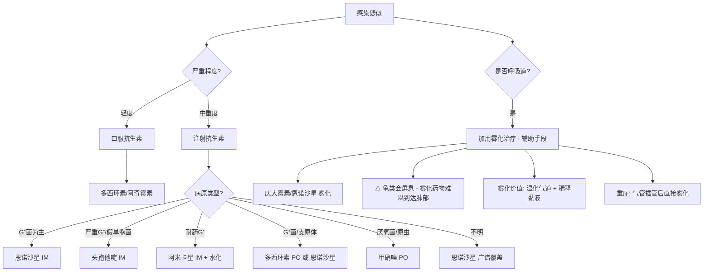
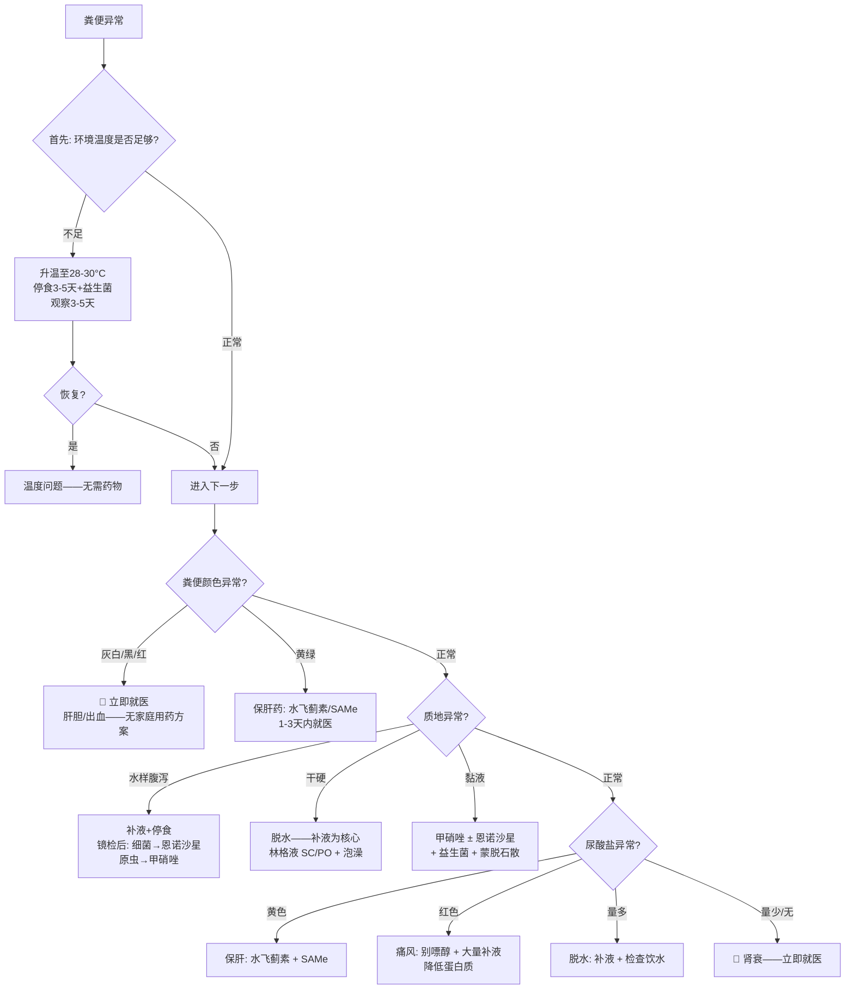
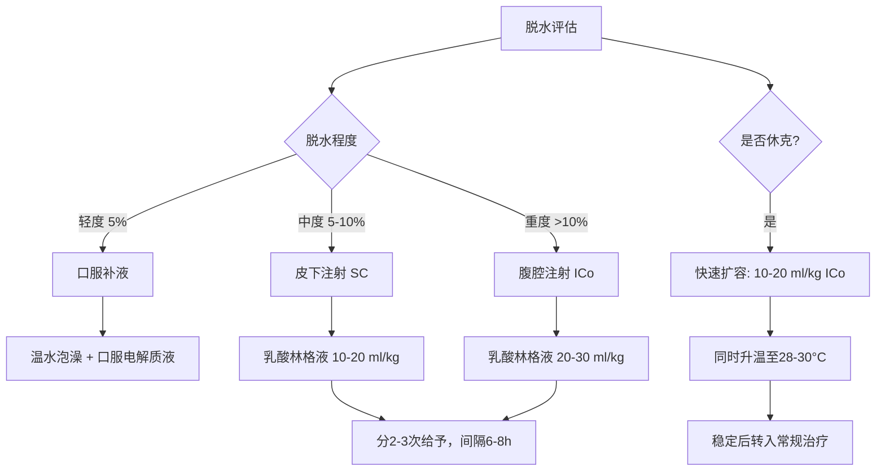
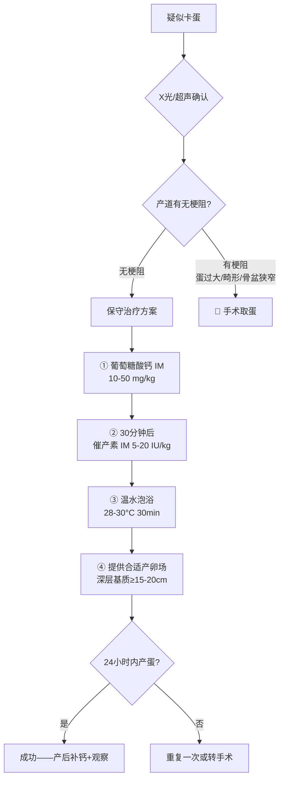

# 黄额闭壳龟（*Cuora galbinifrons*）用药参考手册

> 本文档系统梳理黄额闭壳龟常见疾病的雾化治疗方案与日常用药参考。
>
> **物种说明**：黄额闭壳龟（*Cuora galbinifrons*），又称黄头闭壳龟、三线闭壳龟，分布于越南、老挝及中国海南岛，含三个亚种（*C. g. galbinifrons*、*C. g. bourreti*、*C. g. picturata*）。IUCN 红色名录列为**极危（Critically Endangered）**物种（Asian Turtle Trade Working Group, 2000）。相比锯缘闭壳龟，黄额闭壳龟**更偏陆栖**，栖息于热带/亚热带山地森林底层，对湿度的要求更高，但水域需求相对较少。
>
> **重要声明**：
> - 爬行动物药代动力学（PK）数据远不如哺乳动物完善，许多剂量来源于经验性用药（empirical dosing）和种间外推（allometric scaling）（Mader et al., 2016）。
> - **所有药物使用必须在具有爬行动物医学资质的兽医指导下进行。**
> - 本文档为知识框架参考，不替代临床处方。

---

## 目录

1. [雾化治疗（Nebulization Therapy）](#1-雾化治疗nebulization-therapy)
2. [抗生素用药参考](#2-抗生素用药参考)
3. [抗真菌用药参考](#3-抗真菌用药参考)
4. [抗寄生虫用药参考](#4-抗寄生虫用药参考)
5. [止痛与抗炎药物](#5-止痛与抗炎药物)
6. [营养补充与代谢调节](#6-营养补充与代谢调节)
7. [消化系统用药（含粪便导向用药决策）](#7-消化系统用药)
8. [急救与支持治疗用药](#8-急救与支持治疗用药)
9. [繁殖期用药（Reproductive Medications）](#9-繁殖期用药reproductive-medications)
10. [陆栖物种脱水管理专项](#10-陆栖物种脱水管理专项)
11. [肝胆疾病与消化道出血用药](#11-肝胆疾病与消化道出血用药)
12. [用药核心原则](#12-用药核心原则)
13. [药物速查表](#13-药物速查表)
14. [参考文献](#14-参考文献)

---

## 1. 雾化治疗（Nebulization Therapy）

### 1.1 雾化的原理与意义

雾化治疗（nebulization）是将药物溶液转化为微小气溶胶颗粒（1-5 μm），通过呼吸道吸入到达肺部及支气管表面的局部给药方式。

**为什么雾化在爬行动物中特别重要？**

- 爬行动物肺部的解剖结构特殊（非肺泡结构，而是 faveolar 结构），全身性抗生素到达肺部的浓度可能有限（Mader et al., 2016）
- 雾化可使药物**直接作用于感染部位**，局部浓度高、全身副作用小
- 同时起到**呼吸道湿化**作用，有助于稀释和排出分泌物
- 对于肝功能可能受损的个体，雾化可**绕过肝脏首过效应**

**黄额闭壳龟的特殊考量**：该物种原生于高湿度（80-95%）的山地森林环境，呼吸道黏膜对干燥极为敏感。在人工饲养环境中（尤其北方干燥气候），呼吸道问题的发生率较高，雾化治疗的使用频率可能高于其他闭壳龟种。

> ### ⚠️ 关键限制：龟类的自主屏息行为（Voluntary Apnea）
>
> **雾化在龟类中只能作为辅助治疗（adjunctive therapy），不能替代全身性给药（注射/口服抗生素）作为主要治疗手段。**
>
> **原因**：龟鳖目具有自主控制呼吸节律的能力，可以随意延长屏息时间。在雾化过程中，龟（尤其应激状态下的黄额闭壳龟）会频繁出现以下行为：
>
> | 行为 | 后果 |
> |------|------|
> | **缩头闭气**——将头缩入壳内，关闭鼻孔和声门 | 气溶胶完全无法进入呼吸道 |
> | **延长屏息**——即使不缩头，也可能长时间不呼吸 | 药物几乎不到达肺部 |
> | **浅呼吸**——恢复呼吸时仅为浅表呼吸 | 气溶胶仅到达气管/主支气管，无法深入 faveoli |
>
> 当龟憋气时，雾化的**治疗性药物递送**几乎失效，退化为**空气湿化**功能（Hernandez-Divers et al., 2005; Mader et al., 2016; McArthur et al., 2004）。
>
> **正确的治疗定位**：
> - **主要治疗（Primary）**：全身性抗生素注射（药物经血液循环到达肺部，不受屏息影响）
> - **辅助治疗（Adjunctive）**：雾化（湿化气道、稀释黏液、上呼吸道局部作用）
> - **重症备选**：气管插管后直接雾化（唯一能确保药物到达肺部的方法，需兽医操作）

### 1.2 雾化设备选择

| 设备类型 | 适用性 | 说明 |
|---------|-------|------|
| **压缩式雾化器**（jet nebulizer） | ✅ 推荐 | 颗粒大小合适（2-5 μm），性价比高 |
| **超声雾化器** | ✅ 可用 | 颗粒更细（1-3 μm），适合下呼吸道 |
| **网筛式雾化器**（mesh nebulizer） | ✅ 可用 | 便携、安静，但部分型号颗粒偏大 |
| 蒸汽加湿器 | ❌ 不适用 | 颗粒太大（>10 μm），无法到达肺部 |

**关键参数**：颗粒直径（MMAD）应在 **1-5 μm** 范围内。> 5 μm 的颗粒主要沉积在上呼吸道，< 1 μm 的颗粒会被呼出。

### 1.3 雾化容器

- 使用密闭的透明容器（如塑料饲养箱），大小以龟能舒适放置为宜
- 容器应留有少量通气孔，避免完全密封导致缺氧
- 容器底部不放水，龟直接放置在干燥容器中
- 每次雾化后将龟取出，放回正常饲养环境
- **黄额闭壳龟注意**：该物种应激敏感性较高，雾化容器内应提供遮蔽物（如树皮、叶材），减少视觉暴露带来的应激

### 1.4 雾化用药方案

#### 方案一：抗生素雾化（细菌性呼吸道感染）

| 药物 | 雾化液配制 | 单次用量 | 频次 | 疗程 | 适应症 |
|------|-----------|---------|------|------|-------|
| **庆大霉素**（Gentamicin） | 注射液直接用或生理盐水 1:1 稀释 | 5-10 mg/kg（按体重计算药液总量） | 每日 2 次 | 7-14 天 | 革兰氏阴性菌为主的感染 |
| **阿米卡星**（Amikacin） | 注射液 + 生理盐水稀释至总量 2-5 ml | 5-10 mg/kg | 每日 2 次 | 7-14 天 | 耐药革兰氏阴性菌 |
| **恩诺沙星**（Enrofloxacin） | 注射液 + 生理盐水稀释至总量 2-5 ml | 5 mg/kg | 每日 2 次 | 7-14 天 | 广谱，支原体 |
| **头孢他啶**（Ceftazidime） | 粉针用注射用水复溶后 + 生理盐水稀释 | 10-20 mg/kg | 每日 2 次 | 7-14 天 | 严重革兰氏阴性菌感染 |

> **配制说明**：雾化液的总体积通常为 **2-5 ml**（取决于容器大小和雾化器输出量）。药物剂量按龟的体重计算，然后将计算出的药量加入适量生理盐水至总体积。

#### 方案二：抗真菌雾化（真菌性呼吸道感染）

| 药物 | 雾化液配制 | 单次用量 | 频次 | 疗程 | 适应症 |
|------|-----------|---------|------|------|-------|
| **两性霉素B**（Amphotericin B） | 粉针用注射用水复溶 + 生理盐水稀释 | 0.5-1 mg/kg | 每日 1-2 次 | 14-30 天 | 深部真菌感染 |
| **氟康唑**（Fluconazole） | 注射液直接用 | 5-10 mg/kg | 每日 1-2 次 | 14-30 天 | 念珠菌等酵母菌 |
| **特比萘芬**（Terbinafine） | 片剂研磨后溶于少量生理盐水 | 5-10 mg/kg | 每日 2 次 | 14-30 天 | 丝状真菌 |

> **黄额闭壳龟注意**：该物种在湿度管理不当时（过高 + 通风不良），真菌性呼吸道感染的风险高于一般闭壳龟种。如怀疑真菌感染，建议先做气道冲洗液细胞学检查，明确病原后再选择抗真菌药物。

#### 方案三：联合雾化（细菌+真菌混合感染或不明病原）

| 组合 | 说明 |
|------|------|
| 庆大霉素 + 两性霉素B | 可同时覆盖细菌和真菌，分别配制后混合 |
| 恩诺沙星 + 氟康唑 | 广谱抗菌 + 抗酵母菌 |

#### 方案四：辅助雾化（非药物）

| 溶液 | 用途 | 说明 |
|------|------|------|
| **0.9% 生理盐水** | 呼吸道湿化 | 不含药物，纯粹湿化气道，稀释分泌物 |
| **乳酸林格液** | 呼吸道湿化 + 轻度补液 | 含电解质，可经呼吸道少量吸收 |
| **乙酰半胱氨酸**（NAC） | 黏液溶解 | 加入生理盐水中（浓度 3-5%），帮助稀释黏稠分泌物 |
| **地塞米松**（Dexamethasone） | 减轻气道炎症 | 0.5-1 mg 加入雾化液，短期使用（3-5天），减轻严重炎症 |

> **日常维护雾化**：对于黄额闭壳龟，即使无呼吸道感染，在干燥季节（秋冬）可每周 2-3 次用**纯生理盐水**雾化 15-20 分钟，作为呼吸道黏膜的保湿维护手段。

### 1.5 雾化操作流程

```
准备阶段
  ├── 称量龟体重（精确到克）
  ├── 计算药物剂量和雾化液总量
  ├── 配制雾化液（无菌操作）
  ├── 在雾化容器内放置遮蔽物（减少应激）
  └── 将龟放入雾化容器

雾化阶段
  ├── 启动雾化器，持续 15-30 分钟
  ├── 观察龟的状态（有无应激、呼吸困难加重）
  ├── 如龟出现严重应激 → 立即停止
  └── 雾化结束后取出龟

后续处理
  ├── 清洗雾化容器和雾化器
  ├── 记录用药情况（药物、剂量、时间、龟的反应）
  └── 将龟放回温暖（26-28°C）、高湿度（80%+）的环境
```

### 1.6 雾化注意事项

| 注意事项 | 说明 |
|---------|------|
| **⚠️ 辅助定位** | **雾化始终是辅助治疗，不能替代全身性抗生素注射。** 龟类自主屏息行为使雾化药物难以到达肺部（详见 1.1 节警告框）。全身性注射药物经血液循环到达肺部，是唯一不受屏息影响的给药方式 |
| **温度** | 雾化环境温度应维持在 26-28°C（黄额闭壳龟最适温度略低于锯缘闭壳龟） |
| **应激监测** | 黄额闭壳龟应激敏感性高，雾化过程中密切观察；**应激会加重屏息行为**，严重应激反而抑制免疫 |
| **无菌操作** | 雾化液现配现用，配制过程注意无菌 |
| **疗程完整** | 即使症状改善也不应提前停药，防止耐药 |
| **药物配伍禁忌** | 氨基糖苷类（庆大/阿米卡星）与头孢类可在雾化液中混合；但避免将过多药物混合 |

### 1.7 最大化雾化效果的策略

鉴于龟类的自主屏息行为限制了雾化的药物递送效率，以下策略可以帮助在有限条件下最大化雾化的实际价值：

| 策略 | 具体做法 | 原理 |
|------|---------|------|
| **缩短单次时间、增加频次** | 15分钟 × 3-4次/日 优于 30分钟 × 2次/日 | 减少龟的耐受极限，在每次屏息间歇中捕捉呼吸窗口 |
| **先适应后给药** | 前 3-5 天仅用生理盐水雾化，让龟适应容器和环境 | 降低应激性屏息——适应后的龟屏息频率和持续时间显著减少 |
| **容器内放遮蔽物** | 提供树皮、叶材等视觉遮蔽 | 减少应激→减少防御性屏息 |
| **选择龟活跃时段** | 在龟日常最活跃的时段（通常是上午）进行雾化 | 活跃期龟的呼吸频率更高，屏息更少 |
| **先开盖后密闭** | 雾化开始后先不密封容器，等龟伸出头开始正常呼吸后再密闭 | 让龟在开放环境中先恢复呼吸节律 |
| **观察呼吸节律** | 雾化过程中持续观察，在龟呼吸时确认气溶胶被吸入 | 判断实际药物递送是否有效 |
| **重症：气管插管** | 对于重症且完全不配合的个体，兽医可在镇静/麻醉下进行气管插管后直接雾化给药 | **唯一能确保药物到达肺部的方法** |

### 1.8 雾化的实际价值评估

即使药物因屏息无法充分到达肺部，雾化仍有以下不可替代的辅助价值：

| 价值 | 机制 | 是否依赖主动吸入 |
|------|------|----------------|
| **气道湿化** | 高湿度环境使干燥的呼吸道黏膜重新水化 | 部分依赖（环境湿度升高即可，不完全需要吸入） |
| **黏液稀释** | 湿化后黏稠分泌物变稀，易于排出 | 不依赖（环境效应） |
| **鼻腔/上呼吸道局部用药** | 气溶胶接触鼻腔和前庭黏膜 | 仅需短暂暴露鼻孔 |
| **环境加湿** | 整个容器内湿度接近饱和 | 完全不依赖 |
| **心理安抚** | 类似自然栖息地的高湿环境，减少应激 | 不依赖 |

> **总结**：雾化的核心价值不在于"把药送进肺里"（这在龟类中很难实现），而在于**维持呼吸道黏膜的水合状态、稀释分泌物、为上呼吸道提供局部药物接触**。真正的杀菌/抑菌任务必须由全身性抗生素来完成。

---

## 2. 抗生素用药参考

### 2.1 常用抗生素速查

| 药物 | 给药途径 | 剂量 | 频次 | 疗程 | 主要适应症 | 注意事项 |
|------|---------|------|------|------|-----------|---------|
| **恩诺沙星**（Enrofloxacin） | IM/SC | 5-10 mg/kg | q24-48h | 7-14天 | 广谱G⁻/G⁺，支原体 | 注射部位可能疼痛；避免与含钙/铁同服 |
| 恩诺沙星 | PO（口服） | 5-10 mg/kg | q24h | 7-14天 | 同上 | 口服生物利用度因种而异 |
| **头孢他啶**（Ceftazidime） | IM/SC | 20 mg/kg | q72h | 7-14天 | 严重G⁻感染，假单胞菌 | 半衰期长，间隔给药 |
| **阿米卡星**（Amikacin） | IM/SC | 5-10 mg/kg | q48-72h | 7-14天 | 耐药G⁻菌 | **肾毒性**——必须确保充分水化 |
| **庆大霉素**（Gentamicin） | IM/SC | 2.5-5 mg/kg | q48-72h | 7-14天 | G⁻菌 | **肾毒性+耳毒性**——监测肾功能 |
| **甲硝唑**（Metronidazole） | PO | 20-50 mg/kg | q24-72h | 7-14天 | 厌氧菌，原虫（阿米巴、鞭毛虫） | 可能引起神经毒性（高剂量长期） |
| **多西环素**（Doxycycline） | PO | 5-10 mg/kg | q24-48h | 14-30天 | 支原体，衣原体，立克次体 | 与食物同服减少胃肠刺激 |
| **阿奇霉素**（Azithromycin） | PO | 5 mg/kg | q24-72h | 7-14天 | 支原体，G⁺/G⁻ | 爬行动物PK数据有限 |
| **马波沙星**（Marbofloxacin） | PO/IM | 2-5 mg/kg | q24-48h | 7-14天 | 广谱G⁻ | 恩诺沙星的升级版，组织穿透力更强 |

> **缩写说明**：IM = 肌肉注射；SC = 皮下注射；PO = 口服；q24h = 每24小时；q48h = 每48小时；q72h = 每72小时
>
> **G⁻ = 革兰氏阴性菌；G⁺ = 革兰氏阳性菌**

### 2.2 抗生素选择决策



> **注意**：决策树中雾化标注为"辅助手段"。龟类的自主屏息行为使雾化药物难以到达肺部，雾化不能替代注射抗生素。详见第 1.1 节警告框和第 1.7 节策略。

### 2.3 注射部位选择

| 部位 | 说明 | 注意事项 |
|------|------|---------|
| **前肢/前部肌肉** | 胸肌或前肢大腿肌肉 | ✅ **推荐**——药物经前部静脉回流，减少肾脏首过 |
| **后肢/后部肌肉** | 后肢大腿肌肉 | ❌ **不推荐**——药物经肾门静脉（renal portal system）先到肾脏，增加肾毒性风险 |

> **关键原则**：爬行动物存在肾门静脉系统，后肢注射的药物会先经过肾脏再进入全身循环。因此，**所有注射都应选择身体前半部**（Mader et al., 2016）。

---

## 3. 抗真菌用药参考

| 药物 | 给药途径 | 剂量 | 频次 | 疗程 | 适应症 | 注意事项 |
|------|---------|------|------|------|-------|---------|
| **两性霉素B**（Amphotericin B） | IM | 0.5-1 mg/kg | q24-48h | 14-30天 | 深部真菌感染 | **肾毒性最强**——需充分水化，监测肾功能 |
| 两性霉素B | 雾化 | 0.5-1 mg/kg | q12-24h | 14-30天 | 呼吸道真菌 | 局部用药，全身吸收少 |
| **氟康唑**（Fluconazole） | PO | 5-10 mg/kg | q24-72h | 14-60天 | 念珠菌，隐球菌 | 相对安全，肝毒性较低 |
| **伊曲康唑**（Itraconazole） | PO | 5-10 mg/kg | q24h | 14-60天 | 丝状真菌，皮肤真菌 | 肝毒性——监测肝功能 |
| **特比萘芬**（Terbinafine） | PO | 5-10 mg/kg | q24-48h | 14-30天 | 皮肤真菌，丝状真菌 | 相对安全 |
| 特比萘芬 | 外用 | 乳膏直接涂抹 | q12-24h | 至痊愈 | 甲壳/皮肤浅表真菌 | 清创后涂抹 |
| **制霉菌素**（Nystatin） | PO | 100,000-200,000 IU/kg | q12-24h | 14-30天 | 消化道念珠菌 | 不吸收入血，仅肠道局部作用 |

> **黄额闭壳龟特殊风险**：该物种原生于高湿度森林环境，在人工饲养中若湿度长期 > 90% 且通风不良，真菌感染（尤其是皮肤和甲壳真菌）风险显著升高。抗真菌治疗必须同步改善通风条件，否则易复发。

---

## 4. 抗寄生虫用药参考

### 4.1 体内寄生虫

| 药物 | 靶标寄生虫 | 给药途径 | 剂量 | 频次 | 疗程 | 注意事项 |
|------|-----------|---------|------|------|------|---------|
| **芬苯达唑**（Fenbendazole） | 线虫、绦虫 | PO | 50-100 mg/kg | q24h | 3-5天，2周后重复 | 广谱驱虫首选；安全性高 |
| **甲苯咪唑**（Albendazole） | 线虫 | PO | 25-50 mg/kg | q24h | 3天 | 骨髓抑制风险（高剂量） |
| **甲硝唑**（Metronidazole） | 鞭毛虫、阿米巴 | PO | 20-50 mg/kg | q24-72h | 7-14天 | 原虫感染首选 |
| **伊维菌素**（Ivermectin） | 线虫、蜱虫 | SC/PO | 0.2 mg/kg | 单次，2周后重复 | 1-2次 | ⚠️ **闭壳龟属高度敏感**——神经毒性风险大，**不建议用于黄额闭壳龟** |
| **左旋咪唑**（Levamisole） | 线虫 | PO/IM | 10-20 mg/kg | 单次 | 1次，2周后重复 | 免疫刺激作用；数据有限 |
| **吡喹酮**（Praziquantel） | 绦虫、吸虫 | PO/IM | 5-10 mg/kg | 单次 | 1次，2周后重复 | 绦虫特效 |

### 4.2 体外寄生虫（蜱虫）

| 方法 | 说明 | 注意事项 |
|------|------|---------|
| **手动移除** | 镊子夹住口器基部，旋转拔出 | 勿残留口器；勿用火烧/涂油等偏方 |
| **伊维菌素药浴** | 0.025% 溶液浸泡 30 分钟 | ⚠️ 黄额闭壳龟对伊维菌素极度敏感，**不推荐此方法** |
| **替代方案** | 手动移除后局部涂抹伊维菌素溶液（极低浓度），仅限体表 | 避免浸泡——减少全身吸收 |
| **环境处理** | 彻底更换底材，环境清洁消毒 | 防止再感染 |

> **黄额闭壳龟特别注意**：该物种来源于越南、老挝的山地森林，野外个体蜱虫（*Amblyomma* 属）携带率极高。新引入个体**必须**在隔离期内进行全面的体表检查和驱虫处理，但应**避免使用伊维菌素**——优先选择芬苯达唑（体内）+ 手动移除（体外）的安全组合。

---

## 5. 止痛与抗炎药物

| 药物 | 类别 | 给药途径 | 剂量 | 频次 | 适应症 | 注意事项 |
|------|------|---------|------|------|-------|---------|
| **美洛昔康**（Meloxicam） | NSAIDs | PO/IM/SC | 0.1-0.5 mg/kg | q24-48h | 疼痛、炎症、术后 | 爬行动物最常用的NSAIDs；肾毒性——确保水化 |
| **卡洛芬**（Carprofen） | NSAIDs | PO/SC | 2-4 mg/kg | q24-72h | 疼痛、炎症 | 数据有限 |
| **地塞米松**（Dexamethasone） | 糖皮质激素 | IM/SC/PO | 0.5-2 mg/kg | 单次或q24-72h | 严重炎症、休克、过敏 | **免疫抑制**——仅在必要时短期使用；感染时须同时用抗生素 |
| **曲马多**（Tramadol） | 阿片类 | PO/IM | 5-10 mg/kg | q12-24h | 中重度疼痛 | 爬行动物口服生物利用度低；注射效果更好 |
| **丁丙诺啡**（Buprenorphine） | 阿片类 | IM/SC | 0.01-0.05 mg/kg | q24-72h | 中重度疼痛 | 长效；可能引起呼吸抑制 |
| **利多卡因**（Lidocaine） | 局麻药 | 局部 | 2-5 mg/kg | 单次 | 局部麻醉、清创止痛 | 避免过量——心脏毒性 |

---

## 6. 营养补充与代谢调节

| 药物/补充剂 | 适应症 | 给药途径 | 剂量 | 频次 | 注意事项 |
|------------|-------|---------|------|------|---------|
| **维生素A**（Vitamin A） | V-A缺乏（眼肿、呼吸道黏膜角化） | IM | 5,000-10,000 IU/kg | 单次，2-4周后评估是否重复 | **过量有毒**——不可频繁给药 |
| 维生素A | 预防 | PO | 混入食物 | 每周1-2次 | 通过食物补充更安全 |
| **维生素D3**（Vitamin D3） | MBD辅助治疗 | PO/IM | 50-100 IU/kg（口服）；500 IU/kg（注射） | q24h（口服）；单次（注射） | 注射剂量需精确——过量导致异位钙化 |
| **葡萄糖酸钙**（Calcium gluconate） | 低血钙、MBD急性期 | IM/SC/PO | IM: 10-50 mg/kg；PO: 100-200 mg/kg | q24-48h（IM）；每日（PO） | IM注射需缓慢；与UVB治疗同步 |
| **碳酸钙**（Calcium carbonate） | 日常钙补充 | PO（拌食） | 每次投喂撒粉 | 每次投喂 | 钙磷比调节的核心手段 |
| **降钙素**（Calcitonin） | MBD严重病例 | IM | 50-100 IU/kg | q24-48h × 3-5次 | 促进骨钙沉积；须先确保血钙不低 |
| **维生素B族**（Vitamin B complex） | 食欲恢复、神经功能 | IM/PO | 1-5 mg/kg | q24-72h | 水溶性，安全性高 |
| **维生素E**（Vitamin E） | 黄脂病、抗氧化 | PO/IM | 5-20 IU/kg | q24-48h | 脂溶性——避免长期过量 |
| **维生素K1**（Vitamin K1） | 凝血障碍 | IM/PO | 0.5-2.5 mg/kg | q12-24h | 出血性疾病辅助 |

> **黄额闭壳龟的UVB需求**：虽然黄额闭壳龟比锯缘闭壳龟更偏陆栖，但作为日行性森林底层物种，它们仍需要UVB照射来合成维生素D3。在人工环境中，UVB灯仍是预防MBD的必需品。但由于其原生栖息地有较多树冠遮蔽，UVB强度需求可能略低于完全暴露的物种——建议使用 UVB 5.0-6.0% 的灯管（而非 10.0% 的沙漠型灯管）。

---

## 7. 消化系统用药

### 7.1 基础消化系统用药

| 药物 | 适应症 | 给药途径 | 剂量 | 频次 | 注意事项 |
|------|-------|---------|------|------|---------|
| **甲硝唑**（Metronidazole） | 厌氧菌感染、原虫性肠炎 | PO | 20-50 mg/kg | q48-72h | 爬行动物代谢慢，间隔长 |
| **芬苯达唑**（Fenbendazole） | 肠道线虫 | PO | 50-100 mg/kg | q24h × 3-5天 | 2周后重复一个疗程 |
| **蒙脱石散**（Smectite） | 腹泻（对症止泻） | PO | 0.5-1 g/kg | q12-24h | 吸附毒素；与其他药物间隔2小时 |
| **益生菌**（Probiotics） | 肠道菌群恢复 | PO | 按产品说明 | 每日 | 抗生素疗程后使用；帮助恢复消化功能 |
| **乳酶生** | 消化不良 | PO | 0.5-1 g/kg | q12h | 辅助消化 |
| **多潘立酮**（Domperidone） | 胃动力不足 | PO | 0.5-1 mg/kg | q12-24h | 促进胃排空 |

### 7.2 粪便导向用药决策——从粪便异常到药物选择

> 本节与《黄额闭壳龟常见疾病参考手册》第2章"粪便诊断专题"配套使用。当通过粪便观察发现异常后，按以下路径选择对应药物。

#### 7.2.1 按粪便颜色选药

| 粪便颜色 | 最可能病因 | 首选药物 | 备选药物 | 辅助用药 | 就医指征 |
|----------|-----------|---------|---------|---------|---------|
| **灰白色/陶土色** | 肝胆阻塞/胆道梗阻 | 🔴 **无家庭用药方案——必须立即就医** | 兽医可能使用：熊去氧胆酸（UDCA）10-15 mg/kg PO q24h（利胆）；保肝药（水飞蓟素/Silymarin）20-50 mg/kg PO q24h | 禁食高脂食物 | 立即就医 |
| **黑色/柏油样** | 上消化道出血 | 🔴 **必须就医** | 兽医可能使用：奥美拉唑（Omeprazole）0.5-1 mg/kg PO q24-48h（抑酸）；硫糖铝（Sucralfate）0.25-1 g PO q8-12h（胃黏膜保护） | 止血：维生素K1 0.5-2.5 mg/kg IM | 立即就医 |
| **鲜绿/黄绿色**（排除食物因素） | 肝胆疾病 | 保肝支持：水飞蓟素 20-50 mg/kg PO q24h | 兽医评估后可能使用：SAMe（S-腺苷蛋氨酸）10-20 mg/kg PO q24h | 维生素B族（肝脏代谢支持）；调整饮食降低脂肪 | 1-3天内就医 |
| **红色/带血丝** | 下消化道/泄殖腔出血 | 🔴 **必须就医** | 兽医可能使用：止血药（氨甲环酸/Tranexamic acid 10-15 mg/kg IM q12h）；抗生素（如有感染） | 维生素K1 | 立即就医 |
| **黄色/泡沫状** | 消化不良/肠道感染/温度过低 | ① **首先升温至28-30°C** ② 停食3-5天 ③ 益生菌 | 若感染：甲硝唑 PO 20-50 mg/kg q48-72h | 蒙脱石散（止泻）；多潘立酮（促动力） | 升温3-5天无改善→就医 |

#### 7.2.2 按粪便质地选药

| 粪便质地 | 最可能病因 | 首选药物/处理 | 备选药物 | 辅助用药 |
|----------|-----------|-------------|---------|---------|
| **水样腹泻** | 肠道感染（细菌/原虫） | ① 升温+停食 ② 补液（ORS/林格液） ③ 粪便镜检后针对性用药 | 细菌性：恩诺沙星 PO 5 mg/kg q24h；原虫性：甲硝唑 PO 20-50 mg/kg q48-72h | 蒙脱石散；益生菌（抗生素疗程后） |
| **糊状/不成形** | 轻度消化不良/轻度寄生虫 | ① 调整饮食 ② 益生菌 ③ 粪便镜检 | 镜检阳性→针对性驱虫 | 乳酶生 |
| **干硬/颗粒状** | **脱水**（黄额闭壳龟高风险——偏陆栖） | ① **补液为核心**：温水泡澡 + 口服/SC补液 ② 检查饮水供应 | 乳酸林格液 SC 10-20 ml/kg | 增加环境湿度；提供水盆 |
| **黏液包裹** | 肠道炎症/结肠炎 | ① 粪便检查 ② 甲硝唑（厌氧菌/原虫） ③ 必要时恩诺沙星（G⁻菌） | 根据培养结果调整 | 蒙脱石散；益生菌；补液 |

#### 7.2.3 按尿酸盐异常选药

| 尿酸盐表现 | 最可能病因 | 首选药物/处理 | 备选药物 | 注意事项 |
|-----------|-----------|-------------|---------|---------|
| **黄色/黄绿色** | 肝胆疾病 | 水飞蓟素 20-50 mg/kg PO q24h；SAMe 10-20 mg/kg PO q24h | 兽医评估后保肝方案 | 必须检查肝功能（胆汁酸） |
| **红色/粉红色** | 痛风/高尿酸血症 | ① 大量补液 ② 别嘌醇（Allopurinol）10-20 mg/kg PO q24-48h | 秋水仙碱 0.05-0.1 mg/kg PO q24h（抗炎）；丙磺舒 20-50 mg/kg PO q24h（促排泄） | 🔴 **降低蛋白质摄入是根本** |
| **量显著增多** | 脱水 | ① 补液（林格液 SC/PO） ② 温水泡澡 ③ 检查饮水 | — | 黄额闭壳龟偏陆栖，饮水不足是首要排查项 |
| **量显著减少/消失** | 🔴 肾功能衰竭 | **必须立即就医**——大量补液 + 肾功能评估 | 兽医可能使用：利尿剂（呋塞米 2-5 mg/kg IM q24h）；透析（极端情况） | 预后差——预防远重于治疗 |
| **砂砾感/颗粒粗大** | 痛风前期/慢性脱水 | ① 增加饮水 ② 降低饮食嘌呤 ③ 别嘌醇预防 | — | 长期管理 |

#### 7.2.4 按未消化食物选药

| 表现 | 最可能病因 | 首选处理 | 药物 | 注意事项 |
|------|-----------|---------|------|---------|
| 食物完整 + 温度低 | 消化酶活性不足 | **升温至28-30°C** | 通常无需药物——升温后观察3-5天 | **最常见原因，首先排除** |
| 食物完整 + 温度正常 | 消化酶分泌不足/胰腺问题 | 就医评估 | 胰酶替代（Pancreatic enzyme supplement）——数据极有限 | 需排除慢性胰腺炎 |
| 持续未消化 + 体重下降 | 慢性吸收不良 | 就医系统检查 | 益生菌 + 甲硝唑（如有小肠细菌过度生长） | 可能需要长期管理 |

#### 7.2.5 粪便异常用药决策树



---

## 8. 急救与支持治疗用药

| 药物/方案 | 适应症 | 剂量/方法 | 说明 |
|----------|-------|----------|------|
| **乳酸林格液**（Lactated Ringer's） | 脱水、休克 | 10-30 ml/kg/天，分次给予 | 给药途径：PO（轻度）、SC（中度）、ICo（腹腔内，重度） |
| **葡萄糖溶液**（5% Dextrose） | 低血糖、能量支持 | SC: 5-10 ml/kg | 严重低血糖时可腹腔注射 |
| **肾上腺素**（Epinephrine） | 心脏骤停 | 0.1 mg/kg，IC（心内注射） | 仅用于心肺复苏 |
| **纳洛酮**（Naloxone） | 阿片类药物过量 | 0.1-0.5 mg/kg，IM | 逆转阿片类呼吸抑制 |
| **活性炭**（Activated charcoal） | 经口中毒 | 1-3 g/kg，PO | 吸附毒物；不适用于腐蚀性毒物 |
| **维生素C**（Vitamin C） | 应激支持、抗氧化 | 10-50 mg/kg | PO或注射；减轻氧化应激 |

### 补液方案详解



---

## 9. 繁殖期用药（Reproductive Medications）

> 黄额闭壳龟繁殖技术尚不成熟（详见《交配繁殖心智模型》），繁殖期用药是支撑繁殖成功的重要环节。本节覆盖从繁殖调理到繁殖急症的用药方案。

### 9.1 繁殖期营养与激素管理

| 药物/补充剂 | 适应症 | 给药途径 | 剂量 | 频次 | 注意事项 |
|------------|-------|---------|------|------|---------|
| **催产素**（Oxytocin） | 卡蛋/蛋滞留——促进子宫收缩 | IM | 5-20 IU/kg | 单次，必要时2小时后重复 | **必须先确认产道无梗阻**（X光/超声）——梗阻时使用可致子宫破裂 |
| **精氨酸血管素**（Arginine vasotocin） | 卡蛋——爬行动物天然激素 | IM | 0.01-0.1 μg/kg | 单次 | 比催产素更特异于爬行动物；数据有限 |
| **葡萄糖酸钙** | 卡蛋辅助——提供子宫收缩所需钙离子 | IM/SC | 10-50 mg/kg | 催产素前30分钟给予 | 低血钙→子宫收缩无力→卡蛋 |
| **碳酸钙** | 繁殖期雌性日常钙补充——预防性 | PO（拌食） | 每次投喂撒粉 | 每次投喂 | 繁殖期钙需求急剧升高（卵壳形成） |
| **维生素D3** | 繁殖期钙吸收支持 | PO | 50-100 IU/kg | q24h（口服） | 与钙同步补充 |
| **降钙素**（Calcitonin） | 繁殖后雌性钙恢复 | IM | 50-100 IU/kg | q24-48h × 3-5次 | 须先确保血钙不低 |

### 9.2 卡蛋/蛋滞留（Dystocia）用药方案



### 9.3 繁殖期雌性钙管理方案

| 阶段 | 钙补充策略 | 说明 |
|------|-----------|------|
| **繁殖前期**（雨季信号前 2-3 个月） | 每次投喂撒碳酸钙粉 + UVB 充足照射 | 建立钙储备——卵壳形成需要大量钙 |
| **卵泡发育期**（雨季信号后） | 碳酸钙 PO 每日 + 维生素D3 q24h | 钙需求急剧升高 |
| **产蛋期** | 产蛋前给予葡萄糖酸钙 IM（预防性） | 确保子宫收缩有足够钙离子 |
| **产后恢复期** | 葡萄糖酸钙 IM + 降钙素（如需要） | 补充大量流失的钙 |
| **全年维持** | 碳酸钙拌食 + UVB 5.0-6.0% | 基础钙代谢维持 |

### 9.4 繁殖期雄性用药注意

| 注意事项 | 说明 |
|---------|------|
| **避免肾毒性药物** | 繁殖期雄性需要维持良好精子质量——氨基糖苷类（庆大/阿米卡星）的肾毒性可能间接影响生殖功能 |
| **避免高温** | 用药期间升温不超过 28°C（黄额闭壳龟上限）——过高温度影响精子发生 |
| **避免伊维菌素** | 闭壳龟属对伊维菌素高度敏感——繁殖期尤其不应冒险 |

---

## 10. 陆栖物种脱水管理专项

> 黄额闭壳龟比锯缘闭壳龟更偏陆栖，水域需求少，但**饮水不足和脱水风险相应更高**。脱水不仅是独立疾病，更是痛风、肾功能损伤、消化停滞等多种疾病的共同诱因。

### 10.1 脱水程度评估

| 脱水程度 | 体征 | 补液方案 |
|---------|------|---------|
| **轻度（< 5%）** | 皮肤弹性略降、尿量略减、尿酸盐偏多 | 口服补液 + 温水泡澡（28°C，30min/日） |
| **中度（5-10%）** | 皮肤弹性明显下降、眼窝凹陷、尿量减少、尿酸盐显著增多 | SC 补液（林格液 10-20 ml/kg，分2-3次） |
| **重度（> 10%）** | 眼窝深陷、皮肤无弹性、无尿、嗜睡/无反应 | ICo 补液（林格液 20-30 ml/kg）+ 就医 |

### 10.2 补液药物方案

| 溶液 | 适用场景 | 给药途径 | 剂量 | 频次 | 注意事项 |
|------|---------|---------|------|------|---------|
| **口服补液盐（ORS）** | 轻度脱水/日常维持 | PO（泡澡水中或口服） | 泡澡：加入温水中；口服：10-20 ml/kg | 每日 | 最安全的补液方式 |
| **乳酸林格液** | 中度脱水 | SC | 10-20 ml/kg | 分2-3次/日，间隔6-8h | 首选注射液——电解质平衡 |
| 乳酸林格液 | 重度脱水 | ICo（腹腔内） | 20-30 ml/kg | 分次给予 | 需兽医操作 |
| **5% 葡萄糖溶液** | 低血糖 + 脱水 | SC | 5-10 ml/kg | 单次或重复 | 提供能量 + 水分 |
| 5% 葡萄糖 + 林格液 | 脱水 + 低血糖 + 电解质紊乱 | SC/ICo | 按 1:1 混合 | 分次 | 综合支持 |

### 10.3 脱水预防——环境管理

| 措施 | 说明 |
|------|------|
| **提供水盆** | 即使偏陆栖，黄额闭壳龟仍需饮水——放置浅水盆（水深 ≤ 腹甲高度） |
| **环境湿度** | 维持 60-90%（分区）——湿度过低加速体表水分蒸发 |
| **定期泡澡** | 每周 2-3 次温水泡澡（28°C，20-30min）——促进饮水和皮肤水合 |
| **食物含水** | 提供含水量高的食物（蜗牛、蚯蚓、多汁蔬果） |
| **监测尿酸盐** | 尿酸盐量增多是最早的脱水信号——每次清理时观察 |

---

## 11. 肝胆疾病与消化道出血用药

> 常见疾病文档中，灰白色粪便（肝胆阻塞）和黑色粪便（上消化道出血）被列为急症。本节提供对应的药物参考。

### 11.1 肝胆疾病用药

| 药物 | 适应症 | 给药途径 | 剂量 | 频次 | 注意事项 |
|------|-------|---------|------|------|---------|
| **水飞蓟素**（Silymarin） | 保肝——各种肝病的辅助治疗 | PO | 20-50 mg/kg | q24h | 安全性高；抗氧化+促进肝细胞再生 |
| **SAMe**（S-腺苷蛋氨酸） | 保肝+利胆 | PO | 10-20 mg/kg | q24h | 空腹服用；与某些药物间隔2小时 |
| **熊去氧胆酸**（UDCA） | 利胆——胆汁淤积/胆道梗阻 | PO | 10-15 mg/kg | q24h | 促进胆汁流动；完全梗阻时禁用 |
| **维生素B族** | 肝脏代谢支持 | IM/PO | 1-5 mg/kg | q24-72h | 水溶性，安全性高 |
| **维生素C** | 抗氧化支持 | PO/IM | 10-50 mg/kg | q24h | 减轻肝脏氧化应激 |
| **维生素K1** | 凝血障碍（肝病继发） | IM/PO | 0.5-2.5 mg/kg | q12-24h | 肝病→凝血因子合成减少→出血倾向 |

### 11.2 消化道出血用药

| 药物 | 适应症 | 给药途径 | 剂量 | 频次 | 注意事项 |
|------|-------|---------|------|------|---------|
| **奥美拉唑**（Omeprazole） | 上消化道出血——抑酸 | PO | 0.5-1 mg/kg | q24-48h | 减少胃酸对损伤黏膜的刺激 |
| **硫糖铝**（Sucralfate） | 胃黏膜保护 | PO | 0.25-1 g | q8-12h | 空腹服用；形成黏膜保护层 |
| **氨甲环酸**（Tranexamic acid） | 止血 | IM/PO | 10-15 mg/kg | q12h | 抗纤溶——促进止血 |
| **维生素K1** | 凝血支持 | IM/PO | 0.5-2.5 mg/kg | q12-24h | 辅助凝血 |
| **补液** | 出血导致的血容量下降 | SC/ICo | 林格液 10-30 ml/kg | 根据脱水程度 | 维持循环血量 |

> **关键提醒**：灰白色粪便（胆道梗阻）和黑色粪便（上消化道出血）均为**急症**，家庭用药仅为就医前的临时支持，**不能替代兽医诊治**。

---

## 12. 用药核心原则

### 12.1 爬行动物药理学特殊性

| 原则 | 说明 | 来源 |
|------|------|------|
| **变温动物代谢特点** | 体温决定代谢速率 → 药物代谢速率也受温度影响。低温时药物半衰期延长，需调整给药间隔 | Huey & Stevenson, 1979 |
| **肾门静脉系统** | 后肢/尾部注射的药物经肾门静脉先到肾脏 → 增加肾毒性。**所有注射选前半身** | Mader et al., 2016 |
| **PK数据匮乏** | 大多数药物的爬行动物PK数据来自少量研究或种间外推 → 经验性用药为主 | Divers & Mader, 2019 |
| **肝功能差异** | 爬行动物肝脏代谢酶活性与哺乳动物不同 → 某些药物代谢途径和半衰期差异大 | Mader et al., 2016 |
| **排泄途径** | 爬行动物以尿酸为主要含氮废物 → 肾脏负担重 → 肾毒性药物需格外谨慎 | Divers, 2005 |

### 12.2 用药安全清单

在给予任何药物前，确认以下事项：

- [ ] **准确称重**：剂量基于体重，必须精确到克
- [ ] **正确计算**：mg/kg × 体重(kg) = 实际用药量(mg)；再根据药物浓度换算体积(ml)
- [ ] **注射部位**：选择身体前半部（前肢/胸部肌肉）
- [ ] **水化状态**：使用肾毒性药物（氨基糖苷类、两性霉素B）前必须确保充分水化
- [ ] **药物有效期**：检查药物是否过期
- [ ] **配伍禁忌**：确认混合用药无禁忌
- [ ] **温度支持**：用药期间维持环境温度在最适范围上限（26-28°C，黄额闭壳龟）
- [ ] **记录**：记录每次用药的时间、剂量、途径和龟的反应

### 12.3 绝对禁忌

| 禁忌 | 原因 |
|------|------|
| **后肢/尾部注射** | 肾门静脉系统导致药物先到肾脏，增加肾毒性 |
| **伊维菌素用于闭壳龟属** | 个体耐受差异极大，神经毒性风险高——**黄额闭壳龟尤其敏感** |
| **含磷钙补充剂用于MBD** | 磷会拮抗钙吸收，MBD时应使用纯钙制剂 |
| **长期/高剂量糖皮质激素** | 免疫抑制 → 感染扩散 |
| **人用复方感冒药** | 含多种成分（伪麻黄碱、对乙酰氨基酚等），对龟有毒 |
| **酒精/碘酒直接接触伤口** | 组织毒性，延缓愈合——应使用碘伏（聚维酮碘） |
| **沙漠型UVB 10.0%灯管近距离使用** | 黄额闭壳龟原生环境有树冠遮蔽，过高UVB可能导致眼部损伤和皮肤烧伤 |

---

## 13. 药物速查表

### 按疾病快速查找

| 疾病 | 首选药物 | 备选药物 | 辅助治疗 |
|------|---------|---------|---------|
| **肺炎** | 恩诺沙星 IM 5-10 mg/kg q24-48h | 头孢他啶 IM 20 mg/kg q72h | ⚠️ 雾化仅为辅助（龟会屏息）：生理盐水湿化+庆大霉素；升温28-30°C；重症考虑气管插管雾化 |
| **上呼吸道感染** | 恩诺沙星 PO 5 mg/kg q24h | 多西环素 PO 5 mg/kg q24-48h | ⚠️ 雾化仅为辅助：生理盐水湿化+抗生素；日常维护雾化（纯生理盐水） |
| **MBD** | 碳酸钙 PO + UVB 5.0-6.0% | 葡萄糖酸钙 IM + 降钙素 | 维生素D3；升温促代谢 |
| **胃肠炎** | 甲硝唑 PO 20-50 mg/kg q48-72h | 恩诺沙星 PO | 蒙脱石散；益生菌；补液 |
| **肠道寄生虫** | 芬苯达唑 PO 50-100 mg/kg × 3-5天 | 吡喹酮（绦虫） | 2周后重复疗程；**避免伊维菌素** |
| **甲壳溃疡** | 局部碘伏 + 抗菌药膏 | 全身恩诺沙星 IM | 清创；适当干养 |
| **真菌感染** | 特比萘芬 外用/PO | 伊曲康唑 PO | 改善通风；降低局部湿度 |
| **V-A缺乏** | 维生素A IM 5,000-10,000 IU/kg | 饮食调整 | 眼部局部清洗+抗生素膏 |
| **痛风** | 别嘌醇 PO 10-20 mg/kg q24-48h + 大量补液 | 秋水仙碱 0.05-0.1 mg/kg PO q24h | 降低蛋白摄入；丙磺舒促排泄 |
| **卡蛋** | 葡萄糖酸钙 IM → 30min后催产素 IM 5-20 IU/kg | 精氨酸血管素 IM；手术 | 温水泡澡；提供产卵场；**先确认无梗阻** |
| **外伤/脓肿** | 外科清创 + 恩诺沙星 IM | 头孢他啶 IM | 碘伏消毒；美洛昔康止痛 |
| **脱水** | 乳酸林格液 SC/ICo | 口服补液盐（ORS） | 温水泡澡；提供水盆；增加环境湿度 |
| **应激** | 环境调整为首选 | 维生素C 10-50 mg/kg | 提供遮蔽；减少干扰；保持高湿度 |
| **肝胆疾病** | 水飞蓟素 PO 20-50 mg/kg q24h + SAMe 10-20 mg/kg q24h | 熊去氧胆酸 PO 10-15 mg/kg q24h（利胆） | 维生素B族；维生素K1（凝血）；低脂饮食 |
| **胆道梗阻（灰白便）** | 🔴 **立即就医**——兽医：UDCA + 保肝方案 | — | 家庭仅支持：水飞蓟素 + 禁高脂食物 |
| **上消化道出血（黑便）** | 🔴 **立即就医**——兽医：奥美拉唑 + 硫糖铝 | 氨甲环酸 IM 止血 | 维生素K1；补液维持血容量 |
| **下消化道出血（红便）** | 🔴 **立即就医**——兽医：止血+抗感染 | 氨甲环酸；维生素K1 | 补液 |
| **肾衰竭（尿酸盐消失）** | 🔴 **立即就医**——大量补液 + 肾功能评估 | 呋塞米 2-5 mg/kg IM（利尿） | 预后差 |
| **繁殖期钙管理** | 碳酸钙 PO 每次投喂 + UVB 5.0-6.0% | 葡萄糖酸钙 IM（产蛋期） | 维生素D3 q24h；产后降钙素 |

### 家庭常备药物清单

| 类别 | 药物 | 用途 |
|------|------|------|
| **消毒** | 碘伏（聚维酮碘） | 伤口消毒、甲壳清创 |
| **消毒** | 氯己定溶液 | 环境消毒、皮肤清洗 |
| **外用** | 银磺嘧啶银霜 | 甲壳/皮肤抗感染 |
| **外用** | 特比萘芬乳膏 | 浅表真菌 |
| **外用** | 妥布霉素眼膏 | 眼部感染 |
| **口服** | 芬苯达唑 | 驱虫（**避免伊维菌素**） |
| **口服** | 甲硝唑 | 原虫/厌氧菌肠炎 |
| **口服** | 蒙脱石散 | 腹泻对症 |
| **口服** | 水飞蓟素 | 保肝（肝胆疾病/黄色尿酸盐） |
| **口服** | 奥美拉唑 | 消化道出血临时支持（就医前） |
| **口服** | 碳酸钙粉 | 日常钙补充 + 繁殖期雌性 |
| **补充** | 维生素B族 | 食欲恢复 + 肝脏支持 |
| **补充** | 维生素C | 应激支持 + 抗氧化 |
| **补充** | 维生素K1 | 凝血支持（出血/肝病） |
| **补充** | SAMe（S-腺苷蛋氨酸） | 保肝利胆 |
| **补充** | 益生菌 | 肠道恢复 |
| **补液** | 口服补液盐（ORS） | 轻度脱水 |
| **补液** | 乳酸林格液（备用） | 中度脱水 SC 补液 |
| **器械** | 压缩式雾化器 | 呼吸道治疗 + 日常湿化维护 |
| **器械** | 精密电子秤（0.1g） | 称体重计算剂量 |
| **器械** | UVB 5.0-6.0% 灯管 | 日常UVB照射（森林型） |

---

## 14. 参考文献

### 物种生物学与保育

- Ernst, C. H., & Lovich, J. E. (2009). *Turtles of the United States and Canada* (2nd ed.). Johns Hopkins University Press.
- Zhou, T., Shi, H., & Murphy, R. W. (2020). Phylogeny, taxonomy and biogeography of the genus *Cuora* (Testudines: Geoemydidae). *Zoological Research*, 41(3), 231–243.
- Asian Turtle Trade Working Group. (2000). *Cuora galbinifrons*. The IUCN Red List of Threatened Species 2000: e.T6006A189453910.
- van Dijk, P. P., et al. (2017). *Turtles of the World: Annotated Checklist* (8th ed.). Chelonian Research Foundation.

### 爬行动物药理学

- Mader, D. R., Divers, S. J., & Iglauer, K. (Eds.). (2016). *Mader's Reptile and Amphibian Medicine and Surgery* (3rd ed.). Elsevier. — **第35-42章：药理学与治疗学**
- Divers, S. J., & Mader, D. R. (Eds.). (2019). *Reptile Medicine and Surgery in Clinical Practice*. CRC Press. — **Part III: Therapeutics**
- Girling, S. J., & Raiti, P. (Eds.). (2004). *BSAVA Manual of Reptiles* (2nd ed.). British Small Animal Veterinary Association.

### 雾化治疗

- McArthur, S., Wilkinson, R., & Gibbons, D. (Eds.). (2004). *Medicine and Surgery of Tortoises and Turtles*. Elsevier. — Chapter 15: Therapeutics
- Divers, S. J. (2004). Diagnostic and therapeutic techniques. In *Reptile Medicine and Surgery* (pp. 140–162). Elsevier.
- Hernandez-Divers, S. M., et al. (2005). Nebulization therapy in reptiles. *Journal of Exotic Pet Medicine*, 14(3), 166–173. — **关键文献：明确指出龟类自主屏息行为（voluntary apnea）显著限制雾化药物的肺部沉积量（pulmonary deposition），雾化应定位为辅助治疗**
- Mader, D. R. (2016). Respiratory therapy in reptiles. In *Mader's Reptile and Amphibian Medicine and Surgery* (3rd ed., Chapter 38). Elsevier. — **讨论龟类雾化治疗中药物递送的局限性及气管插管雾化的适应证**

### 抗生素药代动力学

- Jacobson, E. R. (2007). Antimicrobial drug use in reptiles. In *Infectious Diseases and Pathology of Reptiles* (pp. 241–275). CRC Press.
- Whittaker, A. L., et al. (2020). Pharmacokinetics of antimicrobial agents in reptiles. *Journal of Veterinary Pharmacology and Therapeutics*, 43(5), 445–461.
- Martinez, M., et al. (2006). Fluoroquinolones in reptiles. *Compendium on Continuing Education for the Practicing Veterinarian*, 28(Suppl), 12–20.

### 爬行动物特殊生理学

- Huey, R. B., & Stevenson, R. D. (1979). Integrating thermal physiology and ecology of ectotherms. *American Zoologist*, 19(1), 357–366.
- Divers, S. J. (2005). Reptile renal disease. *Veterinary Clinics of North America: Exotic Animal Practice*, 8(1), 109–130.

### 伊维菌素毒性

- Jakob-Hoff, R. M., et al. (2005). Ivermectin toxicity in a leopard gecko (*Eublepharis macularius*). *Journal of Herpetological Medicine and Surgery*, 15(1), 29–31.
- Pessier, A. P., et al. (1998). Suspected ivermectin toxicosis in a radiated tortoise (*Geochelone radiata*). *Journal of Zoo and Wildlife Medicine*, 29(3), 330–333.

### 繁殖医学与产科用药

- Mader, D. R. (2004). Reproductive biology and medicine of chelonians. *Veterinary Clinics of North America: Exotic Animal Practice*, 7(2), 427–447.
- Stahl, S. (2006). Chelonian reproductive medicine. In *Proceedings of the Association of Reptilian and Amphibian Veterinarians*.
- Divers, S. J. (2004). Diagnostic and therapeutic techniques. In *Reptile Medicine and Surgery* (pp. 140–162). Elsevier. — **产科操作：超声诊断、催产素使用**

### 肝胆疾病与保肝药物

- Mader, D. R., Divers, S. J., & Kumar, K. (Eds.). (2016). *Mader's Reptile and Amphibian Medicine and Surgery* (3rd ed.). Elsevier. — **Chapter 29: Hepatobiliary Disease**
- Divers, S. J. (2019). Hepatic disease and medicine. In *Reptile Medicine and Surgery in Clinical Practice* (pp. 530–548). CRC Press.
- Crossley, D. A. (2003). Hepatic medicine in reptiles. *Seminars in Avian and Exotic Pet Medicine*, 12(2), 98–108.

### 脱水与液体治疗

- Divers, S. J. (2004). Fluid therapy. In *Reptile Medicine and Surgery* (pp. 120–139). Elsevier.
- Mader, D. R. (2016). Fluid therapy. In *Mader's Reptile and Amphibian Medicine and Surgery* (3rd ed., Chapter 34). Elsevier.
- Donoghue, S. (2006). Nutrition. In *Reptile Medicine and Surgery* (2nd ed., pp. 255–271). Elsevier. — **陆栖龟类的水分需求与脱水评估**

### 痛风与肾脏疾病用药

- Hernandez-Divers, S. M., et al. (2005). Effects of allopurinol on uric acid concentrations in red-eared slider turtles. *American Journal of Veterinary Research*, 66(8), 1487–1491.
- Divers, S. J. (2005). Reptile renal disease. *Veterinary Clinics of North America: Exotic Animal Practice*, 8(1), 109–130.

---

*本文档为知识框架参考。爬行动物药理学数据仍在快速发展中，具体用药方案应由具有爬行动物医学资质的专业兽医根据个体情况、最新文献和药物敏感性试验结果制定。*
