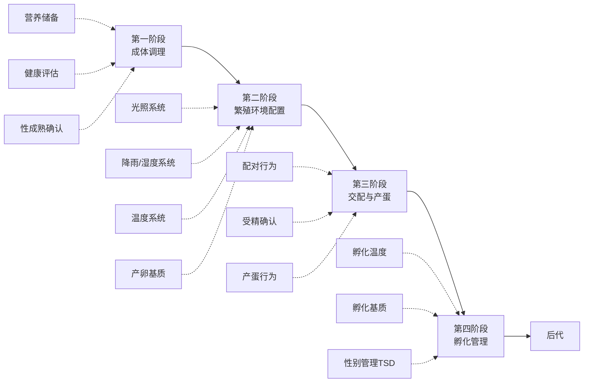
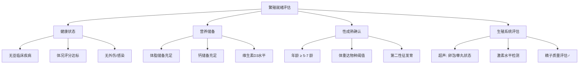
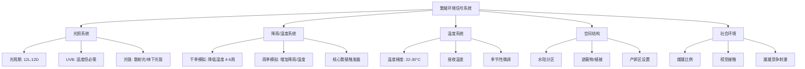
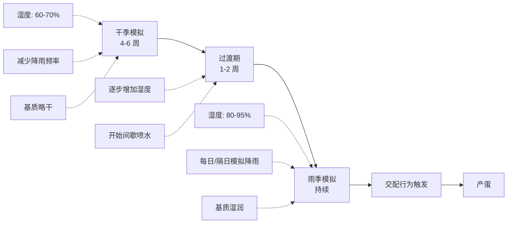
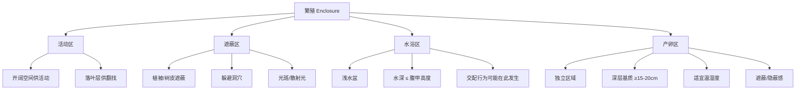
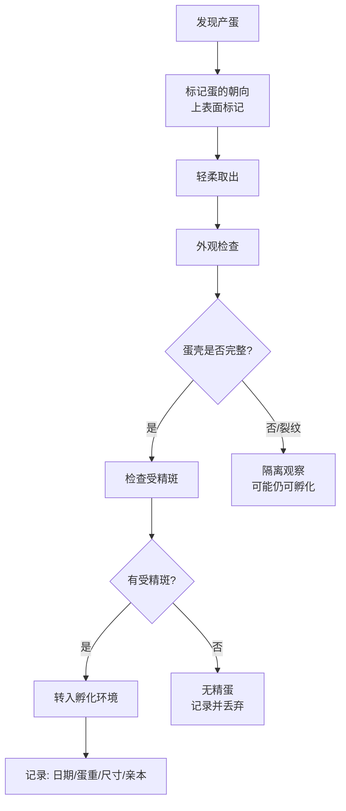
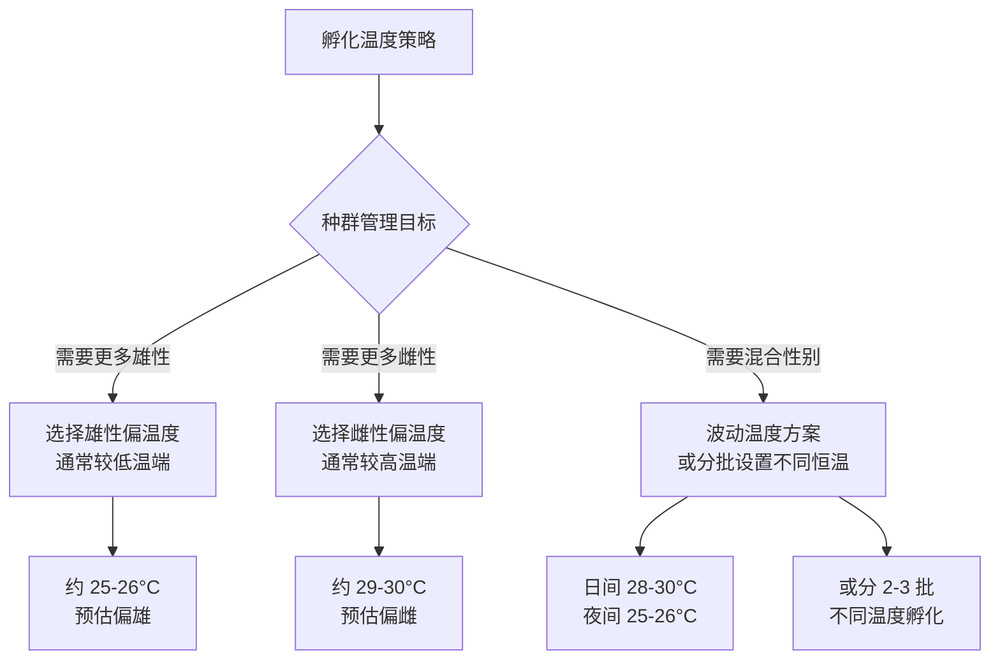
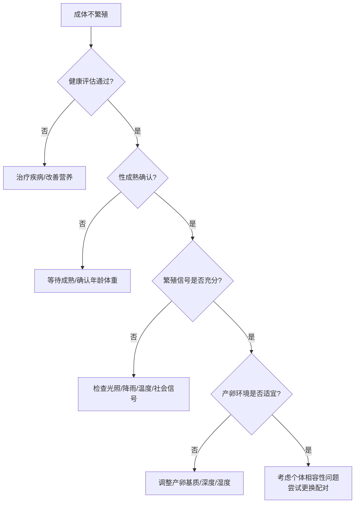

# 黄额闭壳龟（*Cuora galbinifrons*）繁殖全流程指南

> 本文档按照繁殖链条的**时间顺序**组织：从成体调理 → 繁殖环境配置 → 产蛋管理 → 孵化管理，覆盖整个繁殖流程的关键参数与决策逻辑。
>
> **物种说明**：黄额闭壳龟（*Cuora galbinifrons*），含三个亚种（*C. g. galbinifrons*、*C. g. bourreti*、*C. g. picturata*），分布于越南、老挝及中国海南岛。IUCN 红色名录列为**极危（Critically Endangered）**物种。相比锯缘闭壳龟，黄额闭壳龟**更偏陆栖**，栖息于热带/亚热带山地森林底层，繁殖生态有其独特性。

---

## 目录

1. [总览：繁殖链条全景](#1-总览繁殖链条全景)
2. [第一阶段：成体调理（Adult Conditioning）](#2-第一阶段成体调理adult-conditioning)
3. [第二阶段：繁殖环境配置（Breeding Environment Setup）](#3-第二阶段繁殖环境配置breeding-environment-setup)
4. [第三阶段：交配与产蛋管理（Mating & Egg-laying Management）](#4-第三阶段交配与产蛋管理mating--egg-laying-management)
5. [第四阶段：孵化管理（Incubation Management）](#5-第四阶段孵化管理incubation-management)
6. [全流程参数速查表](#6-全流程参数速查表)
7. [常见问题与决策树](#7-常见问题与决策树)
8. [参考文献](#8-参考文献)

---

## 1. 总览：繁殖链条全景



**核心逻辑**：繁殖是一条**串行依赖链**——每个阶段的输出是下一个阶段的输入条件。成体状态不佳 → 环境信号无法触发繁殖；环境配置不当 → 交配或产蛋失败；孵化参数错误 → 胚胎死亡或性别失衡。

---

## 2. 第一阶段：成体调理（Adult Conditioning）

> **目标**：确保个体达到繁殖的生理门槛——健康、营养储备充足、内分泌系统就绪。

### 2.1 繁殖就绪评估框架



### 2.2 营养调理

#### 繁殖前期的营养目标

| 营养素 | 目标 | 原理 |
|--------|------|------|
| **钙** | 充足储备（Ca:P ≥ 1.5:1） | 卵壳形成需要大量钙——每枚蛋的钙含量可达雌体总钙库的显著比例 |
| **维生素 D3** | 维持充足水平 | 促进肠道钙吸收；UVB 合成不足时需膳食补充 |
| **蛋白质** | 动物性蛋白占比适当提高 | 卵黄蛋白合成的原料 |
| **脂肪** | 维持适度体脂储备 | 繁殖是"奢侈活动"——体脂是繁殖的代谢许可信号 |
| **水分** | 充足饮水 | 脱水抑制所有生理过程 |

#### 食物组成建议

| 食物类型 | 比例 | 示例 |
|----------|------|------|
| 动物性蛋白 | 40-50% | 蚯蚓、蜗牛、蛞蝓、昆虫幼虫、少量瘦肉 |
| 植物性物质 | 40-50% | 深色叶菜（芥蓝、蒲公英叶、番薯叶）、少量水果 |
| 钙补充 | 定期 | 墨鱼骨、碳酸钙粉（繁殖期雌性尤其重要） |
| 维生素/矿物质 | 定期 | 爬行动物专用综合维生素（含 D3） |

> **关键原则**：繁殖期的营养调理不是"多喂"，而是**精准补充繁殖所需的关键营养素**——尤其是钙和 D3。过量喂食导致肥胖反而抑制繁殖。

### 2.3 健康调理

| 检查项目 | 目的 | 方法 |
|----------|------|------|
| 体况评分（BCS） | 确认体重和肌肉状态达标 | 触诊四肢基部肌肉丰满度、称重 |
| 粪便检查 | 排除寄生虫感染 | 寄生虫负担过高→营养竞争→繁殖抑制 |
| 血液检查 | 评估基础健康 | 血常规 + 生化（重点关注钙、磷、尿酸） |
| 超声检查 | 评估生殖器官状态 | 雌性：卵泡大小和数量；雄性：睾丸大小 |
| 激素检测 | 评估内分泌就绪状态 | 睾酮（♂）、雌二醇（♀）——可选但推荐 |

### 2.4 性成熟确认

| 指标 | 雌性 | 雄性 |
|------|------|------|
| 年龄 | 通常 ≥ 5-7 龄 | 通常 ≥ 4-6 龄（略早于雌性） |
| 体重 | 达到物种特征阈值（亚种间有差异） | 达到物种特征阈值 |
| 形态特征 | 体型通常大于雄性 | 尾部粗长、腹甲凹陷（便于交配固定） |
| 行为特征 | 接受雄性爬跨 | 主动求偶（追逐、咬颈、爬跨） |

---

## 3. 第二阶段：繁殖环境配置（Breeding Environment Setup）

> **目标**：重建热带山地森林的繁殖生态信号系统——让内分泌系统"认为"自己正处于野外繁殖栖息地中。

### 3.1 环境信号全景



### 3.2 光照系统

黄额闭壳龟对光的敏感涉及三个独立维度：

#### (1) 光周期（Photoperiod）

| 参数 | 建议值 | 说明 |
|------|--------|------|
| 基础光周期 | 12L:12D | 维持基础内分泌节律 |
| 繁殖期调整 | 可微调至 13L:11D | 模拟热带长日照条件，辅助激活 HPG 轴 |
| 敏感性 | **中等** | 热带物种对光周期的敏感性**低于温带物种**——降雨才是核心触发器 |

#### (2) UVB 照射

| 参数 | 建议值 | 说明 |
|------|--------|------|
| UVB 波段 | 290-315 nm | 皮肤中 7-脱氢胆固醇转化为维生素 D3 前体 |
| 照射强度 | 中等（林下水平） | 黄额闭壳龟是林下物种，自然 UVB 暴露低于开阔地 |
| 照射时间 | 与光周期同步 | 每日提供 UVB 照射时段 |
| 繁殖期需求 | **升高** | 雌性卵壳形成需要大量钙 → 需要充足 D3 → 需要 UVB |

> **UVB 不足的后果链**：UVB 缺乏 → D3 合成不足 → 肠道钙吸收障碍 → 卵壳异常（软壳/薄壳）→ 蛋滞留或胚胎死亡

#### (3) 光强与光质

| 参数 | 建议值 | 说明 |
|------|--------|------|
| 光强 | **散射光/林下斑驳光** | 黄额闭壳龟不偏好强光直射——强光增加应激 |
| 遮蔽比例 | ≥ 50% 面积有遮蔽 | 提供视觉安全感，降低应激激素 |
| 光源类型 | 全光谱 + UVB 灯 | 避免单一高强度点光源 |

> **繁殖期特别注意**：强光直射抑制求偶行为。繁殖环境应模拟**林下散射光**——斑驳、柔和、有遮蔽。

### 3.3 降雨/湿度系统（核心繁殖触发器）

这是黄额闭壳龟区别于温带闭壳龟的**最关键差异**。

#### 季节性降雨模拟方案



| 阶段 | 持续时间 | 湿度 | 降雨频率 | 目的 |
|------|---------|------|---------|------|
| **干季模拟** | 4-6 周 | 60-70% | 减少（每周 1-2 次轻喷） | 模拟资源匮乏期，建立"繁殖需求" |
| **过渡期** | 1-2 周 | 70-80% | 逐步增加（隔日喷水） | 信号转换，避免应激 |
| **雨季模拟** | 持续至产蛋 | 80-95% | 增加（每日/隔日模拟降雨） | **核心繁殖触发信号** |

#### 降雨模拟的实现方式

- **喷淋系统**：定时喷淋，模拟自然降雨
- **手动喷水**：每日或隔日对 enclosure 进行喷水
- **湿度控制**：使用加湿器维持高湿度环境
- **基质保湿**：雨林型基质（椰土 + 水苔 + 落叶层）保持湿润

> **原理**：在热带环境中，干季代表资源匮乏，雨季代表资源丰沛——后者是养育后代的最佳时机。进化选择了降雨作为繁殖触发信号。黄额闭壳龟的内分泌系统"等待"雨季信号来启动繁殖。

### 3.4 温度系统

| 参数 | 建议值 | 说明 |
|------|--------|------|
| 基础温度范围 | 24-28°C | 热带物种的基础活动温度 |
| 温度梯度 | 22-30°C | 允许个体自主体温调节（behavioral thermoregulation） |
| 昼夜温差 | 日间 26-30°C / 夜间 22-25°C | 模拟自然昼夜波动 |
| 繁殖期微调 | 雨季期间可略升高至 27-31°C | 配合雨季信号，增强繁殖刺激 |
| 下限 | 不低于 20°C | 热带物种无冬眠需求，低温抑制繁殖 |

> **与温带物种的关键差异**：黄额闭壳龟**不需要冬眠来触发繁殖**。低温不仅不是繁殖信号，反而会抑制繁殖。

### 3.5 空间结构与产卵区

#### Enclosure 分区



#### 产卵区详细配置

| 参数 | 要求 | 原理 |
|------|------|------|
| **基质类型** | 壤土/沙壤土混合（非纯沙、非纯泥炭） | 同时保水且透气 |
| **基质深度** | ≥ 15-20 cm | 黄额闭壳龟偏陆栖，挖掘较深巢穴 |
| **基质湿度** | 含水量 8-15%（手握成团、松手即散） | 过低→蛋脱水；过高→蛋胀裂/霉变 |
| **基质温度** | 25-30°C | 雌性偏好温暖产卵位点 |
| **遮蔽** | 产卵区上方有遮蔽物 | 提供隐蔽感，降低应激 |
| **面积** | 足够雌性挖掘和转身 | 空间不足→拒绝产卵 |

> **产卵环境不适宜的连锁反应**：
> 产卵环境不适宜 → 雌性拒绝产卵 → 蛋滞留 → 卵壳钙化过度 → 难产（dystocia）→ 需兽医干预

### 3.6 社会环境

| 参数 | 建议 | 说明 |
|------|------|------|
| 雌雄比例 | 1♂:2-3♀ | 分散雄性注意力，降低单只雌性被过度追逐的应激 |
| 视觉接触 | 繁殖季前允许视觉接触 | 雄性看到竞争对手→激素水平升高→求偶行为增强 |
| 交配观察 | 密切监控 | 繁殖期雄性可能具攻击性，咬伤雌性→需隔离 |
| 雄性攻击性 | 准备隔离方案 | 如雌性出现咬伤/应激迹象，立即分离 |

---

## 4. 第三阶段：交配与产蛋管理（Mating & Egg-laying Management）

### 4.1 交配行为识别

| 行为 | 描述 | 意义 |
|------|------|------|
| 追逐 | 雄性主动追随雌性 | 求偶启动 |
| 咬颈/咬肩 | 雄性咬住雌性颈部或肩部 | 固定雌性，准备爬跨 |
| 爬跨 | 雄性爬上雌性背甲 | 交配姿势 |
| 泄殖腔对齐 | 双方泄殖腔接触 | 精子传递 |
| 雌性接受 | 雌性静止不动、抬起尾部 | 接受交配 |
| 雌性拒绝 | 雌性逃离、缩入壳中 | 未接受——不应强迫 |

### 4.2 受精确认

| 方法 | 时间 | 说明 |
|------|------|------|
| 超声检查 | 交配后 4-8 周 | 检测卵泡发育和早期蛋形成 |
| X 光检查 | 产蛋前 2-4 周 | 钙化蛋壳清晰可见，确认蛋数量和位置 |
| 产蛋后检查 | 产蛋后立即 | 检查蛋的受精斑（fertile egg 出现乳白色发育带） |
| 照蛋（candling） | 产蛋后 1-2 周 | 透光检查胚胎发育迹象 |

> **精子储存（Sperm Storage）**：雌性黄额闭壳龟可以在泄殖腔腺体中储存存活精子数月甚至更久（Rostal & Lance, 1994）。这意味着"独居"雌龟仍可能产出受精卵。

### 4.3 产蛋行为管理

| 阶段 | 行为表现 | 管理要点 |
|------|---------|---------|
| 产蛋前期 | 食欲下降、频繁挖掘、不安移动 | 确保产卵区可用且条件适宜 |
| 产蛋中 | 挖掘巢穴、产蛋、覆盖 | **不要干扰**——中断可能导致蛋滞留 |
| 产蛋后 | 雌性疲惫、可能饮水 | 提供饮水和安静环境 |

### 4.4 蛋的收集与检查



> **关键**：取出蛋后**不要翻转**——龟蛋没有系带（chalaza），翻转会导致胚胎脱离壳膜死亡。保持蛋的原始朝向。

---

## 5. 第四阶段：孵化管理（Incubation Management）

### 5.1 孵化环境参数

| 参数 | 建议值 | 说明 |
|------|--------|------|
| **孵化温度** | 25-30°C（根据性别目标选择） | TSD——温度决定后代性别 |
| **孵化基质** | 蛭石/珍珠岩 + 水（1:1 重量比） | 保水透气，提供稳定水分环境 |
| **基质湿度** | 含水量约 8-15% | 手握成团、松手即散 |
| **环境湿度** | 85-95% | 防止基质过快失水 |
| **通风** | 适度通风 | 胚胎需要 O2 并排出 CO2 |
| **光照** | 黑暗或极弱光 | 孵化不需要光照 |

### 5.2 TSD 温度策略（温度依赖型性别决定）



> **重要提示**：黄额闭壳龟的精确 TSD 曲线（pivotal temperature、过渡温度范围 TRT）尚未被充分测定。以上温度范围为基于同属/近缘种的估算。建议记录每批孵化的温度与出壳后性别，逐步建立该物种的 TSD 数据。

### 5.3 孵化阶段与时间线

| 阶段 | 时间范围（28°C 为例） | 关键事件 | 管理要点 |
|------|---------------------|---------|---------|
| **早期** | 第 0-20 天 | 卵裂、器官形成 | 保持稳定温度，避免震动 |
| **中期（TSD 窗口）** | 第 20-50 天 | **性别决定**——芳香化酶活性受温度调控 | 此阶段温度波动可能导致性别比例不可预测 |
| **后期** | 第 50-70 天 | 快速生长、卵黄吸收 | 避免温度剧烈变化 |
| **出壳期** | 第 70-75+ 天 | 卵齿破壳、卵黄囊完全吸收、出壳 | **不要人为干预破壳过程** |

> **温度与孵化时长的关系**（估算）：

| 孵化温度 | 预估孵化时长 |
|---------|-------------|
| 25°C | 90-110+ 天 |
| 26°C | 80-100 天 |
| 28°C | 65-85 天 |
| 30°C | 50-65 天 |
| < 22°C | 发育停滞 |
| > 33°C | 胚胎死亡风险急剧升高 |

### 5.4 孵化过程中的监测

| 监测项目 | 频率 | 方法 |
|----------|------|------|
| 温度 | 每日 | 温度计/数据记录仪 |
| 基质湿度 | 每周 | 称重法（补水至原始重量） |
| 蛋的状态 | 每 2 周 | 照蛋检查胚胎发育 |
| 异常蛋 | 随时 | 塌陷/变色/霉变→取出 |
| 出壳迹象 | 孵化后期每日 | 蛋壳裂纹、幼体活动 |

### 5.5 出壳管理

| 阶段 | 时间 | 管理要点 |
|------|------|---------|
| 破壳 | 幼体用卵齿啄破蛋壳 | **不要人为帮助**——过早干预导致卵黄囊未吸收 |
| 壳内停留 | 破壳后 24-48 小时 | 正常行为——继续吸收卵黄囊 |
| 完全出壳 | 自行爬出 | 移至育幼区 |
| 卵黄囊 | 出壳后可能仍有残留 | 保持清洁湿润，数日内自然吸收脱落 |
| 首次进食 | 出壳后 3-7 天 | 卵黄囊吸收完毕后开始进食 |

---

## 6. 全流程参数速查表

| 阶段 | 参数 | 建议值 |
|------|------|--------|
| **成体调理** | 钙磷比 | ≥ 1.5:1 |
| | 体况评分 | 达标（肌肉丰满） |
| | 性成熟年龄 | ♀ ≥ 5-7 龄 / ♂ ≥ 4-6 龄 |
| **光照** | 光周期 | 12L:12D（繁殖期可调至 13L:11D） |
| | UVB | 中等强度，每日照射 |
| | 光强 | 散射光/林下斑驳光 |
| **降雨/湿度** | 干季模拟 | 湿度 60-70%，4-6 周 |
| | 过渡期 | 湿度 70-80%，1-2 周 |
| | 雨季模拟 | 湿度 80-95%，每日/隔日降雨 |
| **温度** | 基础温度 | 24-28°C |
| | 温度梯度 | 22-30°C |
| | 昼夜温差 | 日 26-30°C / 夜 22-25°C |
| **产卵基质** | 类型 | 壤土/沙壤土 |
| | 深度 | ≥ 15-20 cm |
| | 湿度 | 8-15%（手握成团、松手即散） |
| | 温度 | 25-30°C |
| **孵化** | 温度（偏雄） | ~25-26°C |
| | 温度（偏雌） | ~29-30°C |
| | 温度（混合） | 波动温度或分批恒温 |
| | 基质 | 蛭石/珍珠岩 + 水 |
| | 环境湿度 | 85-95% |
| | 孵化时长（28°C） | 约 65-85 天 |

---

## 7. 常见问题与决策树

### 决策树 1：成体不繁殖



### 决策树 2：产蛋异常

```
产蛋异常
    │
    ├─ 软壳蛋/薄壳蛋
    │   → 钙/D3 不足 → 补充钙 + 增加 UVB
    │
    ├─ 蛋滞留（不产蛋但超声有蛋）
    │   → 先检查产卵环境 → 环境 OK → 兽医干预（催产素/手术）
    │
    ├─ 无精蛋（连续多窝）
    │   → 检查精子质量 → 更换雄性 → 或考虑人工授精
    │
    └─ 蛋在不当位点产出（水中/表面）
        → 产卵区不可接受 → 重新配置产卵区
```

### 决策树 3：孵化异常

```
孵化异常
    │
    ├─ 蛋塌陷/萎缩
    │   → 基质太干 → 增加基质含水量
    │
    ├─ 蛋胀裂/霉变
    │   → 基质太湿 → 降低含水量/增加通风
    │
    ├─ 孵化时间远超预期
    │   → 温度偏低 → 检查温度计/调高温度
    │
    ├─ 全部出壳为同一性别
    │   → TSD 温度偏移 → 调整温度方案
    │
    └─ 幼体虚弱/畸形
        → 检查孵化温度波动/营养/亲本健康
```

---

## 8. 参考文献

- Asian Turtle Trade Working Group. (2000). *Cuora galbinifrons*. The IUCN Red List of Threatened Species 2000: e.T6213A12548497.
- Crews, D. (1996). Organizational and activational processes in sex determination: toward an integrated model. *Hormones and Behavior*, 30(4), 434-443.
- Ernst, C. H., & Lovich, J. E. (2009). *Turtles of the United States and Canada* (2nd ed.). Johns Hopkins University Press.
- Ewert, M. A., Jackson, D. R., & Lang, J. W. (2004). Environmental sex determination in crocodilians: implications for understanding turtle TSD. In *Temperature-Dependent Sex Determination in Vertebrates* (pp. 52-67). Springer.
- Frankham, R., Ballou, J. D., & Briscoe, D. A. (2010). *Introduction to Conservation Genetics* (2nd ed.). Cambridge University Press.
- Mader, D. R., Divers, S. J., & Kumar, K. (Eds.). (2016). *Mader's Reptile and Amphibian Medicine and Surgery* (3rd ed.). Elsevier.
- Rostal, D. C., & Lance, V. A. (1994). Reproductive cycles of male and female desert tortoises, *Gopherus agassizii*, in the Mojave Desert. *Copeia*, 1994(4), 978-987.
- Valenzuela, N., & Lance, V. A. (Eds.). (2004). *Temperature-Dependent Sex Determination in Vertebrates: Diversity and Conservation*. Smithsonian Books.
- Zhou, T., et al. (2020). Phylogenetic and biogeographic analysis of the genus *Cuora*. *Molecular Phylogenetics and Evolution*, 145, 106732.
