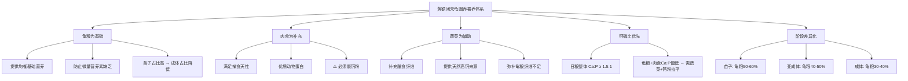
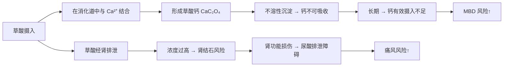
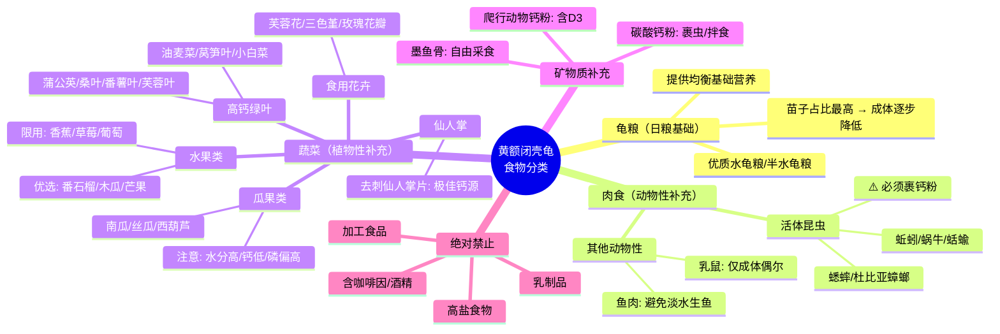
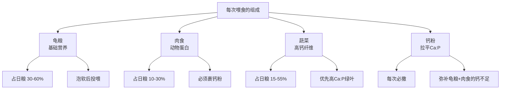
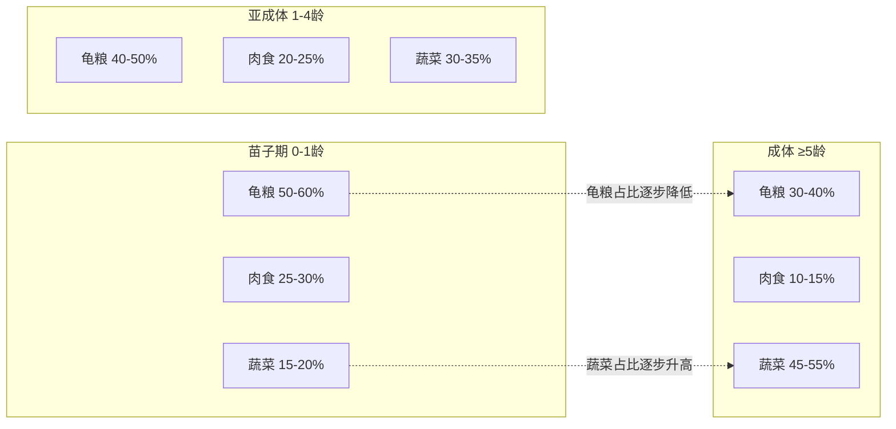
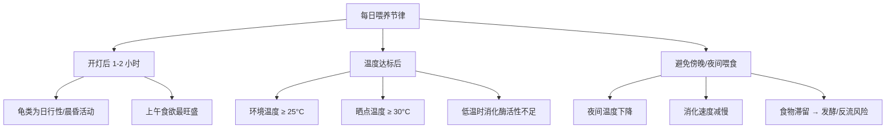
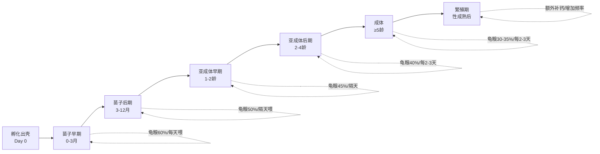
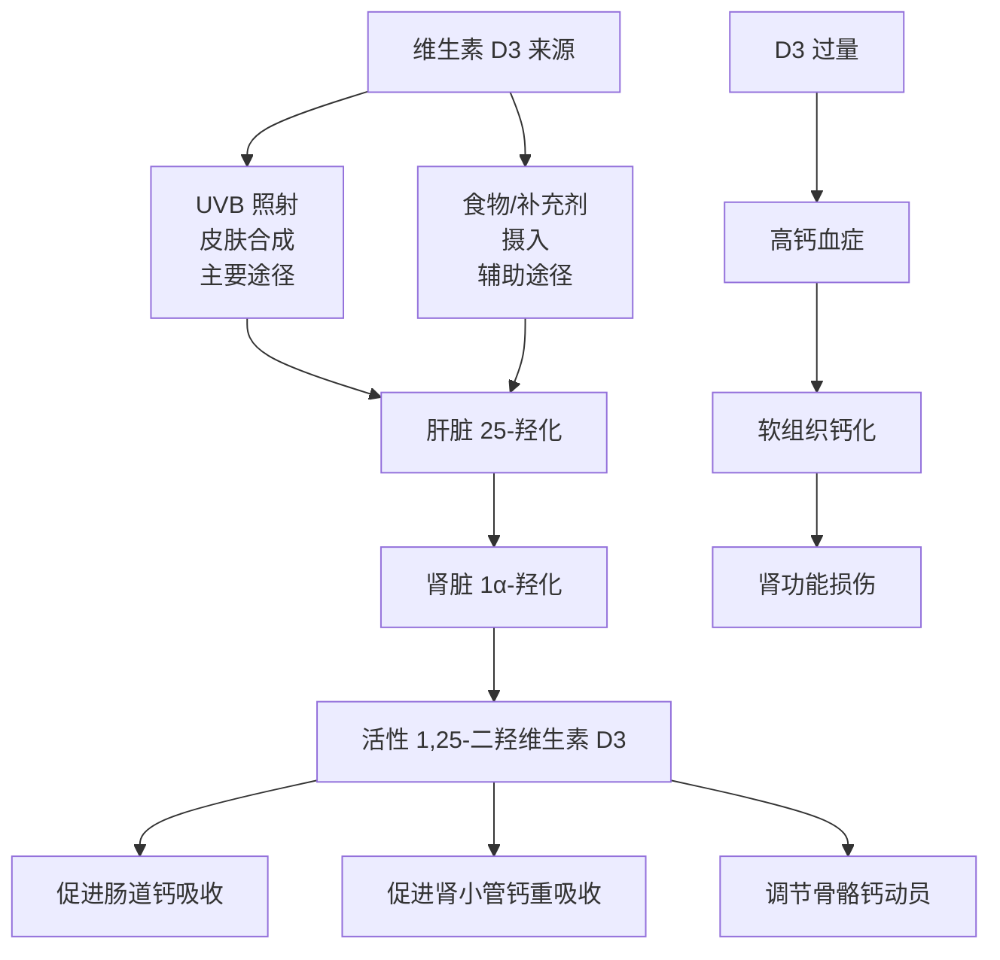

---

# 黄额闭壳龟（*Cuora galbinifrons*）食物配比与喂养指南

> 本文档系统梳理黄额闭壳龟从苗子到成体的食物配比、钙磷比管理、喂养周期与频率，以及各生长阶段的营养策略差异。
>
> **物种说明**：黄额闭壳龟（*Cuora galbinifrons*），含三个亚种（*C. g. galbinifrons*、*C. g. bourreti*、*C. g. picturata*），分布于越南、老挝及中国海南岛。IUCN 红色名录列为**极危（Critically Endangered）**物种。相比锯缘闭壳龟，黄额闭壳龟**更偏陆栖**，栖息于热带/亚热带山地森林底层。这一生态位决定了其**偏植食性-杂食性**的食性特征，与完全水栖龟类有本质差异。
>
> **喂养模式说明**：本文档所有喂养方案均采用**以龟粮为主、肉食与蔬菜为辅**的三元结构。优质龟粮作为日粮基础提供均衡营养，肉食满足天性与蛋白需求，蔬菜补充纤维与高钙来源。
>
> **重要声明**：
> - 黄额闭壳龟的营养学研究数据有限，许多推荐来源于同属物种（如锯缘闭壳龟 *C. mouhotii*、三线闭壳龟 *C. trifasciata*）及相近生态位的陆栖/半水栖龟类的研究外推。
> - 本文档为知识框架参考，不替代爬行动物营养学专家或兽医的个性化指导。
> - 所有营养方案需结合个体健康状态、环境参数及季节变化动态调整。

---

## 目录

1. [食性本质与生态基础](#1-食性本质与生态基础)
2. [营养素基础——理解钙磷比](#2-营养素基础理解钙磷比)
3. [食物分类与评价](#3-食物分类与评价)
4. [龟粮选择与搭配原则](#4-龟粮选择与搭配原则)
5. [各生长阶段食物配比方案](#5-各生长阶段食物配比方案)
6. [喂养周期与频率](#6-喂养周期与频率)
7. [从苗子到成体：全生命周期喂养策略](#7-从苗子到成体全生命周期喂养策略)
8. [补充剂策略](#8-补充剂策略)
9. [常见营养问题与诊断](#9-常见营养问题与诊断)
10. [季节性喂养调整](#10-季节性喂养调整)
11. [食物配比速查表](#11-食物配比速查表)
12. [参考文献](#12-参考文献)

---

## 1. 食性本质与生态基础

### 1.1 野外食性

黄额闭壳龟在原生栖息地中的食性研究表明，其为**偏植食性的杂食动物**（omnivore with herbivorous bias）：

| 食物类别 | 野外占比（估计） | 代表食物 |
|---------|---------------|---------|
| **落果/浆果** | 30-40% | 榕属（*Ficus*）果实、棕榈科果实 |
| **真菌/蘑菇** | 10-20% | 林下腐生真菌 |
| **昆虫/无脊椎动物** | 15-25% | 蚯蚓、蜗牛、蛞蝓、甲虫幼虫 |
| **绿叶/植被** | 15-25% | 林下草本、蕨类嫩叶 |
| **其他** | 5-10% | 腐肉（机会性）、苔藓 |

> **关键参考**：黄额闭壳龟的食性与同属的锯缘闭壳龟（*C. mouhotii*）相似，但**植物性食物占比可能更高**。Hatase et al.（2007）对亚洲多个闭壳龟属物种的稳定同位素分析显示，偏陆栖物种的 δ¹³C 值更偏向植物信号。

### 1.2 圈养食性的核心原则



### 1.3 与锯缘闭壳龟的食性差异

| 特征 | 黄额闭壳龟 (*C. galbinifrons*) | 锯缘闭壳龟 (*C. mouhotii*) |
|------|-------------------------------|---------------------------|
| 栖息偏好 | 更偏陆栖 | 半水栖，水域使用更多 |
| 植食性程度 | **更高**（成体蔬菜占比可达 55%） | 较高 |
| 水果接受度 | 较高（野外落果占比大） | 中等 |
| 水生猎物摄入 | 较少 | 稍多（水生昆虫、软体动物） |
| 真菌摄入 | 显著（野外常见食菇行为） | 有但不如黄额频繁 |

---

## 2. 营养素基础——理解钙磷比

### 2.1 什么是钙磷比（Ca:P Ratio）

钙磷比是指食物中**钙（Ca）含量与磷（P）含量的质量比**。它是爬行动物营养学中最关键的单一指标之一。

**为什么钙磷比如此重要？**

- 钙和磷在体内共享吸收通道和代谢通路，二者存在**竞争性拮抗**关系
- 当磷摄入过量（Ca:P < 1:1）时，磷会与钙结合形成不溶性的**磷酸钙**，阻碍钙的吸收（Mader et al., 2016）
- 长期低 Ca:P 饮食 → **代谢性骨病（MBD）**——这是圈养龟类最常见且最严重的营养性疾病之一
- 反之，过高的钙（Ca:P > 4:1）也可能干扰磷、锌、铁等矿物质的吸收

### 2.2 黄额闭壳龟的理想钙磷比

| 生长阶段 | 推荐 Ca:P 范围 | 说明 |
|---------|---------------|------|
| **苗子期**（0-1 龄） | **1.5:1 ~ 2:1** | 骨骼快速矿化期，钙需求最高 |
| **亚成体期**（1-4 龄） | **1.5:1 ~ 2.5:1** | 骨骼生长放缓，甲壳增厚 |
| **成体期**（≥5 龄） | **1.5:1 ~ 3:1** | 维持性需求；雌性繁殖期需额外补钙 |
| **繁殖期雌性** | **2:1 ~ 3:1** | 蛋壳形成需要大量钙（每枚蛋约含 200-400mg Ca） |

> **最低安全线**：日粮整体 Ca:P **不应低于 1.2:1**。低于 1:1 的饮食被普遍认为是 MBD 的高风险因素（Divers & Mader, 2019）。

### 2.3 钙磷比的计算与实操

**计算方法**：

```
日粮 Ca:P = 食物A的Ca含量 × 占比 + 食物B的Ca含量 × 占比 + ...
           ─────────────────────────────────────────────────────
           食物A的P含量 × 占比 + 食物B的P含量 × 占比 + ...
```

**常见食物钙磷比速查**：

| 食物 | Ca (mg/100g DM) | P (mg/100g DM) | Ca:P | 评价 |
|------|-----------------|----------------|------|------|
| **优质高钙食物** | | | | |
| 墨鱼骨 | 35,000-38,000 | 1,000-1,200 | **29:1 ~ 35:1** | ⭐ 极佳钙源，可常备 |
| 碳酸钙粉 | 38,000 | 痕量 | **极高** | ⭐ 补充剂，非主食 |
| 蒲公英叶 | 3,700 | 750 | **4.9:1** | ⭐ 极佳日常绿叶 |
| 番薯叶 | 2,400 | 500 | **4.8:1** | ⭐ 优秀 |
| 芥蓝 | 1,600 | 400 | **4.0:1** | ⭐ 优秀 |
| 油麦菜 | 1,300 | 350 | **3.7:1** | ⭐ 良好 |
| 莴笋叶 | 1,100 | 300 | **3.7:1** | ⭐ 良好 |
| 桑叶 | 2,700 | 450 | **6.0:1** | ⭐ 极佳 |
| 芙蓉叶/花 | 1,400 | 300 | **4.7:1** | ⭐ 极佳 |
| 仙人掌（去刺） | 1,500 | 200 | **7.5:1** | ⭐ 极佳 |
| 车前草 | 1,700 | 400 | **4.3:1** | ⭐ 优秀 |
| **中等钙磷比食物** | | | | |
| 南瓜 | 250 | 350 | **0.7:1** | ⚠️ 磷偏高，需搭配高钙食物 |
| 胡萝卜 | 350 | 350 | **1.0:1** | ⚠️ 平衡但钙不高 |
| 苹果 | 100 | 100 | **1.0:1** | ⚠️ 钙磷均低，仅做零食 |
| 香蕉 | 50 | 280 | **0.18:1** | ❌ 极差 Ca:P，避免常喂 |
| 草莓 | 200 | 250 | **0.8:1** | ⚠️ 磷略高 |
| 蓝莓 | 100 | 150 | **0.67:1** | ⚠️ 磷偏高 |
| 木瓜 | 200 | 100 | **2.0:1** | ✅ 水果中较好 |
| 芒果 | 150 | 100 | **1.5:1** | ✅ 水果中可接受 |
| 番石榴 | 400 | 200 | **2.0:1** | ✅ 水果中优秀 |
| **动物性食物** | | | | |
| 蚯蚓 | 400 | 600 | **0.67:1** | ⚠️ 磷偏高 |
| 蜗牛（带壳） | 3,000 | 500 | **6.0:1** | ⭐ 极佳（壳提供大量钙） |
| 蛞蝓 | 200 | 350 | **0.57:1** | ⚠️ 需补钙 |
| 蟋蟀（未裹钙粉） | 150 | 500 | **0.3:1** | ❌ 极差，必须裹钙粉 |
| 面包虫 | 100 | 700 | **0.14:1** | ❌ 极差，应尽量避免 |
| 乳鼠（pinkie） | 2,000 | 3,000 | **0.67:1** | ⚠️ 仅偶尔投喂 |
| **龟粮** | | | | |
| 优质水龟粮 | 1,500-3,000 | 800-1,500 | **1.0-2.0:1** | ⚠️ 品种差异大，需看标签 |
| **需避免/限制的食物** | | | | |
| 菠菜 | 1,000 | 500 | **2.0:1** | ⚠️ Ca:P 看似好，但**草酸极高**，螯合钙使钙不可利用 |
| 甜菜叶 | 1,500 | 400 | **3.75:1** | ⚠️ 同上，草酸含量高 |
| 大黄 | 400 | 100 | **4.0:1** | ❌ 草酸极高，有毒性风险 |

> **DM = 干物质（Dry Matter）**。新鲜食物含水量高，钙磷含量需换算为干物质基础才能准确比较。

### 2.4 草酸（Oxalate）——被忽视的钙拮抗剂



**高草酸食物黑名单**（黄额闭壳龟应避免或严格限制）：

| 食物 | 草酸含量 | 风险等级 | 说明 |
|------|---------|---------|------|
| 菠菜 | 极高（600-900 mg/100g FW） | ❌ 避免 | 即使 Ca:P 看似合理，草酸也使钙几乎不可利用 |
| 甜菜/甜菜叶 | 高 | ❌ 避免 | |
| 大黄叶 | 极高 | ❌ 有毒 | 草酸含量可致死 |
| 苋菜 | 高 | ⚠️ 限制 | 偶尔少量 |
| 瑞士甜菜 | 高 | ⚠️ 限制 | |
| 羽衣甘蓝 | 中低 | ✅ 可用 | 草酸远低于上述种类 |

> **关键区分**：草酸含量 vs. 钙磷比是两个独立维度。菠菜的 Ca:P 为 2:1 看似优秀，但因其极高的草酸含量，其中的钙几乎完全被螯合，**生物可利用钙接近于零**（Heaney & Weaver, 1993; FDA/USDA 数据）。

### 2.5 植酸（Phytate）——另一个磷的陷阱

植酸（肌醇六磷酸）存在于种子、坚果和谷物中，会螯合钙、锌、铁等矿物质，降低其生物利用度。

- **对黄额闭壳龟的影响**：该物种在野外几乎不摄入谷物/种子，消化道中缺乏足够的植酸酶来分解植酸
- **实操建议**：避免将谷物、米类、豆类作为日粮组成部分

---

## 3. 食物分类与评价

### 3.1 食物分类体系



### 3.2 食物推荐等级

#### ⭐ 第一梯队：龟粮——日粮基础（占日粮 30-60%，因阶段而异）

| 品牌/类型 | 粗蛋白 | Ca:P | 特点 | 适用阶段 |
|----------|--------|------|------|---------|
| **马祖瑞 Mazuri 水龟粮** | ~35% | ~1.5:1 | 营养全面，国际口碑佳 | 所有阶段 |
| **高够力 Hikari 水龟粮** | ~30-40% | ~1.2:1 | 适口性好，品种多 | 所有阶段 |
| **命脉 水龟粮** | ~30% | ~1.0-1.5:1 | 国产优质，性价比高 | 所有阶段 |
| **苗子/幼龟专用粮** | ~38-42% | ~1.5:1 | 高蛋白配方 | 苗子-亚成体 |
| **成体/陆龟粮** | ~20-28% | ~1.5-2.0:1 | 高纤维配方 | 成体 |

> **龟粮选择核心标准**：配料表前几位应为**鱼粉/虾粉**（而非谷物填充物）；粗蛋白 25-35%（成体）或 30-40%（苗子/亚成体）；避免廉价龟粮（谷物/淀粉为主要成分）。

#### ✅ 第二梯队：高钙蔬菜——核心辅助（占蔬菜部分的 60-70%）

| 食物 | Ca:P | 特点 | 喂养方式 |
|------|------|------|---------|
| **蒲公英叶** | 4.9:1 | 钙含量极高，纤维适中 | 生喂，整叶或切碎 |
| **桑叶** | 6.0:1 | 钙含量极高，蛋白质适中 | 生喂或干品泡发 |
| **番薯叶** | 4.8:1 | 钙高，适口性好 | 生喂，嫩叶为佳 |
| **芙蓉叶/花** | 4.7:1 | 钙高，花可作诱食 | 生喂 |
| **仙人掌（去刺）** | 7.5:1 | 钙极高，水分适中 | 切薄片或切丁 |
| **油麦菜** | 3.7:1 | 适口性极佳，钙良好 | 生喂 |
| **车前草** | 4.3:1 | 钙高，野外自然食物 | 生喂嫩叶 |

#### ⚠️ 第三梯队：肉食与瓜果——少量补充

| 食物 | Ca:P | 特点 | 注意事项 |
|------|------|------|---------|
| **蚯蚓** | 0.67:1 | 高蛋白，诱食性强 | **必须裹钙粉** |
| **蜗牛（带壳）** | 6.0:1 | 天然高钙猎物 | 野外采集注意杀虫剂 |
| **蟋蟀/杜比亚** | 0.3:1 | 常见活饵 | **必须裹钙粉** + 肠道负载（gut-loading） |
| **南瓜** | 0.7:1 | β-胡萝卜素丰富 | 需搭配高钙食物 |
| **胡萝卜** | 1.0:1 | β-胡萝卜素丰富 | 生刨丝或蒸熟 |
| **番石榴** | 2.0:1 | 水果中钙优秀 | 切块 |
| **木瓜** | 2.0:1 | 水果中钙较好 | 切块 |

#### ❌ 应避免的食物

| 食物 | 原因 |
|------|------|
| **菠菜** | 草酸极高，钙不可利用 |
| **甜菜/甜菜叶** | 草酸高 |
| **大黄叶** | 草酸极高，有毒 |
| **香蕉（大量）** | Ca:P 极差（0.18:1） |
| **面包虫/黄粉虫** | Ca:P 极差（0.14:1），几丁质外壳难消化 |
| **乳制品** | 龟类无法消化乳糖 |
| **加工食品** | 盐分、添加剂、营养不匹配 |
| **淡水生鱼** | 含硫胺素酶，破坏维生素 B1 |
| **牛油果** | 对爬行动物有潜在毒性 |
| **谷物/米/面包** | 植酸高，不适合该物种消化系统 |

---

## 4. 龟粮选择与搭配原则

### 4.1 龟粮在日粮中的核心定位

| 角色 | 提供什么 | 弥补什么 | 局限 |
|------|---------|---------|------|
| **龟粮（基础）** | 基础蛋白质、维生素、矿物质（配方较均衡） | 兜底营养，防止因挑食导致的微量营养素缺乏 | 纤维不足；缺乏觅食行为刺激 |
| **肉食（补充）** | 优质动物蛋白、部分微量元素 | 满足捕食天性、诱食、补充活体营养 | Ca:P 普遍偏低 → **必须裹钙粉** |
| **蔬菜（辅助）** | 膳食纤维、天然钙源、水分 | 弥补龟粮纤维不足，提供高 Ca:P 食物拉平日粮钙磷比 | 部分蔬菜适口性差，需轮换 |

### 4.2 龟粮选择标准

- 选择**优质水龟粮/半水龟粮**（如马祖瑞 Mazuri、高够力 Hikari、命脉等品牌）
- 粗蛋白含量 **25-35%**（成体），**30-40%**（苗子/亚成体）
- 配料表前几位应为**鱼粉/虾粉**，而非谷物填充物
- 龟粮本身的 Ca:P 通常在 **1:1 ~ 2:1** 之间，仍需额外搭配高钙蔬菜和钙粉
- 避免廉价龟粮（谷物/淀粉为主要成分，营养密度低）
- **定期更换品牌/配方**：不同品牌营养侧重不同，轮换可减少单一配方缺陷的长期风险

### 4.3 龟粮为主的搭配核心逻辑

> **龟粮保证"营养不缺一"，蔬菜提供高钙纤维，肉食满足天性和蛋白需求。三者互补，但钙粉每次都要撒——因为龟粮 + 肉食的 Ca:P 往往偏低，需要蔬菜（高 Ca:P 绿叶）和钙粉来拉平。**



### 4.4 龟粮为主的注意事项

| 要点 | 说明 |
|------|------|
| **龟粮仍需补钙** | 龟粮 Ca:P 多在 1:1~2:1，加上肉食（Ca:P 普遍偏低），整体日粮 Ca:P 容易不足 → **每次喂食仍需撒钙粉** |
| **龟粮泡软** | 尤其苗子和亚成体，干龟粮吸水膨胀可能造成消化道不适；建议用温水泡 5-10 分钟至软化 |
| **避免龟粮单一化** | 龟粮是"营养保底"而非"唯一食物"——长期只喂龟粮会导致纤维不足、行为单调（缺乏觅食刺激） |
| **肉食必须裹钙粉** | 昆虫/蚯蚓的 Ca:P 极差（0.14:1~0.67:1），不裹钙粉会严重拉低日粮整体 Ca:P |
| **蔬菜选择高钙品种** | 优先蒲公英、桑叶、番薯叶等高 Ca:P 绿叶，弥补龟粮 + 肉食的钙不足 |

---

## 5. 各生长阶段食物配比方案

### 5.1 配比总览



### 5.2 苗子期（0-1 龄）详细配比

> **核心目标**：支持快速生长，骨骼矿化是第一优先级。龟粮提供基础营养保障，肉食提供高蛋白，蔬菜开始引入。

| 类别 | 占比 | 具体食物 | 频率 |
|------|------|---------|------|
| **龟粮** | 50-60% | 苗子/幼龟专用粮（泡软），高蛋白配方 | 每次喂食 |
| **肉食** | 25-30% | 小蚯蚓（切段，裹钙粉）、微型蜗牛（碾碎）、针头蟋蟀（裹钙粉）、杜比亚幼虫（裹钙粉） | 每次喂食均含 |
| **蔬菜** | 15-20% | 蒲公英叶（切极细）、桑叶（泡软切碎）、嫩番薯叶 | 每次喂食均含 |
| **水果** | 0-5% | 暂不建议或极少量木瓜泥 | 极少 |
| **钙补充** | 每次喂食 | 食物上撒微量碳酸钙粉（含 D3） | **每次** |

**苗子期关键参数**：

| 参数 | 目标值 | 说明 |
|------|-------|------|
| 日粮粗蛋白 | 16-22%（DM 基础） | 高于成体，支持快速生长 |
| 日粮钙含量 | 0.8-1.5%（DM 基础） | 骨骼快速矿化期 |
| 日粮 Ca:P | **1.5:1 ~ 2:1** | 最低不低于 1.2:1 |
| 维生素 D3 | 充足（UVB + 补充） | 钙吸收的关键辅助因子 |

**苗子期为什么龟粮占比最高？**

1. **营养均衡保障**：苗子处于快速生长期，对蛋白质、钙、维生素的需求极高，优质苗子粮（粗蛋白 38-42%）可稳定提供这些营养
2. **避免肉食 Ca:P 陷阱**：如果动物性食物占比过高（如 50%），由于昆虫/蚯蚓的 Ca:P 极差，即使裹钙粉也难以完全拉平日粮钙磷比
3. **龟粮 + 肉食 + 蔬菜三元互补**：龟粮兜底 → 肉食提供活体蛋白和诱食 → 蔬菜提供高钙纤维
4. **但必须注意**：肉食**每次必须裹钙粉**

### 5.3 亚成体期（1-4 龄）详细配比

> **核心目标**：生长速度放缓，逐步增加蔬菜比例，龟粮仍为基础但占比下降。

| 类别 | 占比 | 具体食物 | 频率 |
|------|------|---------|------|
| **龟粮** | 40-50% | 水龟粮/半水龟粮（泡软） | 每次喂食 |
| **蔬菜** | 30-35% | 蒲公英叶、桑叶、番薯叶、芙蓉叶、仙人掌、南瓜、油麦菜 | 每次喂食 |
| **肉食** | 20-25% | 蚯蚓、蜗牛、杜比亚蟑螂（均裹钙粉） | 每周 3-4 次 |
| **水果** | 5-10% | 番石榴、木瓜、芒果 | 每周 1-2 次 |
| **钙补充** | 每次喂食 | 碳酸钙粉撒食 | 每次 |

**过渡策略**：


> **过渡原则**：每个阶段过渡应**渐进进行**（每 2-4 周调整 5-10%），避免突然改变饮食结构导致拒食或消化问题。

### 5.4 成体期（≥5 龄）详细配比

> **核心目标**：维持体况，预防肥胖和营养性疾病。龟粮退为营养保底，蔬菜成为最大占比。

| 类别 | 占比 | 具体食物 | 频率 |
|------|------|---------|------|
| **蔬菜** | 45-55% | 蒲公英叶、桑叶、番薯叶、芙蓉叶、仙人掌、车前草、南瓜、油麦菜 | 每次喂食 |
| **龟粮** | 30-40% | 成体/陆龟粮（泡软），高纤维配方 | 每次喂食 |
| **肉食** | 10-15% | 蚯蚓、蜗牛（带壳）、蛞蝓 | 每周 2-3 次 |
| **水果** | 5-10% | 番石榴、木瓜、芒果、芙蓉花 | 每周 1-2 次 |
| **食用花卉** | 5% | 芙蓉花、三色堇、玫瑰花瓣 | 季节性供应 |
| **钙补充** | 每次喂食 | 碳酸钙粉撒食；墨鱼骨自由采食 | 每次 |

**繁殖期雌性额外需求**：

| 参数 | 非繁殖期 | 繁殖期（产蛋前 2-3 个月） |
|------|---------|------------------------|
| 钙补充频率 | 每次喂食撒粉 | **每次 + 额外提供墨鱼骨** |
| 龟粮占比 | 30-40% | 可维持或略降至 25-35% |
| 肉食占比 | 10-15% | 可提升至 15-20%（增加蛋白摄入） |
| 维生素 D3 | 常规 | 确保充足（UVB 或补充剂） |
| 总食量 | 体重的 1-3%/次 | 可增加至 3-5%/次 |

---

## 6. 喂养周期与频率

### 6.1 各阶段喂养频率

| 生长阶段 | 年龄 | 喂养频率 | 每次食量（体重占比） | 说明 |
|---------|------|---------|-------------------|------|
| **苗子期** | 0-6 月 | **每天 1 次** | 体重的 **3-5%** | 少量多餐，确保营养充足 |
| **苗子后期** | 6-12 月 | **每天 1 次或隔天 1 次** | 体重的 **2-4%** | 可开始适当减少频率 |
| **亚成体** | 1-3 龄 | **隔天 1 次** | 体重的 **2-3%** | 生长速度放缓 |
| **亚成体后期** | 3-5 龄 | **隔天 1 次或每 3 天 1 次** | 体重的 **1.5-2.5%** | 逐步接近成体模式 |
| **成体** | ≥5 龄 | **每 2-3 天 1 次** | 体重的 **1-2%** | 维持性喂养 |
| **繁殖期雌体** | 产蛋前 | **每 1-2 天 1 次** | 体重的 **3-5%** | 增加营养储备 |

> **重要说明**：以上食量为**湿重（新鲜食物）**的近似参考。实际应根据个体体况评分（BCS）动态调整。

### 6.2 喂养时间的节律



**最佳喂养时间窗口**：

- **首选**：开灯后 1-2 小时（通常上午 9:00-11:00）
- **可接受**：中午至下午早些时候
- **避免**：关灯前 3 小时内（确保有足够时间在适宜温度下消化）

### 6.3 喂养频率与温度的关系

| 环境温度范围 | 消化效率 | 喂养频率调整 |
|------------|---------|------------|
| **28-32°C**（最适范围） | 100%（基准） | 按标准频率 |
| **25-28°C** | ~80% | 可适当减少频率或食量 |
| **22-25°C** | ~50-60% | **减半频率**，食量减少 |
| **< 22°C** | < 30% | **暂停喂食**，直至温度恢复 |
| **> 35°C** | 下降（热应激） | 减少食量，增加水分补充 |

> **黄额闭壳龟的特殊性**：作为热带物种，其消化酶的最适温度可能略高于温带龟类。低于 25°C 时消化功能即显著下降，这与锯缘闭壳龟类似但低温耐受阈值可能更高（即更不耐低温）。

---

## 7. 从苗子到成体：全生命周期喂养策略

### 7.1 全生命周期总览



### 7.2 阶段一：苗子早期（0-3 月龄）

**生理特征**：
- 卵黄囊刚吸收完毕，消化系统尚未完全成熟
- 生长速度**最快**——体重可在数月内翻倍
- 骨骼矿化需求极高
- 肠道微生物群正在建立

**喂养策略**：

| 项目 | 方案 |
|------|------|
| 喂养频率 | **每天 1 次** |
| 食量 | 体重的 3-5%（以能吃完为宜） |
| **龟粮** | **50-60%**：苗子/幼龟专用粮，温水泡软 |
| **肉食** | **25-30%**：小型蚯蚓（切段，裹钙粉）、微型蜗牛（带壳碾碎）、针头蟋蟀（裹钙粉） |
| **蔬菜** | **15-20%**：蒲公英叶（切极细）、桑叶（泡软切碎）、嫩番薯叶 |
| 钙补充 | **每次喂食必须撒碳酸钙粉（含 D3）** |
| 水分 | 提供浅水盆；每天喷雾保湿；食物含水量本身就是主要水源 |
| UVB | 必须提供，强度 5.0-10.0 UVB 灯管，距晒点 25-30cm |

**苗子早期食物制备要点**：
- 龟粮用温水**泡 5-10 分钟**至软化，切成适合苗子口器的小块
- 所有绿叶**切细**（苗子口器小，吞咽困难）
- 蚯蚓**切段**（防止挣扎逃跑，也便于苗子咬住）
- 蜗牛壳**轻碾**（方便苗子取食壳内肉和壳碎片中的钙）
- 昆虫**裹钙粉**后再投喂（将虫放入袋中撒粉摇匀）

### 7.3 阶段二：苗子后期（3-12 月龄）

**生理特征**：
- 消化系统趋于成熟，可处理更多纤维
- 生长速度仍快但开始放缓
- 可开始接受更多种类的食物
- 肠道微生物群逐步多样化

**喂养策略**：

| 项目 | 方案 |
|------|------|
| 喂养频率 | **每天 1 次** 或 **隔天 1 次**（6 月龄后） |
| 食量 | 体重的 2-4% |
| **龟粮** | **50%** → 逐步降至 **45%**（泡软） |
| **肉食** | **25-30%** → 逐步降至 **25%**：蚯蚓、蜗牛、蟋蟀（均裹钙粉） |
| **蔬菜** | **20%** → 逐步增至 **25-30%**：新增南瓜丝、胡萝卜丝、油麦菜、仙人掌片 |
| 水果引入 | 可开始少量尝试木瓜、番石榴（≤5%） |
| 钙补充 | 每次喂食撒粉；开始放置墨鱼骨供自由采食 |

### 7.4 阶段三：亚成体（1-4 龄）

**生理特征**：
- 生长速度明显放缓（每年增重比例下降）
- 甲壳逐渐增厚，骨化完成度提高
- 肠道微生物群接近成体状态
- 性器官开始发育（2-3 龄后）

**喂养策略**：

| 项目 | 1-2 龄 | 3-4 龄 |
|------|--------|--------|
| 喂养频率 | 隔天 1 次 | 隔天 1 次 或 每 3 天 1 次 |
| 食量 | 体重 2-3% | 体重 1.5-2.5% |
| **龟粮** | **45%**（泡软） | **40%**（泡软） |
| **蔬菜** | **30-35%** | **35-40%** |
| **肉食** | **20-25%**：蚯蚓、蜗牛、杜比亚（裹钙粉），每周 3-4 次 | **20%**：每周 2-3 次 |
| 水果 | 每周 1-2 次 | 每周 1-2 次 |
| 钙补充 | 每次撒粉 + 墨鱼骨 | 每次撒粉 + 墨鱼骨 |

**亚成体关键监测指标**：

| 指标 | 正常范围 | 异常信号 |
|------|---------|---------|
| 体重增长 | 每年增重 15-30%（因亚种/性别而异） | 增长过快 → 可能过度喂养；停滞 → 营养/环境问题 |
| 甲壳硬度 | 坚硬，无软化区域 | 软化 → MBD 信号，检查 Ca:P 和 UVB |
| 粪便形态 | 成形，深绿-褐色 | 松散/水样 → 消化问题或寄生虫 |
| 体况评分（BCS） | 四肢缩入时肉不溢出壳缘 | 过胖 → 减少食量/频率 |

### 7.5 阶段四：成体（≥5 龄）

**生理特征**：
- 生长基本停止（体重变化主要来自脂肪储备和繁殖状态）
- 代谢率低于生长期
- 需要维持性营养，预防肥胖和退行性疾病
- 雌性需为繁殖周期储备营养

**喂养策略**：

| 项目 | 非繁殖期 | 繁殖期（雌性） |
|------|---------|-------------|
| 喂养频率 | 每 2-3 天 1 次 | 每 1-2 天 1 次（产蛋前 2-3 月） |
| 食量 | 体重 1-2% | 体重 3-5% |
| **龟粮** | **30-40%**：成体/陆龟粮，高纤维配方 | **25-35%** |
| **蔬菜** | **45-55%**：高钙绿叶 + 仙人掌为主 | **40-50%** |
| **肉食** | **10-15%** | **15-20%**（增加蛋白摄入） |
| 水果 | 每周 1 次 | 每周 1-2 次 |
| 钙补充 | 每次撒粉 + 墨鱼骨 | **每次撒粉 + 墨鱼骨 + 液态钙** |

### 7.6 各阶段差异对比总表

| 参数 | 苗子早期<br/>0-3月 | 苗子后期<br/>3-12月 | 亚成体<br/>1-4龄 | 成体<br/>≥5龄 |
|------|:---:|:---:|:---:|:---:|
| **喂养频率** | 每天 | 每天/隔天 | 隔天/每3天 | 每2-3天 |
| **食量（体重%）** | 3-5% | 2-4% | 1.5-3% | 1-2% |
| **龟粮占比** | 50-60% | 45-50% | 40-50% | 30-40% |
| **肉食占比** | 25-30% | 25-30% | 20-25% | 10-15% |
| **蔬菜占比** | 15-20% | 20-30% | 30-35% | 45-55% |
| **日粮粗蛋白** | 16-22% | 14-18% | 12-16% | 10-14% |
| **日粮 Ca:P** | 1.5:1 ~ 2:1 | 1.5:1 ~ 2:1 | 1.5:1 ~ 2.5:1 | 1.5:1 ~ 3:1 |
| **钙粉补充** | 每次必撒 | 每次必撒 | 每次撒 | 每次撒 |
| **墨鱼骨** | 3月龄后引入 | 自由采食 | 自由采食 | 自由采食 |
| **UVB 需求** | 必须，高优先级 | 必须 | 必须 | 必须 |
| **主要风险** | MBD、营养不良 | 过渡拒食 | 肥胖、MBD | 肥胖、痛风、肾衰 |

---

## 8. 补充剂策略

### 8.1 钙补充剂类型

| 类型 | 代表产品 | Ca 含量 | 适用场景 | 注意事项 |
|------|---------|---------|---------|---------|
| **碳酸钙粉** | 墨鱼骨研磨、Rep-Cal 等 | ~38% Ca | 日常撒食、裹虫 | 需胃酸溶解，建议与食物混合 |
| **柠檬酸钙** | 爬宠液态钙 | ~21% Ca | 液态补充、泡水 | 吸收率略高，不依赖胃酸 |
| **葡萄糖酸钙** | 爬宠钙凝胶 | ~9% Ca | 轻度缺钙辅助 | Ca 含量低，不适合单独作为主要钙源 |
| **含 D3 钙粉** | Rep-Cal with D3、Zoo-Med Repti-Cal | 变化 | UVB 不足时必用 | D3 促进钙吸收；**过量 D3 有毒** |
| **不含 D3 钙粉** | 纯碳酸钙粉 | ~38% Ca | UVB 充足时 | UVB 充足时动物可自行合成 D3 |

### 8.2 维生素 D3 的管理



**UVB 与 D3 补充的协调**：

| UVB 条件 | D3 补充策略 |
|---------|-----------|
| **UVB 充足**（灯管合规 + 距离正确 + 每日 8-12h） | 可使用**不含 D3** 的钙粉；食物中自然 D3 已足够 |
| **UVB 不足**（灯管老化/距离过远/阴雨天） | **必须使用含 D3 的钙粉**；考虑额外补充 |
| **无 UVB**（不推荐） | 必须含 D3 钙粉 + 液态 D3 补充；MBD 风险极高 |

> **D3 过量风险**：维生素 D3 是脂溶性维生素，过量不易排出。长期超量补充可导致高钙血症、软组织钙化和肾损伤。**在 UVB 充足的情况下，不建议额外大量补充 D3**（Mader et al., 2016）。

### 8.3 其他补充剂

| 补充剂 | 用途 | 频率 | 适用阶段 |
|--------|------|------|---------|
| **爬行动物综合维生素** | 预防微量营养素缺乏 | 每周 1-2 次 | 所有阶段 |
| **益生菌** | 支持肠道菌群，尤其换食/抗生素后 | 按产品说明 | 所有阶段 |
| **电解质粉** | 脱水恢复、疾病期支持 | 按需 | 所有阶段 |
| **鱼油（Omega-3）** | 抗炎、皮肤/甲壳健康 | 每周 1 次（少量） | 成体为主 |

---

## 9. 常见营养问题与诊断

### 9.1 营养问题速查

| 问题 | 病因 | 症状 | 纠正方案 |
|------|------|------|---------|
| **代谢性骨病（MBD）** | Ca:P 长期 < 1:1；D3 不足；UVB 不足 | 甲壳软化、四肢肿胀、骨折、下颌柔软 | 紧急纠正 Ca:P；注射钙剂（兽医）；强化 UVB |
| **肥胖** | 过度喂养；高糖水果过多；运动不足 | 四肢缩入时肉溢出壳缘；体重超标 | 减少食量/频率；减少水果；增加活动空间 |
| **维生素 A 缺乏** | 长期缺乏深色蔬菜/动物肝脏 | 眼部肿胀、呼吸道上皮角化 | 增加深色蔬菜；偶尔投喂蜗牛（含维 A） |
| **痛风** | 蛋白质长期过高；脱水；肾功能损伤 | 关节肿胀（痛风石）、嗜睡、拒食 | 降低蛋白；确保饮水；**紧急就医** |
| **草酸钙结石** | 高草酸食物 + 脱水 | 排尿困难、肾功能异常 | 停止高草酸食物；增加水分摄入 |
| **拒食** | 温度过低；食物单调；疾病；应激 | 不进食 | 先检查温度 → 再检查健康 → 尝试换食 |

### 9.2 粪便与营养状态的关联

| 粪便特征 | 可能原因 | 建议行动 |
|---------|---------|---------|
| **深绿色、成形** | 正常（尤其食用大量绿叶后） | 无需调整 |
| **浅黄/白色** | 钙粉过多；尿酸盐比例高 | 减少钙粉用量；检查水分摄入 |
| **松散/不成形** | 纤维不足；水果过多；寄生虫 | 增加粗纤维（蔬菜）；减少水果；粪检 |
| **含水率高/水样** | 水分摄入过多（可能因食物水分高）；或腹泻 | 减少高水分食物；监测是否持续 |
| **含未消化龟粮** | 温度不足；进食过快；泡软不够 | 检查温度；龟粮泡更软；减少食量 |
| **带血** | 肠道损伤；严重感染；寄生虫 | **立即就医** |

---

## 10. 季节性喂养调整

### 10.1 热带物种的特殊性

黄额闭壳龟作为热带物种，**没有真正的冬眠需求**。但在其原生栖息地，存在干季（11 月-次年 4 月）与雨季（5-10 月）的交替，这会影响食物的自然可获得性。

### 10.2 季节性调整建议

| 季节 | 环境变化 | 喂养调整 |
|------|---------|---------|
| **春夏季**（4-9 月） | 温度高、光照长、活动量大 | 正常频率；可增加食物多样性；繁殖期雌体加量 |
| **秋季**（10-11 月） | 温度开始下降 | 如温度维持稳定，无需大幅调整；适当减少频率 |
| **冬季**（12-3 月） | 温度较低（若不加温） | **如温度 < 25°C，显著减少喂食频率和食量**；确保饮水 |

> **关键原则**：黄额闭壳龟不需要冬眠。如果全年维持适宜温度（25-32°C），则不需要模拟季节性禁食。但在温度无法完全保证的情况下（如冬季加温不足），**必须相应减少喂食**，因为低温下食物无法正常消化，会在消化道内发酵腐败。

---

## 11. 食物配比速查表

### 11.1 一周喂食计划示例（成体，龟粮为主）

| 日 | 龟粮 | 肉食 | 蔬菜 | 钙粉 | 备注 |
|:--:|:----:|:----:|:----:|:----:|------|
| **周一** | ✅ 泡软 | 蚯蚓 3 条（裹钙粉） | 蒲公英叶 + 南瓜丝 | ✅ | |
| **周二** | 休息日 | — | — | — | 提供饮水、墨鱼骨 |
| **周三** | ✅ 泡软 | — | 桑叶 + 番薯叶 | ✅ | 纯蔬菜日 |
| **周四** | 休息日 | — | — | — | 提供饮水、墨鱼骨 |
| **周五** | ✅ 泡软 | 蜗牛 5 只（带壳） | 油麦菜 + 仙人掌片 | ✅ | |
| **周六** | 休息日 | — | — | — | 提供饮水、墨鱼骨 |
| **周日** | ✅ 泡软 | 杜比亚蟑螂 3 只（裹钙粉） | 芙蓉叶 + 番石榴 2 块 | ✅ | 水果日 |

### 11.2 一周喂食计划示例（苗子 3-6 月龄，龟粮为主）

| 日 | 龟粮 | 肉食 | 蔬菜 | 钙粉 | 备注 |
|:--:|:----:|:----:|:----:|:----:|------|
| **周一** | ✅ 泡软（少量） | 小蚯蚓 2 条（切段，裹钙粉） | 蒲公英叶（切细） | ✅ | |
| **周二** | ✅ 泡软 | 针头蟋蟀 3 只（裹钙粉） | 桑叶（泡软切碎） | ✅ | |
| **周三** | ✅ 泡软 | 微型蜗牛 3 只（碾碎） | 番薯叶（切细） | ✅ | |
| **周四** | ✅ 泡软 | 杜比亚幼虫 2 只（裹钙粉） | 油麦菜（切细）+ 南瓜丝 | ✅ | |
| **周五** | ✅ 泡软 | 小蚯蚓 2 条（裹钙粉） | 芙蓉叶（切细） | ✅ | |
| **周六** | ✅ 泡软 | 蜗牛 2 只 + 蟋蟀 2 只（均裹钙粉） | 桑叶 + 仙人掌（切细） | ✅ | |
| **周日** | 休息或极少量龟粮 | — | — | — | 观察进食状态 |

---

## 12. 参考文献

- Divers, S. J., & Mader, D. R. (Eds.). (2019). *Mader's Reptile and Amphibian Medicine and Surgery* (3rd ed.). Elsevier.
- Ernst, C. H., & Lovich, J. E. (2009). *Turtles of the United States and Canada* (2nd ed.). Johns Hopkins University Press.
- Hatase, H., Ota, H., & Sakai, Y. (2007). Stable isotope analysis of feeding ecology in Asian box turtles. *Chelonian Conservation and Biology*, 6(2), 213-217.
- Heaney, R. P., & Weaver, C. M. (1993). Oxalic acid: the major constraint on calcium absorption from spinach. *American Journal of Clinical Nutrition*, 57(2), 223-224.
- Mader, D. R., Divers, S. J., & Kumar, K. (Eds.). (2016). *The Reptile Clinic* (2nd ed.). Elsevier.
- McArthur, S., Wilkinson, R., & Mitchell, J. (2004). *Medicine and Surgery of Tortoises and Turtles*. Elsevier.
- Oonincx, D. G. A. B., & Finke, M. D. (2017). Nutritional composition of commonly fed feeder insects. *Journal of Insects as Food and Feed*, 3(2), 89-99.
- Zhou, T., Shi, H., & Chen, P. (2020). Habitat use and seasonal movement of *Cuora galbinifrons* in Hainan, China. *Asian Herpetological Research*, 11(2), 85-92.
- Asian Turtle Trade Working Group. (2000). *Cuora galbinifrons*. The IUCN Red List of Threatened Species 2000: e.T6030A12299594.

---

> **文档版本**：v2.0
> **最后更新**：2026 年 8 月
> **适用范围**：黄额闭壳龟（*Cuora galbinifrons*）三个亚种的圈养营养管理
> **配套文档**：黄额闭壳龟常见疾病参考手册 | 黄额闭壳龟用药参考手册 | 黄额闭壳龟繁殖全流程指南 | 黄额闭壳龟交配繁殖心智模型
